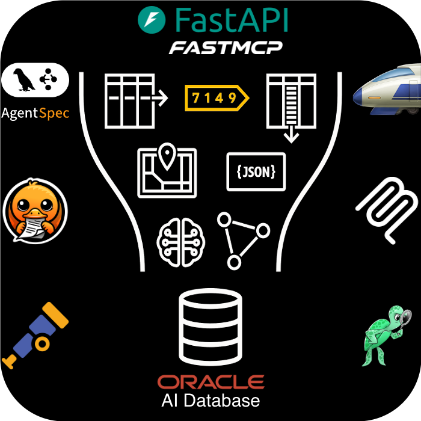

+++
title = " "
menus = 'main'
archetype = "home"
description = './ai-optimizer/docs'
keywords = 'oracle optimizer toolkit microservices development genai rag'
+++

<!--
Copyright (c) 2024, 2026, Oracle and/or its affiliates.
Licensed under the Universal Permissive License v1.0 as shown at http://oss.oracle.com/licenses/upl.

spell-checker:ignore streamlit genai relref venv giskard deepsec docling
-->

The {} provides a streamlined environment where developers and data scientists can explore the potential of Generative Artificial Intelligence (**GenAI**).

By integrating [*Oracle AI Database*](https://www.oracle.com/database/) [Vector Search](https://www.oracle.com/database/ai-vector-search/) and [SQLcl MCP](https://www.oracle.com/database/sqldeveloper/technologies/sqlcl/) with familiar Open Source Software (**OSS**), the {} enables users to enhance existing Language Models through Retrieval Augmented Generation (**RAG**) and Natural Language to SQL (**NL2SQL**). 

This method significantly improves the accuracy of AI models, helping to avoid common issues such as knowledge cut-off and hallucinations.

<div class="home-integrations">
  <div class="home-integrations__image">
    
  </div>
  <div class="home-integrations__list">
    <strong class="home-integrations__heading">
      Familiar OSS components<sup>*</sup>
    </strong>
    <ul>
      <li><a href="https://github.com/fastapi/fastapi">FastAPI</a> (REST API)</li>
      <li><a href="https://github.com/jlowin/fastmcp">FastMCP</a> (tools)</li>
      <li><a href="https://github.com/langchain-ai/langgraph">LangGraph</a> + <a href="https://github.com/oracle/agent-spec">AgentSpec</a> (orchestration)</li>
      <li><a href="https://github.com/docling-project/docling">Docling</a> (parsing)</li>
      <li><a href="https://github.com/open-telemetry/opentelemetry-python">OpenTelemetry</a> (observability)</li>
      <li><a href="https://github.com/BerriAI/litellm">LiteLLM</a> (models)</li>
      <li><a href="https://github.com/Giskard-AI/giskard">Giskard</a> (evaluation)</li>
    </ul>
  </div>
</div>
<p class="home-integrations__note">
   * Project names and logos are shown for identification purposes only. Unless expressly stated, their use does not imply affiliation with, sponsorship by, or endorsement by Oracle or the respective project owners.
</p>

## Features

The {} streamlines the entire workflow from prototyping to production, making it easier to create and deploy GenAI solutions using the **Oracle AI Database**.

- [Configuring **Embedding** and **Language** Models]({})
- [Experimenting with **Language Model** Parameters]({})
- [Splitting and **Embedding** Documentation]({})
- [Modifying System **Prompts** (Prompt Engineering)]({})
- [Enforcing **Deep Data Security**]({})
- [**Testbed** for auto-generated or existing Q&A datasets]({})


# Getting Started

The {} is available to install in your own environment, which may be a developer's desktop, on-premises data center environment, or a cloud provider. It can be run either on bare-metal, within a container, or in a Kubernetes Cluster.

{}
<!-- Hard-coding AI Optimizer to avoid raw HTML, this is an exception -->
The [Walkthrough]({}) is a great way to familiarize yourself with the **AI Optimizer** and its features in a development environment.
{}

## Prerequisites

- Python 3.11 (for running Bare-Metal)
- Container Runtime e.g. docker/podman (for running in a Container)
- Access to an Embedding and Chat Model:
  - API Keys for Third-Party Models
  - On-Premises Models*
- Oracle AI Database incl. [Oracle AI Database Free](https://www.oracle.com/database/free/)

~\*Oracle recommends running On-Premises Models on hardware with GPUs. For more information, please review the [{}]({}) documentation.~

{}
<!-- Hard-coding AI Optimizer to avoid raw HTML, this is an exception -->
The **AI Optimizer** will start and allow interaction with language models without any database or pre-configuration. However, to persist settings across restarts and to enable features like RAG, NL2SQL and the [Testbed]({}), at a minimum a [database]({}) should be configured.
{}

Available deployment methods:
- [Bare-Metal Installation](#bare-metal-installation)
- [Container Installation](#container-installation)
- [Oracle Cloud Infrastructure](#oracle-cloud-infrastructure)

### Bare-Metal Installation

To run the application on bare-metal, download the latest release:
{}

1. Uncompress the release in a new directory.  For example:

   ```bash
   mkdir ai-optimizer
   tar zxf ai-optimizer-src.tar.gz -C ai-optimizer

   cd ai-optimizer
   ```

1. Create and activate a Python Virtual Environment:

   ```bash
   cd ai-optimizer
   python3.11 -m venv .venv
   source .venv/bin/activate
   pip3.11 install --upgrade pip wheel uv
   ```

1. Install the Python modules:

   ```bash
   uv pip install -e ".[all]"
   ```

1. _(Optional)_ Create an [environment file]({}) to pre-configure the application:

   ```bash
   cp src/.env.example src/.env.dev
   ```

   Edit `src/.env.dev` as needed. See [Environment Configuration]({}) for details.

1. Start the application:

   ```bash
   python src/entrypoint.py client
   ```

1. Navigate to `http://localhost:8501`.

1. [Configure]({}) the {}.

### Container Installation



To run the application in a container, download the latest release:
{}

1. Uncompress the release in a new directory.  For example:

   ```bash
   mkdir ai-optimizer
   tar zxf ai-optimizer-src.tar.gz -C ai-optimizer

   cd ai-optimizer
   ```

1. Build the *ai-optimizer-aio* image.

   _Note:_ MacOS Silicon users may need to specify `--arch amd64`

   ```bash
   podman build -f src/Dockerfile -t ai-optimizer-aio .
   ```

1. Start the Container:

   ```bash
   podman run -p 8501:8501 -it --rm ai-optimizer-aio
   ```

1. Navigate to `http://localhost:8501`.

1. [Configure]({}) the {}.

### Oracle Cloud Infrastructure

The {} can easily be deployed using Infrastructure as Code (**IaC**) into Oracle Cloud Infrastructure (**OCI**).

**OCI** deployment options include:
- An [Always-Free](https://docs.oracle.com/en-us/iaas/Content/FreeTier/freetier_topic-Always_Free_Resources.htm) Installation
- Simple Virtual Machine Installation
- Advanced Oracle Kubernetes Engine

To get started, review the [IaC]({}) documentation.
