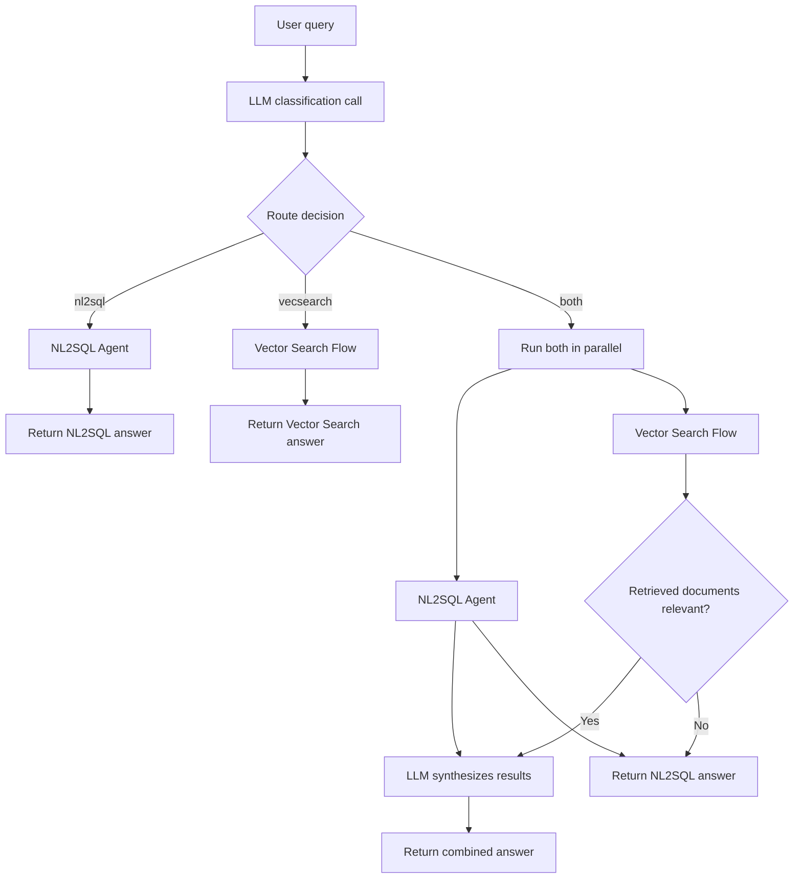

The Combined router is an orchestrator that routes queries to the Vector Search Flow, the NL2SQL Agent, or both. Unlike the reusable agents and flow, it coordinates existing sub-sessions at runtime rather than using its own AgentSpec definition.

- The classifier prompts the LLM to respond with exactly one word — `nl2sql`, `vecsearch`, or `both` — based on the user's question. Unrecognized responses default to `both`.
- When routed to a single tool, the query is dispatched directly to the corresponding sub-session.
- When routed to `both`, the sub-sessions run in parallel. If Vector Search finds relevant documents, both results are fed into a synthesis LLM call to produce a unified response; otherwise, the router returns the NL2SQL answer directly.
- The system prompt is fetched from the MCP server (`optimizer_tools-default`). If unavailable, a default instruction is used.
- Token usage from the classifier, sub-sessions, and synthesis calls is aggregated.
- Requires both a configured [Vector Search](vecsearch/) flow and an [NL2SQL](nl2sql/) agent to be available.

## Model Use and Fallbacks

The router uses the selected primary language model for both classification and synthesis, as well as for the NL2SQL and Vector Search sub-sessions. There is no separate classifier-model setting in the client. Applications that need a smaller, dedicated model for the lightweight classification and synthesis calls must provide it through custom runtime wiring.

Classification adds one language-model call to every combined request; synthesis adds another when both routes return relevant results. Consider this additional latency and token use when selecting a model for high-throughput or cost-sensitive workloads.

If classification fails or produces an unrecognized result, the router runs both routes. If synthesis fails, it returns the NL2SQL and Vector Search answers under labelled headings instead.
