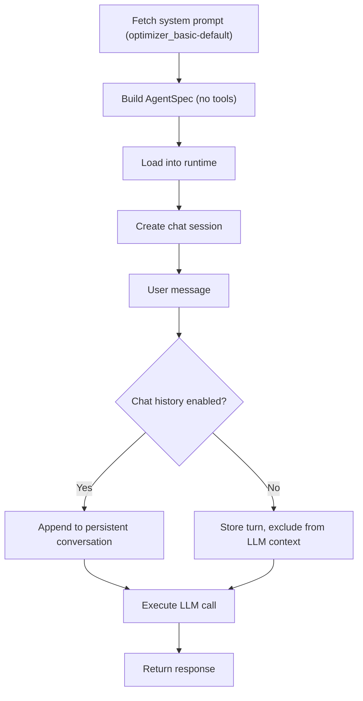

The LLM-Only agent provides a pure conversational experience with no tools or external data sources. It is the simplest agent in the **AI Optimizer**.

- The system prompt is fetched from the MCP server (`optimizer_basic-default`). If unavailable, a default instruction is used.
- `build_llm_only_agentspec` creates a portable AgentSpec Agent with no tools — pure LLM conversation.
- The session manages conversation state. Turns are always stored and returned by the history API. When `chat_history` is disabled, turns are excluded from future LLM context and remain available to inspect or clear through the history API.
- Failed turns are fully rolled back — the user message and any partial response are removed so subsequent turns are not corrupted.
