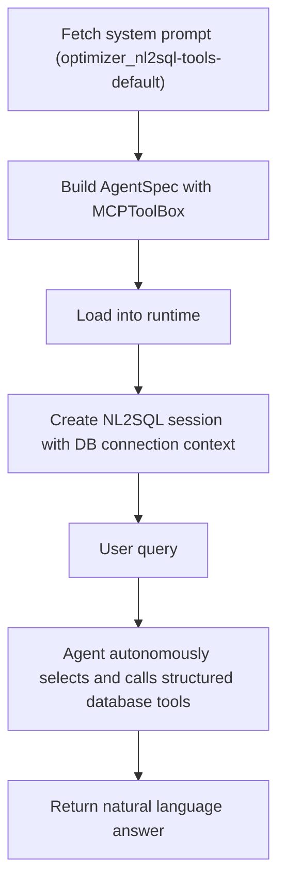

The [NL2SQL agent](./intro) enables natural language queries against structured data in [Oracle Database](../../client/configuration/databases).

- NL2SQL uses an **Agent** that autonomously selects from its fixed SQLcl connection, schema, query, and request-status tools using the ReAct pattern, rather than following a fixed pipeline.
- `build_nl2sql_agentspec` creates a portable AgentSpec Agent with an `MCPToolBox` restricted to `sqlcl_connect`, `sqlcl_schema_information`, `sqlcl_sql_run`, and `sqlcl_request_status`.
- The session augments the agent's system prompt with the configured database connection name, model, and thread ID so the LLM passes them to the SQL execution tool calls.
- The system prompt is fetched from the MCP server (`optimizer_nl2sql-tools-default`). If unavailable, a default instruction is used.
- Requires a configured structured [database connection](../../client/configuration/databases) and [SQLcl MCP Server](../../guides/sqlcl-mcp-server).
- SQLcl uses restrict level `4` by default. Database access is determined by the configured connection account; use an account with only the required permissions.
