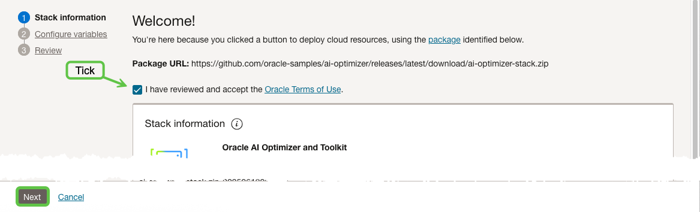
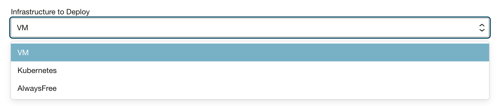
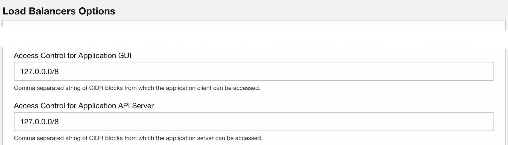
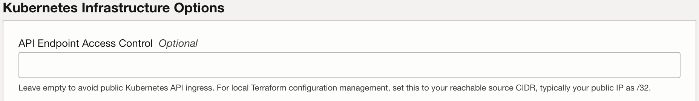
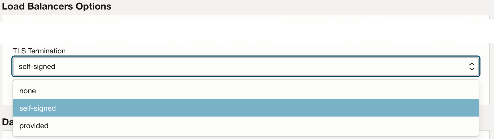
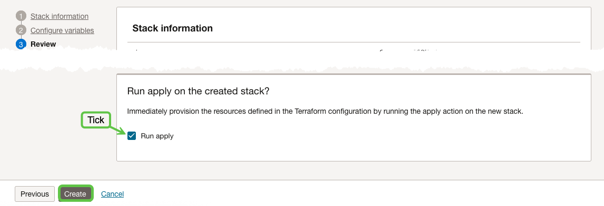
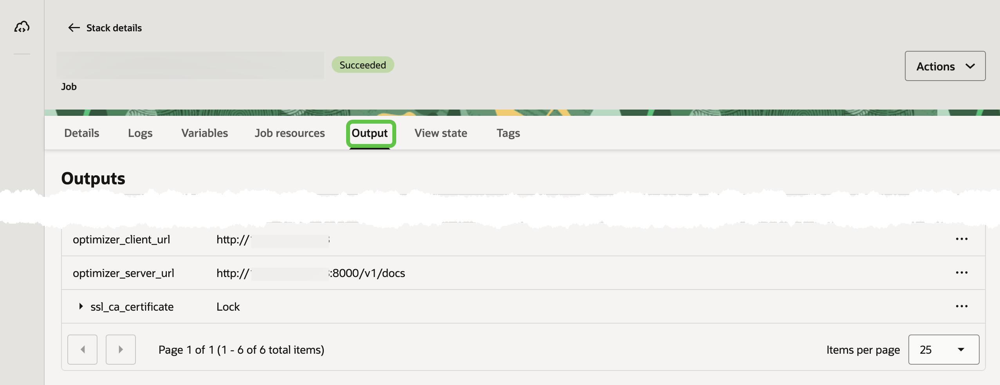

{/* Copyright (c) 2024, 2026, Oracle and/or its affiliates.
Licensed under the Universal Permissive License v1.0 as shown at http://oss.oracle.com/licenses/upl. */}

The **AI Optimizer** includes [OpenTofu](https://opentofu.org/) infrastructure as code (**IaC**) in the [`opentofu/`](https://github.com/oracle/ai-optimizer/tree/main/opentofu) directory for deploying into Oracle Cloud Infrastructure (OCI).  You can either deploy the IaC from [OCI Resource Manager](https://docs.oracle.com/en-us/iaas/Content/ResourceManager/Concepts/resourcemanager.htm) or from a local checkout using OpenTofu or Terraform.

The stack provisions compute, networking, load balancer, Oracle AI Database resources, and the **AI Optimizer** platform. It can provision a new Autonomous Database or connect the deployment to an existing Autonomous Database or other Oracle database.

## OCI Resource Manager

To get started with OCI Resource Manager, select **Deploy to Oracle Cloud**:

[](https://cloud.oracle.com/resourcemanager/stacks/create?zipUrl=https://github.com/oracle/ai-optimizer/releases/latest/download/ai-optimizer-iac.zip)

### Terms

After signing in to OCI, review and accept the terms.



Select **Next** to configure variables.

### Deployment Type

Choose the deployment type that suits your use case, then select it under **Infrastructure to Deploy**.

| Deployment | Use case |
| --- | --- |
| **AlwaysFree** | An Always Free-compatible VM deployment with a free-tier Autonomous Database. |
| **VM** | An all-in-one Server and Client deployment for development or small-scale use. |
| **Kubernetes** | Separate Server and Client deployments on Oracle Kubernetes Engine (OKE). |



### Options

The available compute, database, networking, and load-balancer options depend on the selected deployment type. The following sections highlight the common configuration choices.

#### Models and Compute

VM deployments can use a GPU shape. Kubernetes deployments can add a GPU node pool. A VM deployment can also install Ollama and pull the default models; CPU-only Ollama deployments are intended for development use. For model configuration after deployment, see [AI Models](../guides/ai-models).

:::note[Models Needed]
GPU deployments install Ollama and pull the default models. For a CPU VM deployment, select **Install Ollama** to do the same; otherwise, configure a model before using model-dependent features.
:::

#### Network

**Access Control for Application GUI** controls browser access to the Client, and **Access Control for Application API Server** controls direct access to the Server API. Both values accept comma-separated CIDR ranges. Their default, `127.0.0.0/8`, does not permit access from external client networks.

:::warning[Access Denied]
The default access-control values block external clients. Before using the Client or Server, replace them with the smallest CIDR ranges required for your client networks. For an individual workstation, use a single-host `/32` range.
:::

To use the Client, set **Access Control for Application GUI** under **Load Balancer Options** to the smallest CIDR ranges required for your users. If users or applications call the Server API directly, also set **Access Control for Application API Server**.


For example:

```text
192.168.1.0/24,10.0.0.0/16,203.0.113.42/32
```

#### Database

To provision a new Autonomous Database, leave **Bring Your Own Oracle Database?** unselected. To connect to an existing Autonomous Database or other Oracle database, select it, choose the value under **Bring Your Own Database - Type**, and provide its connection details.

#### Kubernetes API Endpoint

For OKE, leave **API Endpoint Access Control** empty when deploying through Resource Manager.



#### TLS

The stack terminates TLS at the load balancer. Set **TLS Termination** to one of the following:

- `none` for HTTP only.
- `self-signed` to generate a certificate. Retrieve the sensitive `ssl_ca_certificate` stack output and add it to the trust store of browsers, operating systems, or other clients that connect to the deployment.
- `provided` to supply PEM-encoded certificate and private-key content.



For the application's other TLS deployment options, see [TLS / HTTPS](./tls).

### Review and Apply

Review the plan and costs, then select **Apply** to create the stack.



### Outputs

After the apply job succeeds, use the stack outputs to open the Client or Server API URL. The Server output points to its OpenAPI documentation. Initial image pulls and application startup can take several minutes after the infrastructure job completes. If a URL is not ready, wait a few minutes and try again.



### Clean Up

To remove a Resource Manager deployment, open its stack in OCI and select **Destroy**.

## OpenTofu

Use OpenTofu or Terraform 1.5 or later when deploying from a local checkout. Before continuing, follow the [OpenTofu README](https://github.com/oracle/ai-optimizer/tree/main/opentofu) to configure prerequisites and OCI credentials. Then start from the example closest to your deployment:

| Example | Deployment |
| --- | --- |
| [`vm-new-adb.tfvars`](https://github.com/oracle/ai-optimizer/blob/main/opentofu/examples/vm-new-adb.tfvars) | VM with a new Autonomous Database |
| [`vm-byo-adb.tfvars`](https://github.com/oracle/ai-optimizer/blob/main/opentofu/examples/vm-byo-adb.tfvars) | VM with an existing Autonomous Database |
| [`vm-byo-other-db.tfvars`](https://github.com/oracle/ai-optimizer/blob/main/opentofu/examples/vm-byo-other-db.tfvars) | VM with another Oracle database |
| [`k8s-new-adb.tfvars`](https://github.com/oracle/ai-optimizer/blob/main/opentofu/examples/k8s-new-adb.tfvars) | OKE with a new Autonomous Database |
| [`k8s-byo-other-db.tfvars`](https://github.com/oracle/ai-optimizer/blob/main/opentofu/examples/k8s-byo-other-db.tfvars) | OKE with another Oracle database |
| [`always-free.tfvars`](https://github.com/oracle/ai-optimizer/blob/main/opentofu/examples/always-free.tfvars) | Always Free VM and Autonomous Database |

If you choose an OKE example, set `k8s_api_endpoint_allowed_cidrs` to a reachable source CIDR, typically your public IP address with a `/32` suffix.

The example files contain placeholders. Copy one to `terraform.tfvars`, replace the OCI and database values, then run:

```bash
cd opentofu
cp examples/vm-new-adb.tfvars terraform.tfvars
tofu init
tofu plan
tofu apply
```

### Clean Up

To remove a local deployment, run:

```bash
cd opentofu
tofu destroy
```

Review the destruction plan before confirming it. This removes resources managed by the stack.
