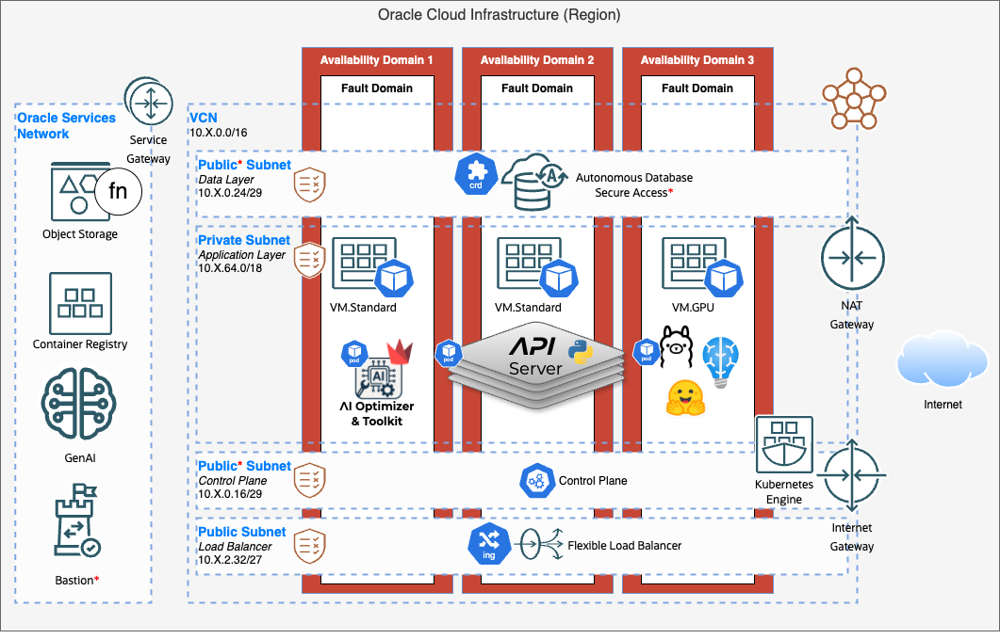

{/* Copyright (c) 2024, 2026, Oracle and/or its affiliates.
Licensed under the Universal Permissive License v1.0 as shown at http://oss.oracle.com/licenses/upl. */}

import {GitHubSourceExtract, GitHubSourceLink} from '@site/src/components/GitHubSourceLink';

The **AI Optimizer** is designed to run in container orchestration environments such as [Kubernetes](https://kubernetes.io/), including managed [Oracle Kubernetes Engine (OKE)](https://www.oracle.com/uk/cloud/cloud-native/kubernetes-engine/). The Helm chart deploys separate Server and Client workloads, with optional Ollama and Oracle AI Database resources. For `ADB-S` deployments, the chart can use the [Oracle Database Operator](https://github.com/oracle/oracle-database-operator).



<sub>OCI OKE deployment with separate Server and Client workloads and a GPU node pool for model inference.</sub>

## Prerequisites

A **container runtime**, such as [Podman](https://podman.io/) or [Docker](https://www.docker.com/), is required to build the Server and Client images.

:::note

The command examples use a Linux/macOS-compatible shell and Podman. Where applicable, replace `podman` with `docker` to use Docker.

:::

**Helm 3** is required to install the chart. The Helm CLI can be installed from [https://helm.sh/docs/intro/install/](https://helm.sh/docs/intro/install/).

⭐️ Depending on the deployment path, you may also need additional tools, which are documented in each path.

### Download and Extract the AI Optimizer

<GitHubSourceExtract />

### Build the Server and Client Images

```bash
APP_VERSION="$(sed -nE 's/^__version__ = "([^"]+)"/\1/p' src/_version.py)"

podman build -f src/client/Dockerfile -t localhost/ai-optimizer-client:${APP_VERSION} .
podman build -f src/server/Dockerfile -t localhost/ai-optimizer-server:${APP_VERSION} .
```

:::note[Use pinned images]
The chart rejects `latest`, `head`, and `canary` image tags. Use the same immutable version in the image tags and chart configuration.
:::

### Helm Chart Repository

Add the published chart repository:

```bash
helm repo add ai-optimizer https://oracle.github.io/ai-optimizer/helm
helm repo update
```

## Choose a Deployment Path

- **Existing cluster:** Tag the built images for a registry your cluster can access, push them, then install the Helm chart.
- **Local evaluation:** Use [Kind](https://kind.sigs.k8s.io/) to load the built images directly into a local Kubernetes cluster. Skip to [Try It Locally with Kind](#try-it-locally-with-kind).

## Deploy to an Existing Cluster

**Additional Requirements:**

- Kubernetes 1.23+
- `kubectl` configured for the target cluster.

### Push the Images to a Registry

Set the registry host and namespace that your cluster can access, then sign in before pushing images.

For example, if using the [Oracle Cloud Infrastructure Container Registry (**OCIR**)](https://www.oracle.com/uk/cloud/cloud-native/container-registry/) in the Ashburn region, use:

```bash
REGISTRY_HOST="iad.ocir.io"
REGISTRY="${REGISTRY_HOST}/<registry-namespace>"

podman login "${REGISTRY_HOST}"
```

Where `<registry-namespace>` is your tenancy and compartment path, such as `mytenancy/mycompartment`.

Tag the images for the registry, then push them:

```bash
podman tag localhost/ai-optimizer-client:${APP_VERSION} \
  ${REGISTRY}/ai-optimizer-client:${APP_VERSION}
podman tag localhost/ai-optimizer-server:${APP_VERSION} \
  ${REGISTRY}/ai-optimizer-server:${APP_VERSION}

podman push ${REGISTRY}/ai-optimizer-client:${APP_VERSION}
podman push ${REGISTRY}/ai-optimizer-server:${APP_VERSION}
```

### Create Kubernetes Secrets

Create a namespace, the API key used by the Client and Server, and the Client cookie-signing key:

```bash
kubectl create namespace ai-optimizer
kubectl -n ai-optimizer create secret generic optimizer-api-key \
  --from-literal=apiKey="$(openssl rand -base64 32)"
kubectl -n ai-optimizer create secret generic optimizer-cookie-key \
  --from-literal=cookieSecret="$(openssl rand -base64 32)"
```

If your image registry is private, also create a registry pull Secret. Substitute the credentials supplied by your registry:

```bash
kubectl -n ai-optimizer create secret docker-registry registry-creds \
  --docker-server="${REGISTRY_HOST}" \
  --docker-username='<registry-username>' \
  --docker-password='<registry-password>'
```

### Create a Values File

Helm uses a YAML configuration file, conventionally named `values.yaml`, to describe a deployment.

Create its directory in the repository root:
```bash
mkdir -p deploy
```

Then create `deploy/values.yaml` with the following starter configuration.

Replace `<registry-host>/<registry-namespace>` with the `${REGISTRY}` value used to tag and push the images, and replace `<version>` with the `${APP_VERSION}` value used to build them.

```yaml
global:
  api:
    secretName: optimizer-api-key

server:
  image:
    repository: <registry-host>/<registry-namespace>/ai-optimizer-server
    tag: "<version>"

client:
  image:
    repository: <registry-host>/<registry-namespace>/ai-optimizer-client
    tag: "<version>"
  cookieSecretName: optimizer-cookie-key
```

For a private registry, add the pull Secret to the existing `global:` section:

```yaml
global:
  imagePullSecrets:
    - registry-creds
```

When two examples use the same top-level key, such as `server:`, add their settings to the existing section rather than duplicating the key. The chart's complete <GitHubSourceLink path="helm/values.yaml"><code>values.yaml</code></GitHubSourceLink> lists every available option.

:::danger[Keep secrets out of values files]
Use Kubernetes Secrets rather than committing credentials to a values file.
:::

### Configure the Database

Choose a database mode when the deployment needs a chart-managed or external Oracle database. To run the Server without a database configuration, leave `server.database.type` empty. The chart then omits database resources and database environment variables; database-backed features such as RAG and NL2SQL are unavailable.

| Mode | Use when | Notes |
| --- | --- | --- |
| `SIDB-FREE` | Running Oracle Database Free in the cluster. | Requires a pinned database image. Its data is ephemeral unless you enable persistent storage. |
| `ADB-FREE` | Running Autonomous Database Free in the cluster. | Requires a pinned database image. Its data is ephemeral unless you enable persistent storage. |
| `ADB-S` | Connecting to an OCI Autonomous Database. | Requires the Oracle Database Operator CRD when the chart creates the database resource. |
| `OTHER` | Connecting to another Oracle database. | Requires connection details and usable credentials in a Secret. |

For `SIDB-FREE`, use:

```yaml
server:
  database:
    type: SIDB-FREE
    image:
      repository: container-registry.oracle.com/database/free
      tag: "<pinned-database-image-tag>"
```

For `ADB-FREE`, use:

```yaml
server:
  database:
    type: ADB-FREE
    image:
      repository: container-registry.oracle.com/database/adb-free
      tag: "<pinned-database-image-tag>"
```

The extracted source archive also includes complete local examples in `helm/examples/values-kind-sidb-free.yaml` and `helm/examples/values-kind-adb-free.yaml`.

For `SIDB-FREE` and `ADB-FREE`, enable persistent storage to keep database data when the database Pod is replaced. The chart creates a PersistentVolumeClaim and uses the cluster's default storage class unless you specify `storageClass`:

```yaml
server:
  database:
    persistence:
      enabled: true
      storageClass: fast-ssd # optional; omit to use the cluster default
      size: 50Gi
```

The claim is retained when you uninstall the release so you can recover the database. Set `global.cleanupPVCs=true` only when Helm should delete chart-managed PVCs with the release.

For an external database, first create a Secret containing the credentials:

```bash
kubectl -n ai-optimizer create secret generic db-authn \
  --from-literal=username='<database-username>' \
  --from-literal=password='<database-password>' \
  --from-literal=service='mydbhost.example.com:1521/MYSERVICE'
```

Then add its connection details:

```yaml
server:
  database:
    type: OTHER
    other:
      dsn: "mydbhost.example.com:1521/MYSERVICE"
    authn:
      secretName: db-authn
```

For `ADB-S`, provide the database OCID and TNS alias. On OKE, set `oke: true` to use workload identity; the required IAM policies must already exist:

```yaml
server:
  database:
    type: ADB-S
    oci:
      ocid: "ocid1.autonomousdatabase.oc1..."
    adb:
      serviceName: myadb_low
  ociConfig:
    oke: true
    region: us-ashburn-1
```

For an `ADB-S` deployment outside OKE, configure OCI credentials for OraOperator by following the [OraOperator project](https://github.com/oracle/oracle-database-operator). Then reference the ConfigMap and API-key Secret that it creates:

```yaml
server:
  ociConfig:
    configMapName: <operator-config-map>
    keySecretName: <operator-api-key-secret>
```

For database connection requirements, see [Database](../guides/database).

### Optional Configuration

#### OCI and Model Credentials

For a non-OKE installation, the packaged helper generates an `oci-config-file` Kubernetes Secret from your OCI config file. It requires Python 3 but no third-party Python packages.

```bash
python3 helm/scripts/oci_config.py \
  --config ~/.oci/config \
  --namespace ai-optimizer |
  kubectl apply -f -
```

Reference it in the existing `server:` section to make the configuration available to the running Server:

```yaml
server:
  ociConfig:
    fileSecretName: oci-config-file
```

This Secret does not configure OraOperator for an `ADB-S` deployment; use the OraOperator guidance above for that case. See [Oracle Cloud Infrastructure](../guides/oracle-cloud-infra) for Server authentication methods.

To use a third-party model provider, create its API-key Secret and reference it in the existing `server:` section. For example:

```bash
kubectl -n ai-optimizer create secret generic openai-secret \
  --from-literal=apiKey='<api-key>'
```

```yaml
server:
  models:
    openai:
      secretName: openai-secret
      secretKey: apiKey
```

For model configuration after deployment, see [AI Models](../guides/ai-models).

#### Application Settings

Add application environment settings through the chart-managed environment Secret:

```yaml
server:
  envSecret:
    content:
      AIO_LOG_LEVEL: INFO
      AIO_GENAI_REGION: us-chicago-1
```

Values in `server.envSecret.content` override chart-generated dotenv settings. Process environment values injected into the pod take precedence over the dotenv file. See [Environment Variables](../guides/env-vars) for application settings.

#### Client and Ollama

The Client is enabled by default. Disable it only when another client will connect to the Server:

```yaml
client:
  enabled: false
```

Ollama is disabled by default. Enable it only on a cluster with suitable CPU, memory, and—where required by the selected models—GPU scheduling:

```yaml
ollama:
  enabled: true
  resources:
    limits:
      nvidia.com/gpu: 1
```

#### Observability

Set `server.otel.enabled` to export OpenTelemetry data to your own collector. Provide an endpoint for a separately deployed SigNoz, Jaeger, Tempo, or vendor collector:

```yaml
server:
  otel:
    enabled: true
    endpoint: http://signoz-otel-collector.observability.svc.cluster.local:4317
    insecure: true # plaintext gRPC inside the cluster
    resourceAttributes:
      service.namespace: ai-optimizer
    # logsEnabled: true # opt-in; review backend retention first
    headersSecret:
      name: otel-headers
```

Alternatively, enable the bundled SigNoz stack. The chart automatically sets the server's OTLP endpoint to the in-cluster collector; configure only the OpenTelemetry options that differ from their defaults:

```yaml
signoz:
  enabled: true
server:
  otel:
    enabled: true
    insecure: true # the in-chart collector serves plaintext gRPC
```

The published image already includes the `[otel]` extra, so `enabled: true` works with the default image. Within Kubernetes, `service.instance.id` uses `HOSTNAME` (the pod name), and `deployment.environment` uses the chart's `global.env` value.

When tracing is enabled, the chart requires an endpoint unless `tracesExporter: console` is configured for local debugging or `signoz.enabled=true` provides the in-chart collector. `helm template` and `helm install` fail fast when no usable tracing endpoint is available.

:::note[SigNoz storage]
The bundled observability components require substantial memory and retain their persistent volumes after uninstall. Set `global.cleanupPVCs=true` only when you intend to delete the chart-managed database and telemetry storage.
:::

For instrumentation coverage, local and container deployment, and trace investigation, see [Observability](./observability/intro).

### Install or Upgrade

Install the published chart using the values file in the extracted source directory:

```bash
helm upgrade --install ai-optimizer ai-optimizer/ai-optimizer \
  --version "${APP_VERSION}" \
  --namespace ai-optimizer \
  --create-namespace \
  --values deploy/values.yaml
```

### Access the Client

With the Client enabled, access it locally:

```bash
kubectl -n ai-optimizer port-forward svc/ai-optimizer-client-http 8501:8501
```

Open `http://localhost:8501` in a browser.

### HTTPS and Public Access

For public Kubernetes access, terminate TLS at an ingress or gateway. The <GitHubSourceLink path="helm#example-6-ingress-with-tls" type="tree">Helm chart ingress TLS example</GitHubSourceLink> shows how to create a Kubernetes TLS Secret and reference it from the Server and Client ingress values.

You can enable TLS directly on a Client pod when it is accessed without ingress or gateway TLS. Set `client.ssl.enabled` to `true`; this also configures the Client health probes for HTTPS. To use a certificate stored in a Secret, mount it and supply its paths:

```yaml
client:
  ssl:
    enabled: true
    certFile: /app/tls/tls.crt
    keyFile: /app/tls/tls.key
  volumes:
    - name: tls
      secret:
        secretName: client-tls
  volumeMounts:
    - name: tls
      mountPath: /app/tls
      readOnly: true
```

## Try It Locally with Kind

**Additional Requirements:**

- [Kind](https://kind.sigs.k8s.io/)

### Create a Kind Cluster

Create `kind-cluster-config.yaml` with a port mapping from `localhost:8501` to the Client's NodePort:

```yaml
kind: Cluster
apiVersion: kind.x-k8s.io/v1alpha4
nodes:
  - role: control-plane
    extraPortMappings:
      - containerPort: 30080
        hostPort: 8501
        listenAddress: "127.0.0.1"
        protocol: TCP
```

The packaged Kind values file configures the Client Service to use the matching NodePort, `30080`. Create the cluster with the configuration file:

```bash
kind create cluster -n ai-optimizer --config kind-cluster-config.yaml
```

### Load the Images

```bash
kind load docker-image localhost/ai-optimizer-client:${APP_VERSION} -n ai-optimizer
kind load docker-image localhost/ai-optimizer-server:${APP_VERSION} -n ai-optimizer
```

:::note[Local Kind credentials]
The following command generates temporary inline API and cookie secrets for local evaluation. For a shared or persistent deployment, use Kubernetes Secrets as described in [Create Kubernetes Secrets](#create-kubernetes-secrets).
:::

### Install the Chart

```bash
helm upgrade --install ai-optimizer ai-optimizer/ai-optimizer \
  --version "${APP_VERSION}" \
  --namespace ai-optimizer \
  --create-namespace \
  --set-string global.api.apiKey="$(openssl rand -base64 32)" \
  --set-string client.cookieSecret="$(openssl rand -base64 32)" \
  --set-string server.image.tag="${APP_VERSION}" \
  --set-string client.image.tag="${APP_VERSION}" \
  --values helm/examples/values-kind-sidb-free.yaml
```

### Access the Client

After the installation completes, open `http://localhost:8501` in a browser.
