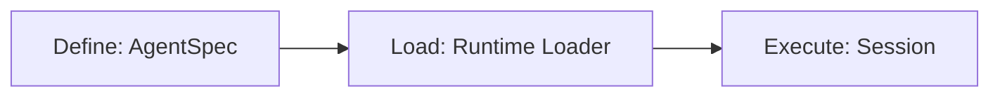

+++
title = 'Agents and Flows'
weight = 30
+++
<!--
Copyright (c) 2024, 2026, Oracle and/or its affiliates.
Licensed under the Universal Permissive License v1.0 as shown at http://oss.oracle.com/licenses/upl.

spell-checker: ignore agentspec pyagentspec vecsearch
-->

The  uses [Oracle AgentSpec](https://oracle.github.io/agent-spec/development/) to define its AI agents and flows as portable, serializable configurations. These configurations are loaded into [LangGraph](https://langchain-ai.github.io/langgraph/) for execution.

## What is AgentSpec?

AgentSpec is Oracle's Open Agent Specification. It provides a standard way to define two primary building blocks: **Agents** and **Flows**.

**Agents** are LLM-powered conversational assistants, optionally equipped with tools (e.g., the ReAct pattern). They are defined with a system prompt, an LLM configuration, and a set of tools.

**Flows** are structured DAGs (directed acyclic graphs) of connected nodes that form precise action sequences. Each node performs a specific task such as calling an LLM, invoking a tool, or branching on a condition, and edges wire them together.

AgentSpec configurations are pure data (JSON/YAML). They contain no executable code, which makes them portable across runtimes and safe to serialize, version, and share.

## How They Work Together

Every agent in this project follows a three-stage pattern:



### 1. Define — AgentSpec Layer

Agent and flow definitions live in the `agentspec/` package. This layer uses only `pyagentspec` SDK classes and produces portable configurations with no runtime dependencies.

Builder functions create the AgentSpec definitions:
- `build_llm_only_agentspec()` — pure LLM conversation agent (no tools)
- `build_nl2sql_agentspec()` — NL2SQL agent with dynamic MCP tool discovery
- `build_vecsearch_flow()` — RAG pipeline flow with conditional nodes

Each builder takes the user's client settings (model provider, model ID, temperature, etc.) and constructs a complete AgentSpec definition.

### 2. Load — Runtime Loader

The runtime loader converts an AgentSpec definition into engine-specific objects. A plugin system handles custom components — for example, the **LiteLLM plugin** converts the AgentSpec LLM configuration into the appropriate model adapter.

For agents and flows that use MCP tools, the loader ensures the MCP transport is configured for API-key-based authentication.

### 3. Execute — Session Layer

Once loaded, agents and flows are executed through session objects that manage conversation state, chat history, and error handling.

### Error Handling

All session objects catch exceptions raised during execution. When a flow or agent call fails:

- The error is logged at ERROR level on the server.
- The caller receives a generic error string (`"An error occurred while processing your request."`) instead of an unhandled exception.
- For agent sessions, failed turns are fully rolled back — the user message and any partial assistant messages are removed from conversation history, so subsequent turns are not corrupted.
- For flow sessions, failed turns are simply not appended to history.

### Prompt Fetching

All agents and flows attempt to fetch their system prompt from the MCP server. If the MCP server is unavailable, a hardcoded default instruction is used instead. This allows prompts to be managed externally without breaking the system.

## Porting Specs to Your Own Application

AgentSpec definitions are pure data — they can be exported, modified, and loaded into any compatible runtime. The  exposes all its specs through a REST API so developers can inspect and reuse them.

### Fetching Specs

| Endpoint | Description |
|----------|-------------|
| `GET /agentspec/specs` | Returns all specs as serialized JSON |
| `GET /agentspec/specs/{name}` | Returns a single spec by name |

Available specs:

| Name | Type | Description |
|------|------|-------------|
| `llm_only` | Agent | LLM-only conversational agent (no tools) |
| `nl2sql_agent` | Agent | NL2SQL agent with dynamic MCP tool discovery |
| `vecsearch_flow` | Flow | RAG pipeline: rephrase → retrieve → grade → answer |

### Loading a Spec in Your Application

Save the JSON response from the API, then deserialize and load it:

```python
from pyagentspec.serialization import AgentSpecDeserializer

# Deserialize from JSON
component = AgentSpecDeserializer().from_json(spec_json)
```

AgentSpec is runtime-agnostic — the same JSON can be loaded into LangGraph, WayFlow, CrewAI, AutoGen, or any other framework with an AgentSpec adapter.

### Customizing Before Loading

Since specs are plain JSON/YAML, you can modify them before loading:

- **Swap the LLM provider** — change `provider` and `model_id` in the LLM config to use OpenAI, OCI GenAI, or any LiteLLM-supported provider.
- **Change the MCP server** — update the transport URL and headers to point to your own tool server.
- **Adjust prompts** — edit system prompts, node instructions, or prompt templates to fit your domain.
- **Add or remove nodes** — modify the flow DAG to add validation steps, logging, or custom branching logic.
