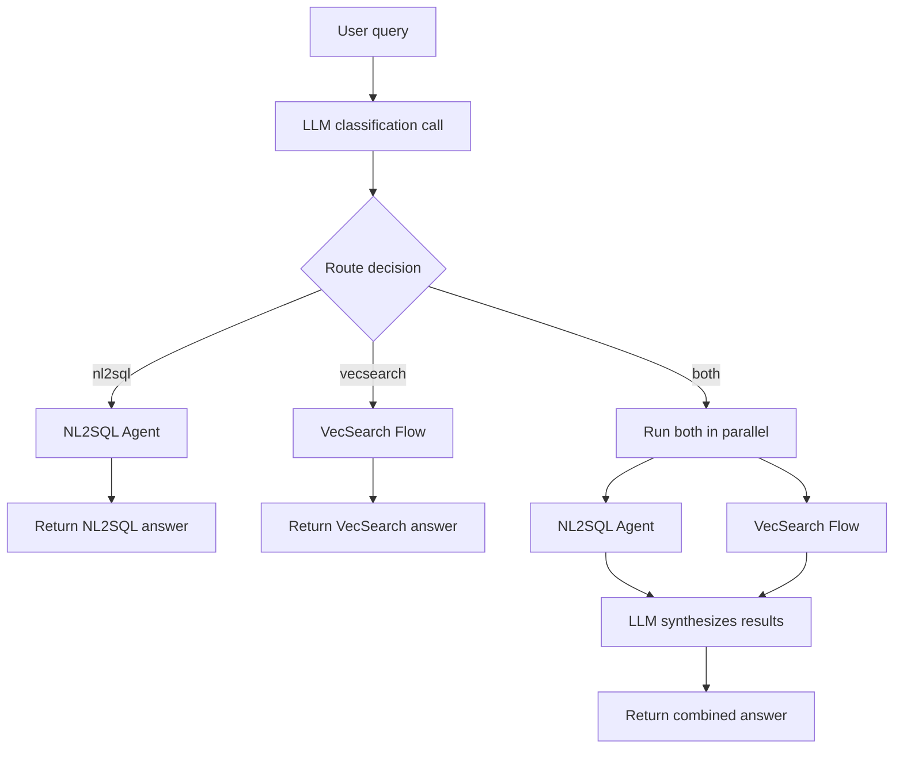

The Combined session is an orchestrator that routes queries to VecSearch, NL2SQL, or both. Unlike the other agents and flows, it does not have an AgentSpec definition — it coordinates existing sub-sessions at runtime.

- The classifier prompts the LLM to respond with exactly one word — `nl2sql`, `vecsearch`, or `both` — based on the user's question. Unrecognized responses default to `both`.
- When routed to a single tool, the query is dispatched directly to the corresponding sub-session.
- When routed to `both`, the sub-sessions run in parallel. The results are then fed into a synthesis LLM call to produce a unified response.
- The system prompt is fetched from the MCP server (`optimizer_tools-default`). If unavailable, a default instruction is used.
- Token usage from the classifier, sub-sessions, and synthesis calls is aggregated.
- Requires both a configured [VecSearch](vecsearch/) flow and an [NL2SQL](nl2sql/) agent to be available.
