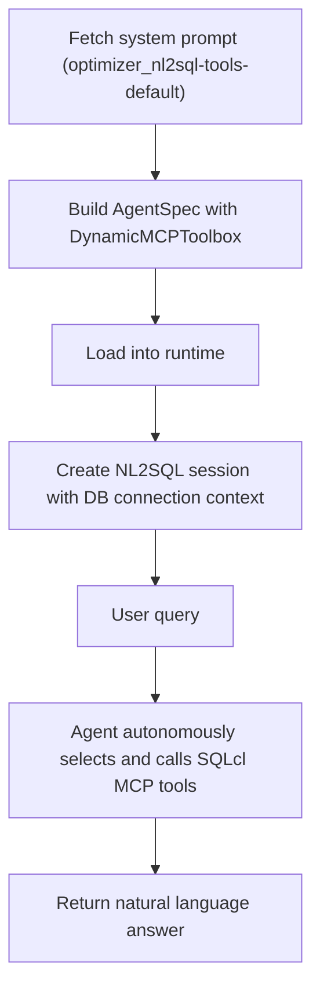

The NL2SQL agent enables natural language queries against structured data in Oracle Database via the SQLcl MCP server.

- NL2SQL uses an **Agent** with dynamic MCP tool discovery — it autonomously decides which SQLcl tools to call using the ReAct pattern, rather than following a fixed pipeline.
- `build_nl2sql_agentspec` creates a portable AgentSpec Agent with a `DynamicMCPToolbox` that discovers available SQLcl tools at runtime (e.g. `sqlcl_connect`, `sqlcl_schema-information`, `sqlcl_run-sql`).
- The session augments the agent's system prompt with the configured database connection name, model, and thread ID so the LLM passes them to `sqlcl_*` tool calls.
- The system prompt is fetched from the MCP server (`optimizer_nl2sql-tools-default`). If unavailable, a default instruction is used.
- Requires a configured [SQLcl MCP Server](https://docs.oracle.com/en/database/oracle/sql-developer-command-line/25.2/sqcug/using-oracle-sqlcl-mcp-server.html) and a database connection.
