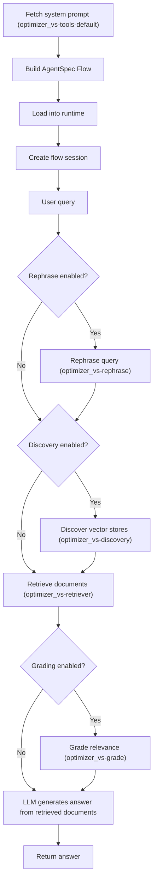

The VecSearch flow implements a Retrieval-Augmented Generation (RAG) pipeline with conditional nodes for query rephrasing, store discovery, retrieval, and document grading. It is exposed through the AgentSpec REST API under the name `vecsearch_flow`.

- The system prompt is fetched from the MCP server (`optimizer_vs-tools-default`). If unavailable, a default instruction is used.
- `build_vecsearch_flow` creates a portable AgentSpec Flow with conditional nodes based on the user's vector search settings (rephrase, discovery, grade).
- **Rephrase** (`optimizer_vs-rephrase`) rewrites the user question using conversation history to improve retrieval quality.
- **Discovery** (`optimizer_vs-discovery`) lists available vector stores when AutoRAG is enabled, allowing the LLM to select the most relevant store.
- **Retriever** (`optimizer_vs-retriever`) performs the core vector similarity search and always runs.
- **Grade** (`optimizer_vs-grade`) filters retrieved documents for relevance before answer generation.
- The final LLM node generates the answer using the system prompt and the retrieved (or graded) documents.
- Unlike NL2SQL, VecSearch does not require a database connection name — it operates entirely through vector search MCP tools.
- When the selected chat model has fewer than 7 billion parameters, the rephrase and grade nodes are automatically disabled to optimize performance. See [Model Configuration](/client/configuration/models/#automatic-optimization) for details.
