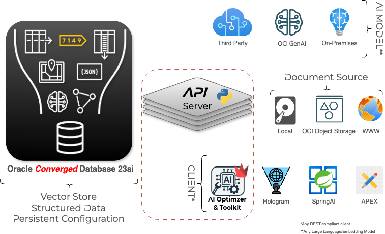
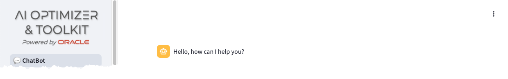

+++
title = 'AI Optimizer'
weight = 20
+++

<!--
Copyright (c) 2024, 2025, Oracle and/or its affiliates.
Licensed under the Universal Permissive License v1.0 as shown at http://oss.oracle.com/licenses/upl.

spell-checker:ignore streamlit, uvicorn
-->

The  consists of an API Server ([**ai-optimizer-server**](#api-server-ai-optimizer-server)) and an _optional_ web-based GUI ([**ai-optimizer-client**](#client-ai-optimizer-client)) component.  Both the API Server and GUI can be run on bare-metal or inside containers.  

The following additional components, not delivered with the , are also required.  These can be run On-Premises or in the Cloud:
- [Oracle AI Database](#database), including [Oracle AI Database **Free**](https://www.oracle.com/database/free)
- Access to at least one [Large Language Model](#large-language-model)
- Access to at least one [Embedding Model](#embedding-model) (for Retrieval Augmented Generation)

The  is specifically designed to run in container orchestration systems, such as [Kubernetes](https://kubernetes.io/).  For more information on deploying the  in Kubernetes, using a Helm Chart, please review the [Advanced - Helm Chart](/advanced/helm) documentation.

## API Server (AI Optimizer Server)

The workhorse of the  is the API Server, referred to as the **AI Optimizer Server**.  By default, the **AI Optimizer Server** will start on port 8000

{}
The **AI Optimizer Server** API documentation can be accessed at `http://<IP Address>:<Port>/v1/docs#` of a running instance. 
{}

Powered by [FastAPI](https://fastapi.tiangolo.com/) and [Uvicorn](https://www.uvicorn.org/), the **AI Optimizer Server** acts as an intermediary between the clients, AI Models, and the Oracle Database.

## Client (AI Optimizer Client)

The provided web-based GUI client is built with [Streamlit](https://streamlit.io/) and interacts with the API Server via REST calls.  

{}
You can develop and replace the provided client with any REST capable client.
{}

## Database

[Oracle AI Database](https://www.oracle.com/database), including [Oracle AI Database **Free**](https://www.oracle.com/database/free) provides a persistent data store for the .  

{}
<!-- Hard-coding AI Optimizer to avoid unsafe HTML, this is an exception -->
The **AI Optimizer** can be used to interact with language models without having the database configured, but additional functionality such as RAG, will not be available without the database.
{}

Oracle AI Database provides:

- the Vector Store for split and embedded documents used for Retrieval Augmented Generation (RAG).
- storage for the [Testbed](testbed) Q&A Test Sets and Evaluations
- storage of  settings and configuration

## Document Source

Access to document sources for the purpose of embedding and populating the Vector Storage is provided. Documents can be accessed from your local storage, OCI Object Storage, or from a web page.

## AI Models

The  provides the ability to connect to any language or embedding model to be used for completions and creating vectors.  Adding, Deleting, and Modifying access to AI Models is quick and easy.
