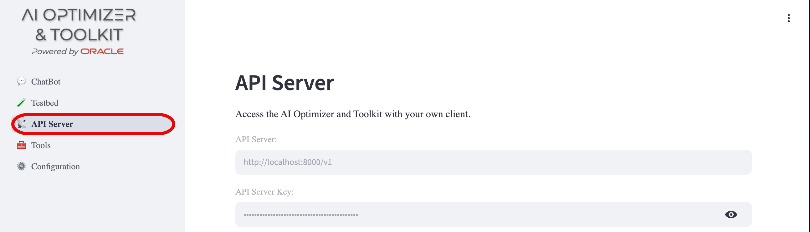
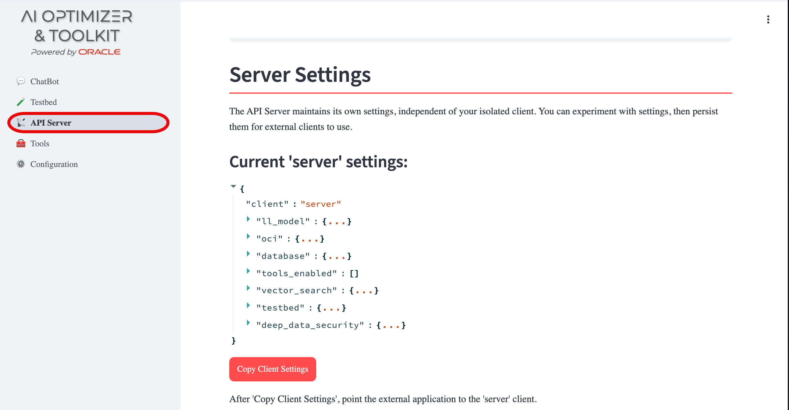
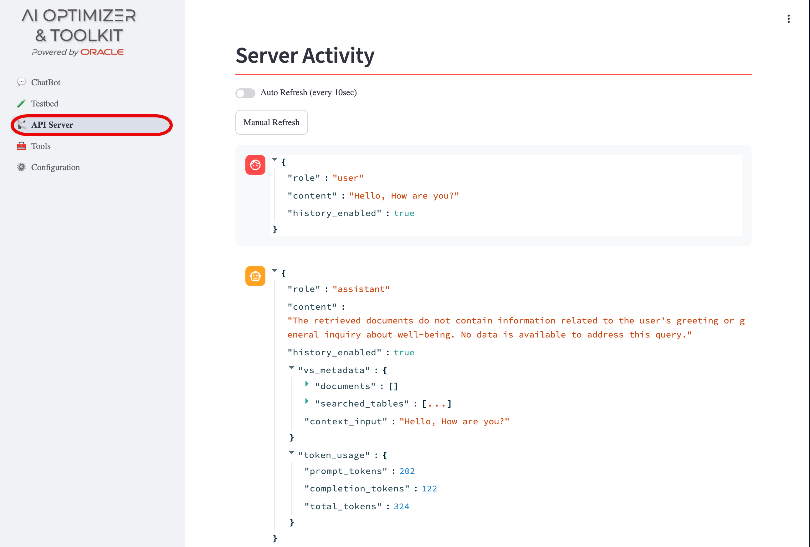

{/* Copyright (c) 2024, 2026, Oracle and/or its affiliates.
Licensed under the Universal Permissive License v1.0 as shown at http://oss.oracle.com/licenses/upl. */}

The **Oracle AI Optimizer and Toolkit** (the **AI Optimizer**) includes an API Server that lets compatible clients access its features. The API Server can run with the provided **AI Optimizer** GUI client (the "All-in-One" deployment) or as a separate process.

Connected clients share database, model, OCI, and prompt configurations. This shared catalog avoids duplicating connection details, credentials, and model definitions for every client that uses the same API Server.

Each client separately selects a database, language model, OCI profile, enabled tools, and Vector Search options. This lets users run independent experiments while using the same shared resources. A client ID partitions these settings and conversation history, but it is not a security or tenant-isolation boundary.

For deployment guidance when multiple users share an API Server, including how to protect shared configuration and isolate untrusted workloads, see [Access Control](../guides/access-control).

## Server Configuration

When the API Server starts, it creates a `server` client from the configured client settings if one does not already exist. The `server` client is the default for external chat calls that do not specify a client. To copy the current GUI client's settings to the `server` client for use by external applications, click **Copy Client Settings**.

The **API Server Key** field shows the key external clients use to authenticate with the API Server. In All-in-One deployments, the **AI Optimizer** client creates and shares this key with the API Server when one has not been configured. When running the API Server as a standalone process, configure `AIO_API_KEY` explicitly and distribute it through your normal secret-management process.

For API request details, see [AI Optimizer Server](../server/intro).

You can review the `server` client's settings by expanding the `{...}` brackets. The copy action transfers client-specific settings only; shared configuration remains unchanged, and runtime-only Deep Data Security settings are not copied.

## Server Activity

Server Activity displays chat interactions that use the `server` client. Toggle **Auto Refresh** or select **Manual Refresh** to view interactions from outside the **AI Optimizer** GUI client.

