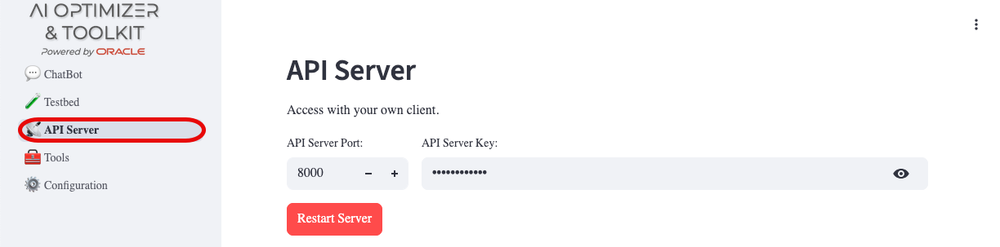
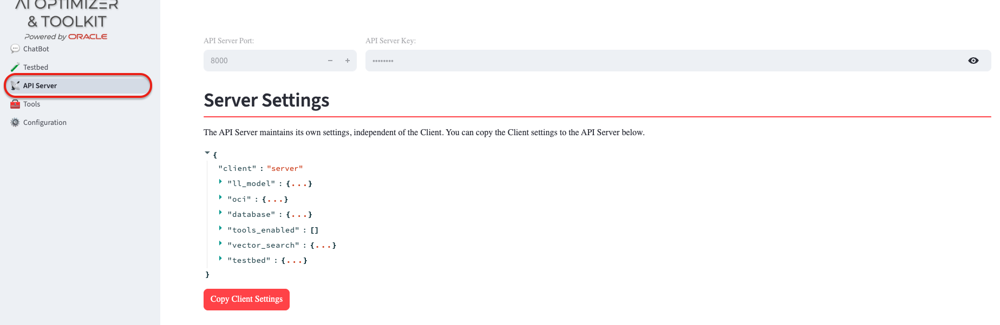
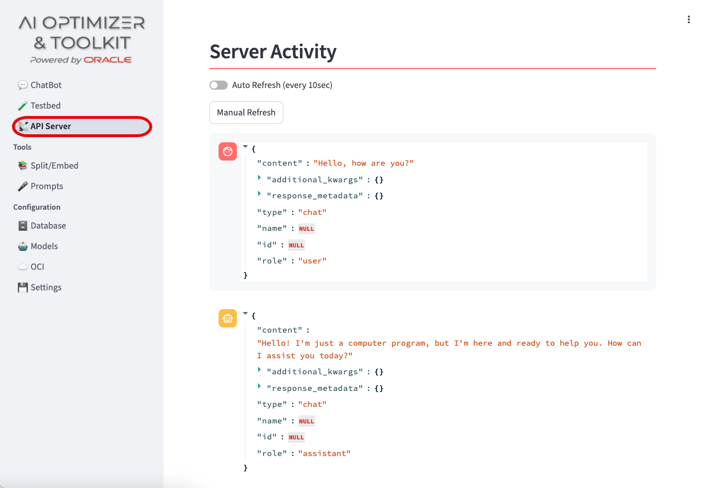

+++
title = '📡 API Server'
weight = 35
+++
<!--
Copyright (c) 2024, 2026, Oracle and/or its affiliates.
Licensed under the Universal Permissive License v1.0 as shown at http://oss.oracle.com/licenses/upl.
-->

The {} is powered by an API Server to allow for any client to access its features.  The API Server can be run as part of the provided {} GUI client (referred to as the "All-in-One" deployment) or as a separate, independent process.  

Each client connected to the API Server, including those from the {} GUI client, share the same configuration but maintain their own settings.  Database, Model, OCI, and Prompt configurations are used across all clients; but which database, models, OCI profile, and prompts set are specific to each client.

If the API Server is started independently of the {} client, the configuration is shown, but cannot be modified from the client.

## Server Configuration

During the startup of the API Server, a `server` client is created and populated with minimal settings.  The `server` client is the default when calling the API Server outside of the {} GUI client.  To copy your {} GUI client settings to the `server` client for use with external application clients, click the "Copy Client Settings".  

The "API Server Key" field on this page shows the key external clients must send when calling the API Server.  In All-in-One deployments, the {} client creates and shares this key with the API Server when one has not been configured.  When running the API Server as a standalone process, configure `AIO_API_KEY` explicitly and distribute it through your normal secret-management process.

You can review how the `server` client is configured by expanding the `{...}` brackets.

## Server Activity

All interactions with the API Server using the `server` client can be seen in the Server Activity.  Toggle the "Auto Refresh" or manually refresh the Activity to see interactions from outside the {} GUI client.

