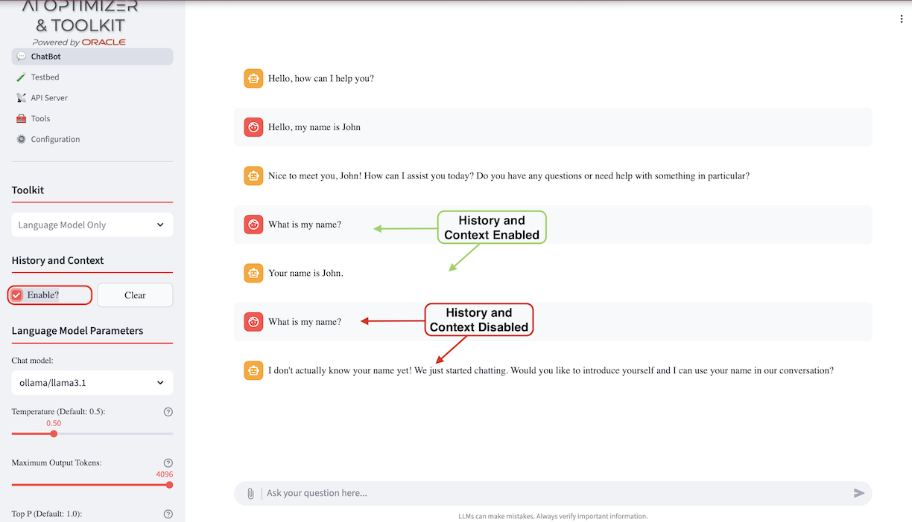
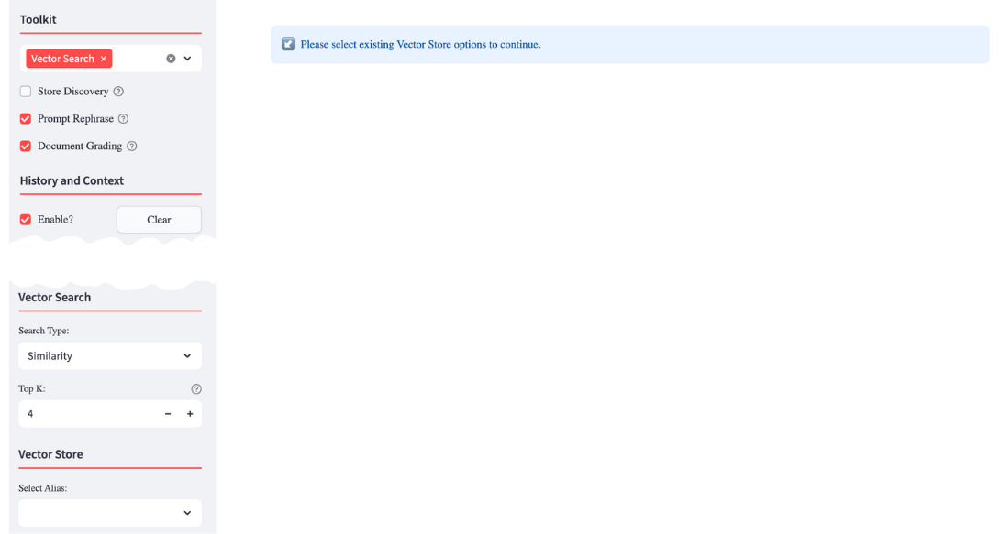
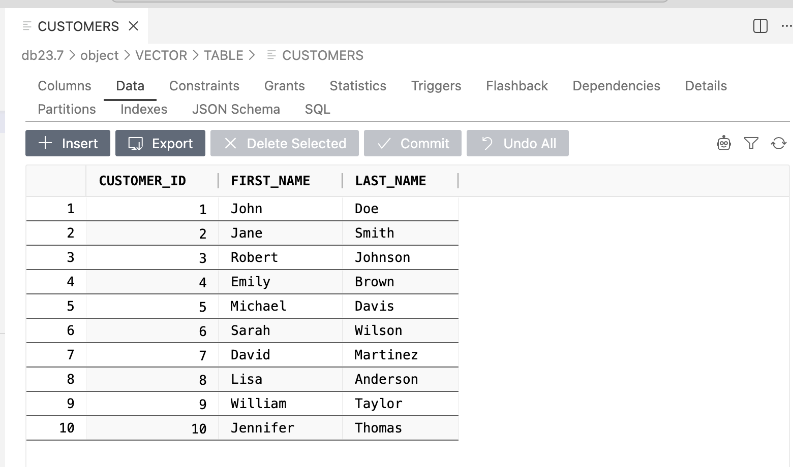
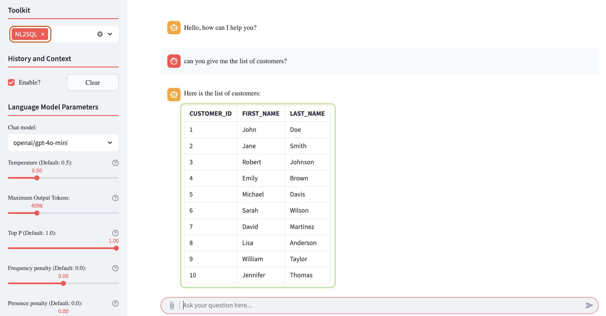

{/* Copyright (c) 2024, 2026, Oracle and/or its affiliates.
Licensed under the Universal Permissive License v1.0 as shown at http://oss.oracle.com/licenses/upl. */}

import LanguageParametersImage from '../_assets/images/chatbot-lm-params.png';
import ToolkitImage from '../_assets/images/chatbot-toolkit.png';
import VectorSearchOptionsImage from '../_assets/images/chatbot-vs-options.png';

The **Oracle AI Optimizer and Toolkit** (the **AI Optimizer**) provides an interactive workbench for exercising its agents, flows, and AI tools. Use the Chatbot to compare model settings, prompts, and tool configurations before deploying an application.

Each Chatbot turn follows the runtime route selected by **Tool Selection**. The selected language model may generate the answer directly, choose tool calls as an agent, or participate in a Vector Search flow.

## Agentic Routes

| Tool selection    | Runtime route      | How the request is handled                                                                                                  |
| ----------------- | ------------------ | --------------------------------------------------------------------------------------------------------------------------- |
| No tools          | LLM-only Agent     | The model generates an answer using the selected system prompt and optional conversation history.                           |
| **NL2SQL**        | NL2SQL Agent       | The model selects from the restricted SQLcl MCP tools needed to connect, inspect schema, run a query, and check its status. |
| **Vector Search** | Vector Search Flow | The flow can rephrase the question, discover a store, retrieve documents, grade relevance, and generate an answer.          |
| Both tools        | Combined Router    | A classifier chooses a route or runs both routes and asks the model to synthesize the results.                              |

For implementation details, see [Agents and Flows](../advanced-guides/agents/intro).

## History and Context

Interactions with the AI models are stored as conversation history in the model's **context window**. When _History and Context_ is enabled, previous interactions from enabled turns are provided to the model so that it can use them to guide the next response. When _History and Context_ is disabled, only the current user input is provided.



Use the "Clear" button to reset the "context window" and start a fresh interaction with a model.

## Language Model Parameters

<div className="doc-media-row">
  

  <div>

You can select from enabled models to experiment with. To enable, disable, or add models, use the [Configuration - Models](configuration/models) page. Choose a language model based on your requirements, which may include:

**Privacy Concerns** - Locally run, open-source models offer more control over your data.

**Accuracy & Knowledge** - Some models excel in factual correctness. When using Retrieval-Augmented Generation, grounding responses in retrieved sources can reduce the importance of a model's built-in knowledge.

**Speed & Efficiency** - Smaller models run faster and require fewer resources. When using Retrieval-Augmented Generation, a smaller model with good natural-language capabilities can be more useful than a larger model with extensive built-in knowledge.

  </div>
</div>

**Cost & Accessibility** - Some models are free, cheaper, or available for local use.

Once you've selected a model, you can change its parameters to control behavior such as response length, creativity, and repetition. Hover over the help icon next to a parameter for more information. Here are some general guidelines:

**Response Length & Repetition** - _Maximum Output Tokens_ controls the maximum response length, while _Frequency Penalty_ discourages repeated words and phrases.

**Creativity** - _Temperature_ and _Top P_ influence how unpredictable or original the model's output is. Higher values make responses more varied; lower values make them more focused.

**Novelty** - _Presence Penalty_ encourages the model to introduce new topics or ideas rather than repeat those already mentioned.

For more details on the parameters, ask the Chatbot or review [Concepts for Generative AI](https://docs.oracle.com/en-us/iaas/Content/generative-ai/concepts.htm).

## Toolkit

<div className="doc-media-row">
  

  <div>

The **AI Optimizer** provides MCP tools and runtime routes that ground model responses in your proprietary data, including:

    <ul>
      <li><a href="#vector-search">Vector Search</a> for unstructured data</li>
      <li><a href="#nl2sql-natural-language-to-sql">NL2SQL</a> for interacting with structured data using natural language</li>
    </ul>

  </div>
</div>

### Vector Search

<div className="doc-media-row">
  

  <div>
    <p>Once you've created embeddings using <a href="tools/split-embed">Split/Embed</a>, the Vector Search tool is available. After selecting Vector Search, you can configure the following options:</p>

    <ul>
      <li><strong>Store Discovery:</strong> Dynamically discover vector stores for Retrieval-Augmented Generation.</li>
      <li><strong>Prompt Rephrase:</strong> Rephrase the user prompt, based on context and history, for a more meaningful vector search.</li>
      <li><strong>Document Grading:</strong> Grade vector search results to determine their relevance. Results judged irrelevant are not used to generate the response.</li>
    </ul>

  </div>
</div>

#### Vector Store

When Store Discovery is enabled, the **AI Optimizer** identifies vector stores to use for each search. To use a specific Vector Store instead, disable Store Discovery and select the Vector Store options manually. To choose a different Vector Store, click the "Reset" button to clear the current selections and display the available options.



Choose the type of search to perform and its additional parameters.

### NL2SQL (Natural Language to SQL)

The Natural Language to SQL (NL2SQL) agent enables users to query structured data stored in Oracle AI Database by using natural language instead of SQL statements.

The **AI Optimizer** uses a local [SQLcl MCP proxy](../guides/sqlcl-mcp-server) for NL2SQL. Container installations include SQLcl and register the proxy automatically at startup. For bare-metal installations, install SQLcl so that the `sql` command is available on `PATH`. The NL2SQL agent then selects the SQLcl tools it needs for the request.

⭐️ For more information about SQLcl and its MCP capabilities, see the [Oracle SQLcl MCP server documentation](https://docs.oracle.com/en/database/oracle/sql-developer-command-line/25.2/sqcug/using-oracle-sqlcl-mcp-server.html).

To enable NL2SQL, configure and select a database with valid credentials in [Configuration → Databases](configuration/databases). The NL2SQL agent becomes available when both the database connection and SQLcl proxy are available. You can then issue natural language queries against structured data, such as the dataset shown in the example below:



To use the agent, navigate to **Chatbot**, select **NL2SQL** under **Tool Selection**, and enter a query such as:

```text
Can you give me the list of customers?
```

The agent's answer is based on a SQL query executed against the database:



By using this agent, the **AI Optimizer** allows users to query structured data without writing any SQL code, simplifying data access and exploration.

You can experiment freely with your own structured datasets and progressively issue more complex natural language queries to explore the full capabilities of the NL2SQL agent.
