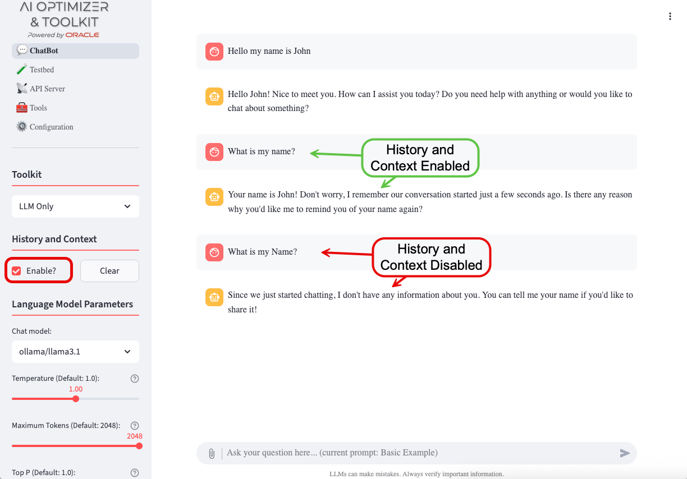
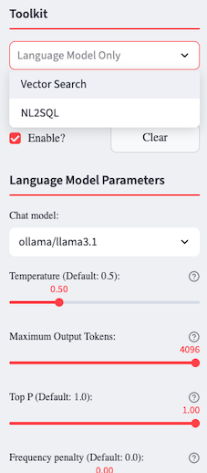
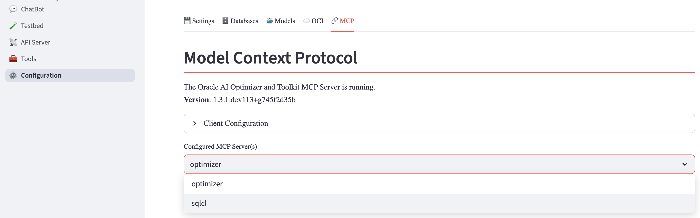
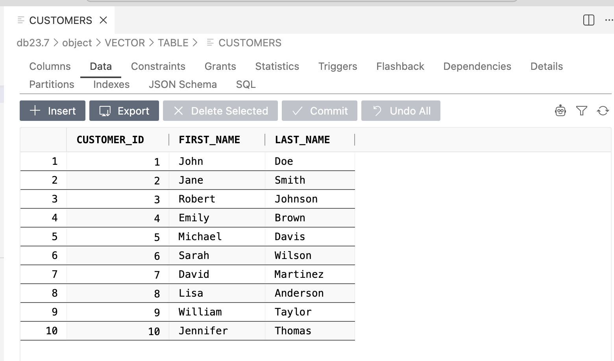
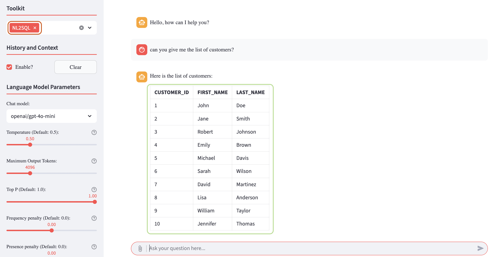

+++
title = '💬 Chatbot'
weight = 20
+++
<!--
Copyright (c) 2024, 2025, Oracle and/or its affiliates.
Licensed under the Universal Permissive License v1.0 as shown at http://oss.oracle.com/licenses/upl.
-->

The  provides a Chatbot to experiment with different Language settings and Embeddings.  It allows you to manually find the optimal configuration for your AI project before launching it into Production. 

There are a number of configurations you can experiment with to explore AI and RAG capabilities to understand their behavior without requiring deep technical knowledge.

## History and Context

Interactions with the AI models are stored inside a "context window".  When *History and Context* is enabled, the full context window is provided to the model so that it can use previous interactions to guide the next response.  When *History and Context* is disabled, only the last user input is provided.



Use the "Clear History" button to reset the "context window" and start a fresh interaction with a model.

## Language Model Parameters


You can select different, enabled models to experiment with.  To enable, disable, or add models, use the [Configuration - Models](../configuration/model_config) page.  Choose a Language Model based on your requirements, which may include:

**Privacy Concerns** - Local, Open-Source models offer more control over your data.

**Accuracy & Knowledge** - Some models excel in factual correctness, however when using Retrieval Augmented Generation, this is less important when grounding the responses to retrieved sources.

**Speed & Efficiency** - Smaller models run faster and require fewer resources.  When using Retrieval Augmented Generation, smaller models with good Natural Language capabilities is often more important than larger models with lots of knowledge.

**Cost & Accessibility** - Some models are free, cheaper, or available for local use.

Once you've selected a model, you can change the different model parameters to help control the model’s behavior, improving response quality, creativity, and relevance.  Hover over the {} for more information as to what the parameters do.  Here are some general guidelines:

**Response Quality** - Parameters like *Maximum Tokens* and *Frequency penalty* ensure clear, well-structured, and non-repetitive answers.

**Creativity** - *Temperature* and *Top P* influence how unpredictable or original the models output is.  Higher values make responses more varied, lower values make them more focused.

**Relevance** - *Presence penalty* help the model stay on-topic and maintain coherence, especially in longer interactions.

For more details on the parameters, ask the Chatbot or review [Concepts for Generative AI](https://docs.oracle.com/en-us/iaas/Content/generative-ai/concepts.htm).

## Toolkit

The  provides tools to augment Large Language Models with your proprietary data using different tools, such as Retrieval Augmented Generation (**RAG**), including:
* [Vector Search](#vector-search) for Unstructured Data
* [NL2SQL](#nl2sql-natural-language-to-sql) for interacting with your structured data using natural language




## Vector Search

Once you've created embeddings using [Split/Embed](../tools/split_embed), the Vector Search tool will be available. After selecting Vector Search, three additional options will pop up:
* **Store Discovery**: Dynamically discover Vector Stores for use in Retrieval Augmented Generation.
* **Prompt Rephrase**: Rephrase the user prompt, based on context and history, for a more meaningful Vector Search.
* **Document Grading**: Grade the results from a Vector Search to determine their relevancy. 


If you have more than one [Vector Store](#vector-store) you can either use the Store Discovery option or disable it. If you decide to disable the Store Discovery option, you will need to select the Vector Store you want to work with.


 Choose the type of Search you want performed and the additional parameters associated with that search.

### Vector Store

With Vector Search selected, if you have more than one Vector Store, you can either select Store Discovery and enable AutoRAG, or you can disable it and choose which specific Vector Store will be used for searching, otherwise it will default to the only one available.  To choose a different Vector Store, click the "Reset" button to open up the available options.

## NL2SQL (Natural Language to SQL)

The Natural Language to SQL (NL2SQL) tool enables users to query structured data stored in Oracle AI Database 26ai by using natural language instead of SQL statements. 

To use this tool, the **Oracle SQLcl MCP server** must be enabled and properly configured within the . Detailed instructions are available in the official [Oracle documentation](https://docs.oracle.com/en/database/oracle/sql-developer-command-line/25.2/sqcug/using-oracle-sqlcl-mcp-server.html):



Once the MCP server is configured, the **NL2SQL** tool allows you to issue natural language queries against structured data, such as the dataset shown in the example below:



To interact with the tool, navigate to the Chatbot tab, select NL2SQL from the tool dropdown menu, and enter a query such as:

```text
Can you give me the list of customers?
```
The response returned by the tool will be equivalent to the result of an actual SQL query executed against the database:



By using this tool, the  allows users to query structured data without writing any SQL code, simplifying data access and exploration.

You can experiment freely with your own structured datasets and progressively issue more complex natural language queries to explore the full capabilities of the NL2SQL tool.


