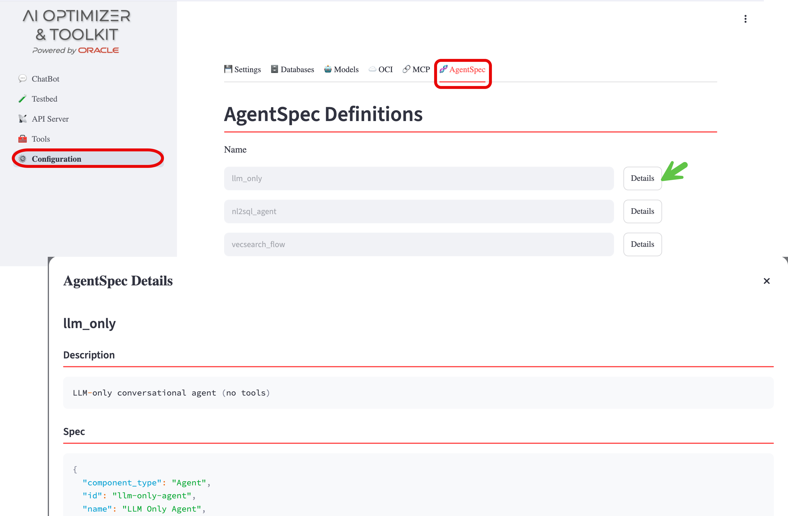

{/* Copyright (c) 2024, 2026, Oracle and/or its affiliates.
Licensed under the Universal Permissive License v1.0 as shown at http://oss.oracle.com/licenses/upl. */}

The **Oracle AI Optimizer and Toolkit** (the **AI Optimizer**) exposes portable [AgentSpec](https://oracle.github.io/agent-spec) definitions that describe agent pipelines as serializable JSON. These definitions can be inspected in the GUI, customized, and loaded into any compatible runtime.

The built-in definitions are `llm_only`, `nl2sql_agent`, and `vecsearch_flow`. The NL2SQL agent uses a restricted SQLcl MCP tool inventory.

## Viewing Specifications

Navigate to **Configuration** > **AgentSpec**:

Each specification is listed with its name and description. Click the **Details** button to view the full serialized JSON definition. This JSON represents the complete AgentSpec that is built from the current sample configuration and can be used as a starting point for custom agent definitions.

For more information on the agent architecture and how these specifications are used at runtime, see the [Agents](../../advanced-guides/agents/intro) documentation.
