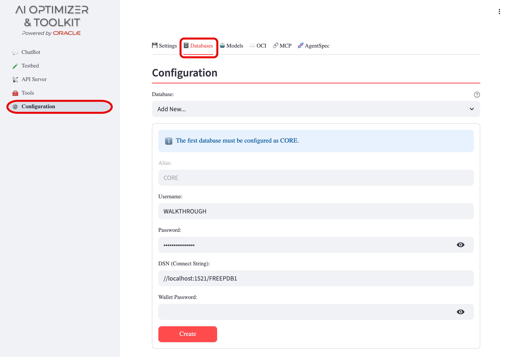
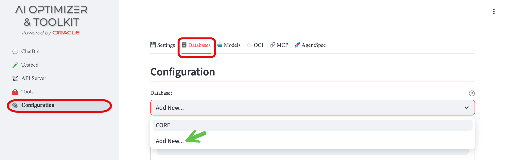

{/* Copyright (c) 2024, 2026, Oracle and/or its affiliates.
Licensed under the Universal Permissive License v1.0 as shown at http://oss.oracle.com/licenses/upl. */}

The Oracle AI Database provides:

- vector storage for document embeddings used in Retrieval-Augmented Generation (RAG)
- structured data for Natural Language to SQL (NL2SQL)
- storage for [Testbed](../testbed) question-and-answer test sets and evaluations
- storage for **AI Optimizer** settings and configuration

To use this functionality of the **AI Optimizer**, you will need access to an **Oracle AI Database**. Both the [Always Free Oracle Autonomous Database Serverless (ADB-S)](https://docs.oracle.com/en/cloud/paas/autonomous-database/serverless/adbsb/autonomous-always-free.html) and the [Oracle AI Database Free](https://www.oracle.com/database/free/get-started/) are supported. They are a great, no-cost, way to get up and running quickly.

⭐️ For more information on setting up an Oracle AI Database, see the [Oracle AI Database Guide](../../guides/database).

## Configuration

Navigate to **Configuration** > **Databases**:



### CORE Database

The first database configured must use the alias **CORE**. The **CORE** database is used for application persistence (settings, test sets, evaluations). When no database has been configured, the alias field will automatically be set to `CORE`.

### Additional Databases

Once the **CORE** database is configured, additional databases can be added with custom aliases by selecting **Add New...** from the database dropdown. These databases can be used for Vector Search and NL2SQL operations.

The currently selected database is used for all Splitting and Embedding, NL2SQL, and Vector Search operations, so when you have more than one database, be sure to select the correct database.



### Configuration Fields

Provide the following inputs:

- **Alias**: A unique identifier for the database configuration (automatically set to `CORE` for the first database)
- **Username**: The pre-created [database username](../../guides/database#database-user)
- **Password**: The password for the **Username**
- **DSN (Connect String)**: The full connection string or [TNS Alias](../../guides/database#using-a-wallettns_admin) for the Database.
  This is normally in the form of:
  ```
  (DESCRIPTION=(ADDRESS=(PROTOCOL=tcp)(HOST=<hostname>)(PORT=<port>))(CONNECT_DATA=(SERVICE_NAME=<serviceName>)))
  ```
  or
  ```
  //<hostname>:<port>/<serviceName>
  ```
- **Wallet Password** (_Optional_): If the connection to the database uses mTLS, provide the wallet password. ⭐️ Review [Using a Wallet](../../guides/database#using-a-wallettns_admin) for additional setup instructions.

Once all fields are set, click the `Create` or `Save` button.
