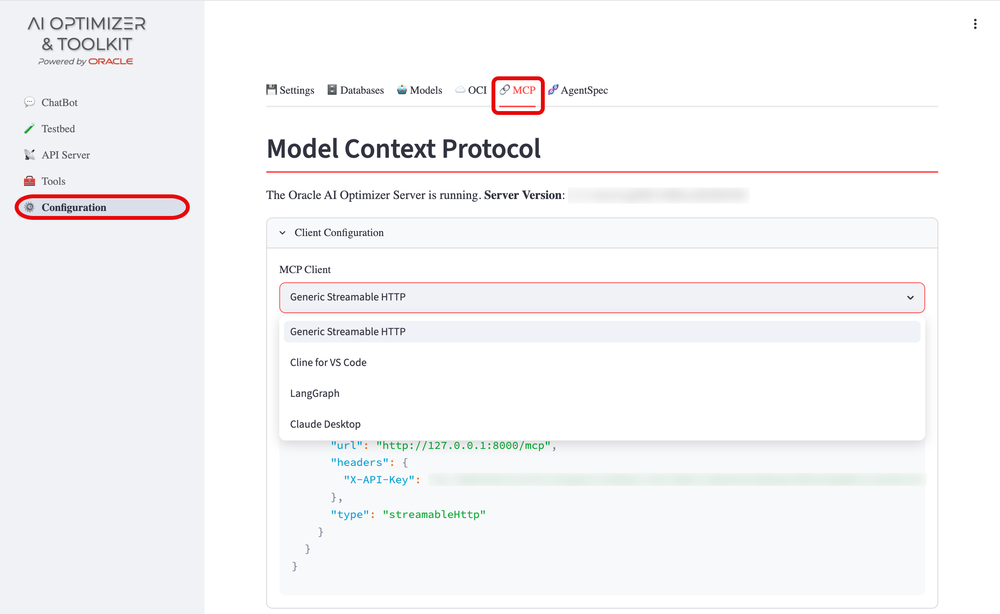

{/* Copyright (c) 2024, 2026, Oracle and/or its affiliates.
Licensed under the Universal Permissive License v1.0 as shown at http://oss.oracle.com/licenses/upl. */}

The **Oracle AI Optimizer and Toolkit** (the **AI Optimizer**) exposes a built-in [Model Context Protocol](https://modelcontextprotocol.io/) (MCP) server using [FastMCP](https://github.com/PrefectHQ/fastmcp). At startup, the server automatically registers tools, prompts, and any configured proxy servers (such as SQLcl for NL2SQL).

:::tip[SQLcl MCP Server]
The **AI Optimizer** natively supports the [SQLcl MCP Server](../../guides/sqlcl-mcp-server.mdx) for Natural Language to SQL (NL2SQL) capabilities. When SQLcl is available and databases are configured, the SQLcl MCP server is automatically registered at startup as a proxy under the `sqlcl` namespace.
:::

⭐️ For developing custom MCP tools to integrate into the **AI Optimizer**, see [Custom MCP Tools](../../advanced-guides/mcp-custom).

## MCP Configuration Page

The MCP Configuration page displays:

- **Server Health**: Connection status, server name, and version
- **Client Configuration**: JSON configuration block for connecting external MCP clients
- **Registered Servers**: Dropdown to select between registered MCP server namespaces
- **Tools, Prompts, and Resources**: Details for each registered item, including input schemas and descriptions

## Connecting External MCP Clients

The **AI Optimizer** MCP server can be consumed by external MCP clients such as Claude Desktop, Claude Code, VS Code Copilot, or Cursor.

Use the client configuration from **Configuration** > **MCP Server** to retrieve the settings required for connecting external MCP clients.

