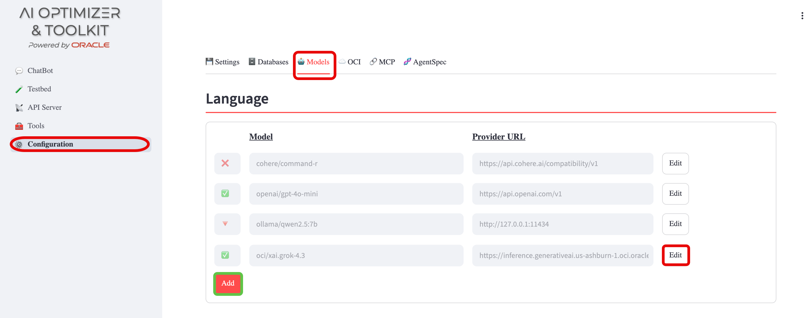
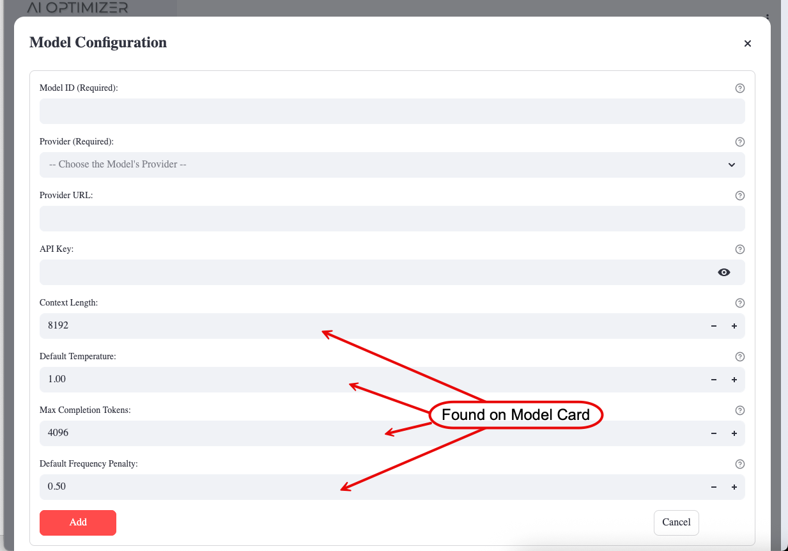

{/* Copyright (c) 2024, 2026, Oracle and/or its affiliates.
Licensed under the Universal Permissive License v1.0 as shown at http://oss.oracle.com/licenses/upl. */}

The **AI Optimizer** can connect to language and embedding models supported by [LiteLLM](https://docs.litellm.ai/docs/providers) for completions and vector creation. You can add, modify, and delete model configurations from the client.

At a minimum, a _Language Model_ must be configured in the **AI Optimizer** for basic functionality. For Retrieval-Augmented Generation (**RAG**), an _Embedding Model_ will also need to be configured.

:::note[Too Small to Handle]
Some older and small _Language Models_ may not have native function/tool calling support for NL2SQL and RAG, which may result in unexpected results.
:::

## Configuration

To configure a _Language Model_ or _Embedding Model_, from the **AI Optimizer**, navigate to **Configuration** > **Models**:

⭐️ For model-selection guidance, provider setup, and environment-variable configuration, see the [AI Models](../../guides/ai-models) guide.

### Add/Edit/Delete

Set the Provider, API Key, and Provider URL as required.

For _Language Models_ you can also set the **Max Input Tokens (Context Length)** and **Max Output (Completion) Tokens**.

For _Embedding Models_, set the **Max Chunk Size**. These values can often be found on the model card—if they are not listed, the defaults are usually sufficient.

Some models ship pre-configured but **disabled**. When editing a model, tick the **Enabled** checkbox to activate it.

:::note[More than meets the eye]
Enabling a model is necessary but not always sufficient for it to appear in selection lists. The **AI Optimizer** only offers models that are both enabled and **reachable** (a valid Provider URL, and an API Key where one is required).
:::

To remove a model, use the **Delete** button while editing it; any settings that referenced it are cleared automatically.

### Parameters

#### Provider

The **AI Optimizer** supports a number of model providers. When adding a model, choose the most appropriate provider. If unsure, or the specific provider is not listed, try a LiteLLM OpenAI-compatible provider, such as `openai_like` or `custom_openai`, before [opening an issue](https://github.com/oracle/ai-optimizer/issues/new) requesting additional model provider support.

There are a number of local AI Model runners that use OpenAI-compatible APIs, including:

- [LM Studio](https://lmstudio.ai)
- [vLLM](https://docs.vllm.ai/en/latest/#)
- [LocalAI](https://localai.io/)

When using these local runners, select the appropriate LiteLLM provider. For example, use `hosted_vllm` for vLLM, or an OpenAI-compatible provider such as `openai_like` or `custom_openai` for other compatible endpoints.

#### Provider URL

The Provider URL for the model is either the URL, including the IP address or hostname and port, of a locally running model; or the remote URL for a third-party or cloud model.

Examples:

- **Third-Party**: OpenAI - https://api.openai.com/v1
- **On-Premises**: Ollama - http://localhost:11434
- **On-Premises**: LM Studio - http://localhost:1234/v1

#### API Keys

Third-party cloud models, such as [OpenAI](https://openai.com/api/) and [Perplexity AI](https://docs.perplexity.ai/getting-started), require API keys. These keys are tied to registered, funded accounts on these platforms. For more information on creating an account, funding it, and generating API keys for third-party cloud models, visit their respective sites.

On-premises models, such as those from [Ollama](https://ollama.com/) or [HuggingFace](https://huggingface.co/), usually do not require API keys. These values can be left blank.
