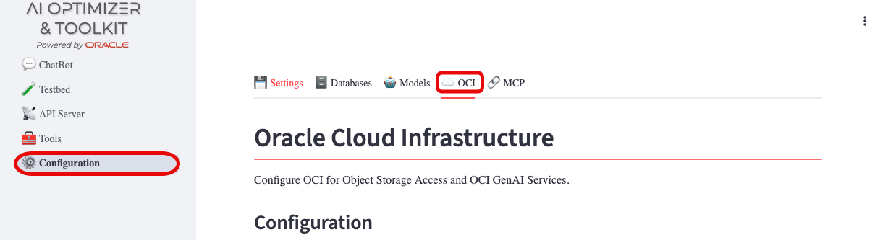
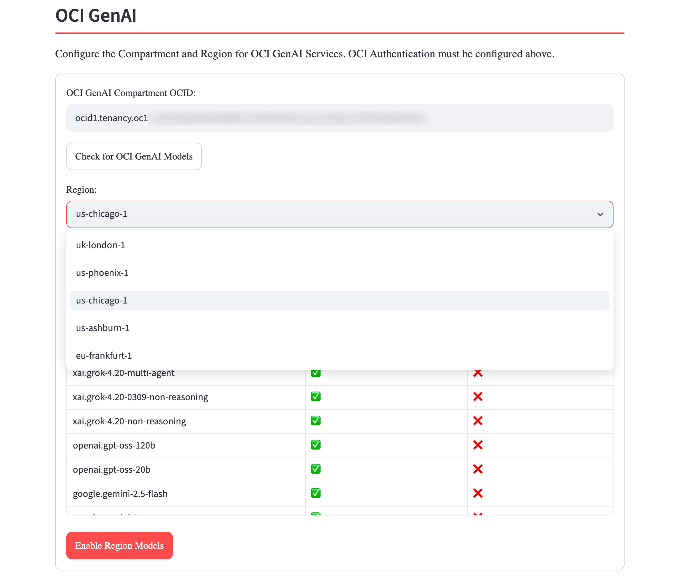

{/* Copyright (c) 2024, 2026, Oracle and/or its affiliates.
Licensed under the Universal Permissive License v1.0 as shown at http://oss.oracle.com/licenses/upl. */}

Oracle Cloud Infrastructure (OCI) is optional, but it enables additional **AI Optimizer** functionality:

- Document sources for Split/Embed from [Object Storage](https://docs.oracle.com/en-us/iaas/Content/Object/Concepts/objectstorageoverview.htm)
- Private cloud language and embedding models from the [OCI Generative AI service](https://docs.oracle.com/en-us/iaas/Content/generative-ai/home.htm)

For API-key prerequisites, configuration files, containers, environment variables, and authentication types, see the [Oracle Cloud Infrastructure](../../guides/oracle-cloud-infra) guide.

## Configuration

To configure OCI access from the **AI Optimizer**, navigate to **Configuration** > **OCI**:

Provide the values obtained by [generating an API key](https://docs.oracle.com/en-us/iaas/Content/API/Concepts/apisigningkey.htm#two). Once OCI access is usable, you can also configure OCI Generative AI services on this page.

## Loading OCI GenAI Models

The [OCI Generative AI service](https://docs.oracle.com/en-us/iaas/Content/generative-ai/home.htm) provides private cloud language and embedding models. If you subscribe to the service, load the models available in your selected region directly into the **AI Optimizer**.

On the **OCI** tab, enter the **GenAI Compartment OCID**, click **Check for OCI GenAI Models**, choose a **Region**, then click **Enable Region Models**. The **AI Optimizer** queries the OCI Generative AI service for that region, then registers and enables every chat and embedding model it offers.

The models appear on the **Models** tab. Changing the configured region clears the previously loaded OCI models; the new region's models load when you run **Enable Region Models** again or when the application next starts with a persisted GenAI configuration. For startup configuration, see the [Oracle Cloud Infrastructure](../../guides/oracle-cloud-infra#loading-oci-genai-models-at-startup) guide.
