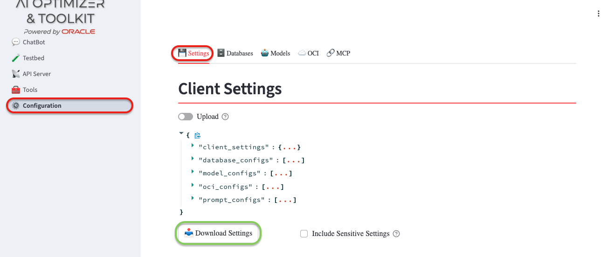
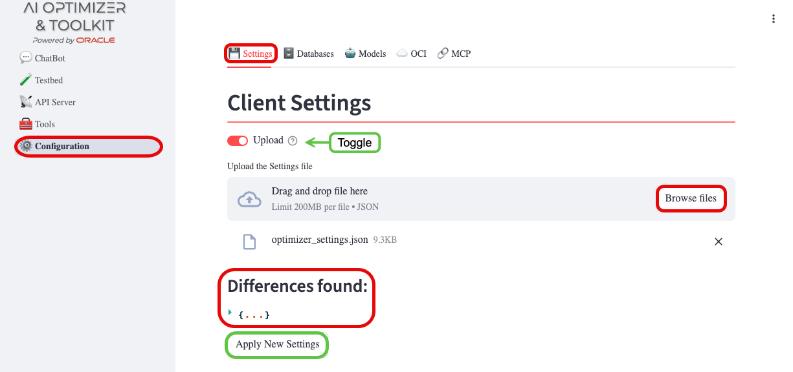
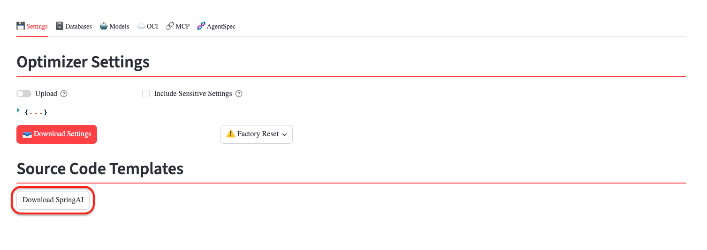

{/* Copyright (c) 2024, 2026, Oracle and/or its affiliates.
Licensed under the Universal Permissive License v1.0 as shown at http://oss.oracle.com/licenses/upl. */}

Once you are happy with the specific configuration of your **AI Optimizer**, the settings can be exported in **.json** format.  Those settings can then be loaded in later to return the **AI Optimizer** to your previous configuration.  The settings can also be imported into another instance of the **AI Optimizer**.

## View and Download

To view and download the **AI Optimizer** configuration, navigate to the _Configuration_ page and _Settings_ tab:

:::warning[Shh... Secrets Inside!]
Settings contain sensitive information such as database passwords and API Keys.  By default, these settings will not be exported and will have to be re-entered after uploading the settings in a new instance of the **AI Optimizer**.  

If you have a secure way to store the settings and would like to export the sensitive data, tick the "Include Sensitive Settings" box.
:::

### Factory Reset

To reset the **AI Optimizer** settings back to the delivered "factory" state, you can use the "Factory Reset" button.

Factory Reset performs the following:
  - Rebuilds model settings from the factory model list, then reapplies environment overrides and discovers Ollama models.
  - Restores factory prompt configurations and re-registers MCP prompts.
  - Resets protected client settings to defaults and removes non-protected/ephemeral client sessions.
  - Preserves infrastructure configuration: database and OCI configurations are not reset.
  - Persists the reset into the databases.

## Upload

To upload previously downloaded settings, navigate to `Configuration -> Settings`:

1. Toggle to the "Upload" button
1. Browse files and select the settings file

If differences are found, you can review the differences before clicking "Apply Settings".

## Source Code Templates

You can download basic templates from the console to help expose the RAG chatbot defined in the chat console as an OpenAI API-compatible REST endpoint.

If your configuration includes either Ollama or OpenAI as providers for both chat and embedding models, the *Download Spring AI* button will be displayed.

:::info[Spring AI template availability]
Mixed provider configurations, such as Ollama for embeddings and OpenAI for chat completion, are supported by the AI Optimizer. However, Spring AI templates are available only when the chat and embedding models use the same supported provider.
:::

For more information, about the **AI Optimizer** and  downloadable templates:

* **SpringAI**: please view the [Advanced - SpringAI](../../advanced-guides/spring-ai) documentation.
