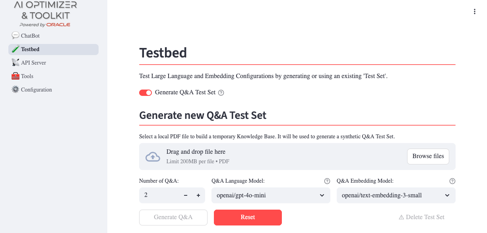
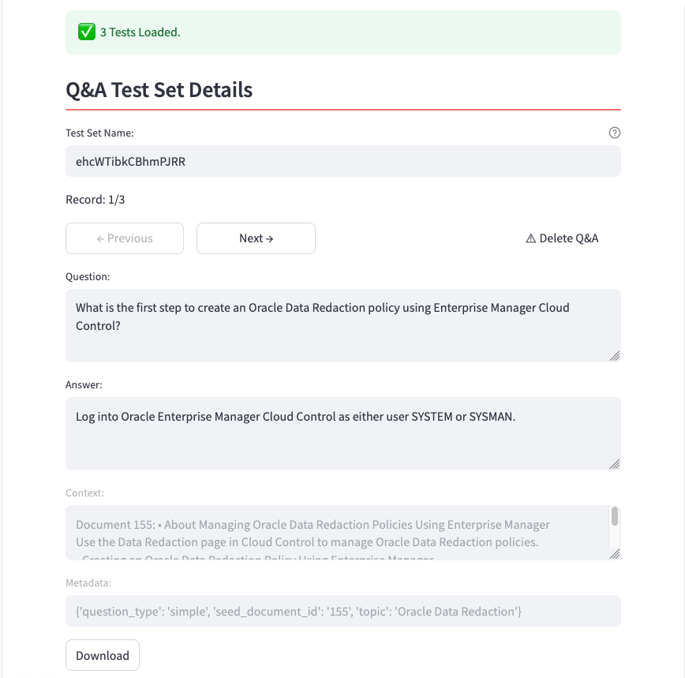
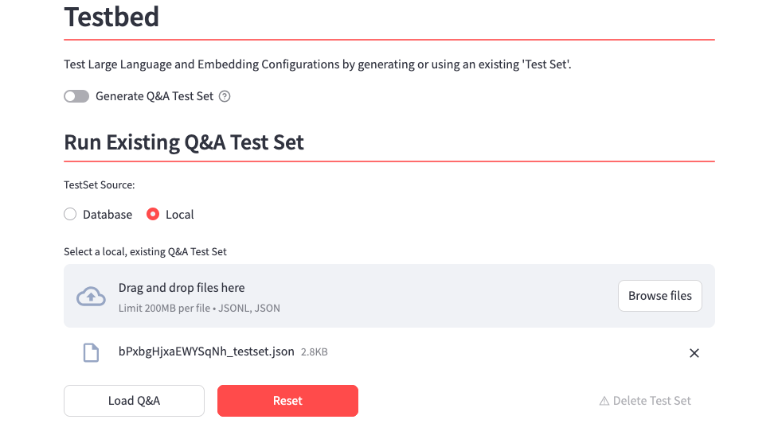
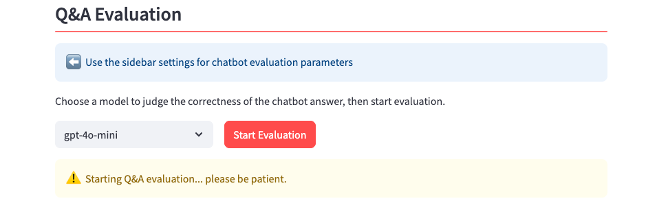
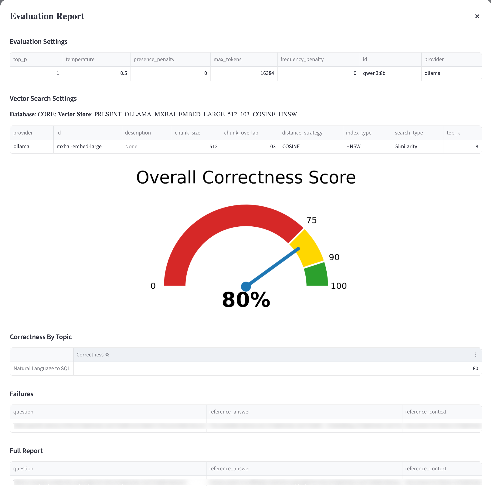
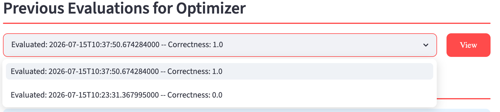

{/* Copyright (c) 2024, 2026, Oracle and/or its affiliates.
Licensed under the Universal Permissive License v1.0 as shown at http://oss.oracle.com/licenses/upl. */}

The **Oracle AI Optimizer and Toolkit** (the **AI Optimizer**) integrates with [Giskard](https://www.giskard.ai/) to generate and evaluate Q&A test sets. You can create a test set from PDFs or upload an existing [JSON/JSONL](#upload-an-existing-test-set) test set.

During evaluation, the configured agent answers each question and an LLM judge compares the response with the reference answer.

## Generate Q&A Test Set
From the **Testbed** page, enable **Generate Q&A Test Set**, upload one or more PDF files, select the Q&A language/embedding models, and specify the number of Q&A pairs to generate:



Use a model that suits the quality and cost requirements of your evaluation.

:::tip
Use a higher-capability model to generate Q&A pairs, even if you plan to use a more cost-effective model in production. A higher-quality test set provides a more reliable evaluation of the production configuration.
:::

The generation process creates the requested number of Q&A pairs and identifies topics that help classify the generated questions.

Once complete, the generated test set is displayed in a table. You can edit or delete Q&A pairs and download the test set for offline use:



- Delete a Q&A that is not useful to the test set.
- Update the **Question** or **Reference answer** (the **Context** and **Metadata** fields are read-only).

:::note[Save edits]
Edits and deletions apply to the current Testbed session. To save them to the database, download the test set, change its name, or start an evaluation before switching test sets or leaving the page.
:::

## Upload an Existing Test Set

To use an existing test set, disable **Generate Q&A Test Set**. Under **Run Existing Q&A Test Set**, select **Local** as the test set source and upload a JSON or JSONL file. Each record must follow this schema:

```json
[
    {
        "id": "2f6d5ec5-4111-4ba3-9569-86a7bec8f971",
        "question": "What is the retention period?",
        "reference_answer": "The retention period is seven years.",
        "reference_context": "Retention policy excerpt.",
        "conversation_history": [],
        "metadata": {
            "question_type": "simple",
            "seed_document_id": "1",
            "topic": "retention"
        }
    }
]
```



To create a template, generate a single Q&A pair, download the test set, and extend the downloaded JSON file.

## Evaluation
After you generate or load a test set, configure the evaluation settings in the sidebar and start an evaluation.



Similar to the [Chatbot](./chatbot), the sidebar controls configure the language model, request parameters, and enabled tools used for the evaluation. Change these settings to compare their effect on the results.

### Judge Model and Prompt

Select a **Judge Language Model** to evaluate responses. The judge compares each agent response with the reference answer for **semantic equivalence**: the response does not need to use the same wording, but it must convey the same meaning.

The **Testbed Judge Prompt** controls the judge's behavior. Customize it on the [Prompts](./tools/prompts.mdx) configuration page to adjust evaluation strictness, such as requiring more precise answers or allowing broader interpretations.

### Results

The **Overall Correctness Score** is the percentage of questions answered correctly:



The evaluation also produces correctness metrics by topic, a detailed list of failures, and a complete breakdown of evaluated Q&A pairs. Each evaluated Q&A includes:

* **agent_answer**: the actual answer provided by the language model agent;
* **correctness**: true/false indicating whether the agent's answer is semantically equivalent to the reference answer, as determined by the judge;
* **correctness_reason**: the reason why an answer has been evaluated wrong by the judge LLM.

### Previous Evaluations

Evaluation reports are stored in the database. When you open a test set with earlier evaluations, use **Previous Evaluations** to select and review a past report. This supports comparison across configurations and repeated runs.



:::note[Score Variability]
Because the evaluation uses your configured hyper-parameters (including temperature), scores may vary slightly between runs. This is expected behavior and reflects the natural variability of your production configuration. Running multiple evaluations and comparing results provides a more reliable assessment of your configuration's effectiveness.
:::
