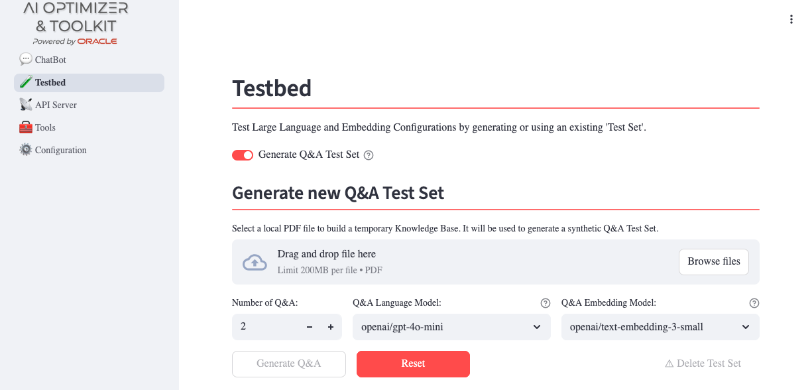
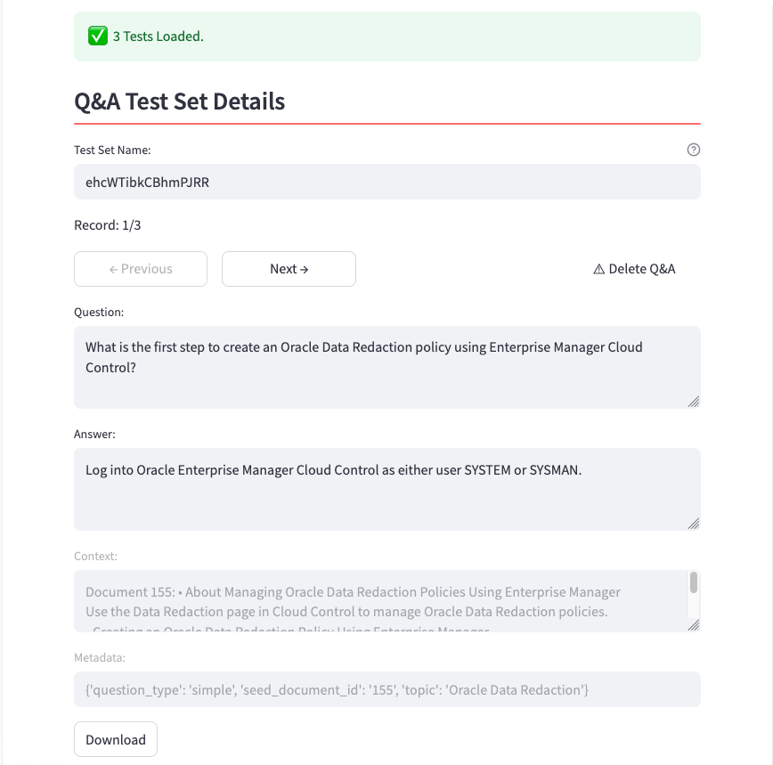
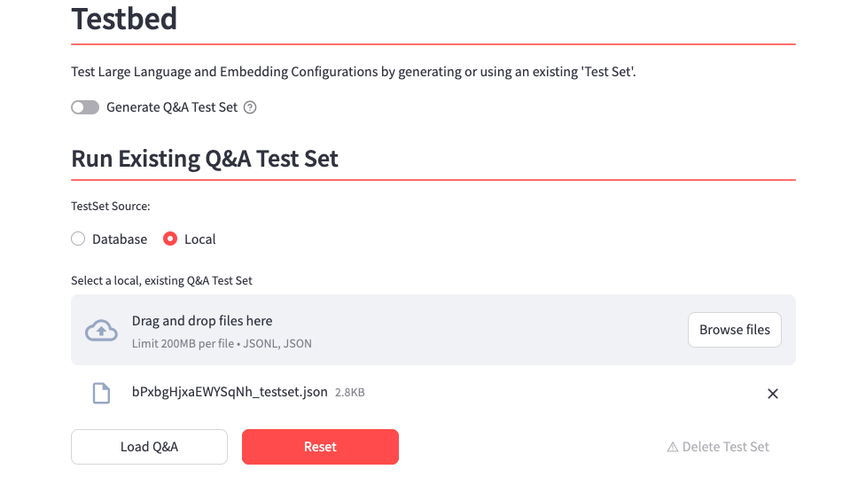
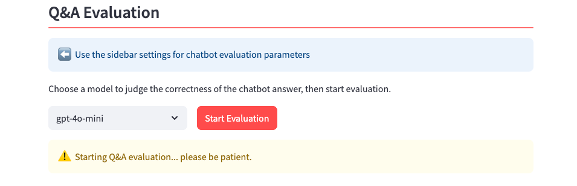
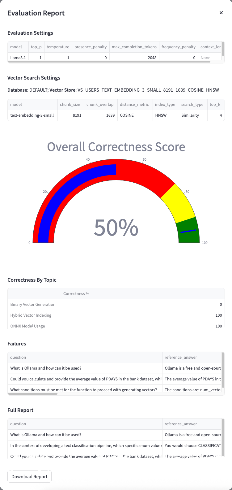

+++
title = '🧪 Testbed'
weight = 30
+++
<!--
Copyright (c) 2023, 2024, Oracle and/or its affiliates.
Licensed under the Universal Permissive License v1.0 as shown at http://oss.oracle.com/licenses/upl.
-->
Generating a Test Dataset of Q&A pairs using an external LLM can significantly accelerate the testing phase. The  integrates with the [Giskard](https://www.giskard.ai/) framework, which is specifically designed to support this process. 

Giskard analyzes  documents to identify high-level topics associated with the generated Q&A pairs and automatically includes this information in the resulting Test Dataset. All test datasets and evaluation results are stored in the database, enabling future evaluations, comparisons, and reviews.


The dataset generation phase is optional but strongly recommended, especially during proof-of-concept activities. Manually creating high-quality test datasets requires substantial human effort, whereas automated generation reduces both time and cost.

After the dataset is generated, each question is submitted to the configured agent. The agent’s responses are collected and compared against the expected answers by an LLM acting as an automated judge. The judge classifies each response and provides a justification for its decision, as illustrated in the following diagram:


## Generation
From the Testbed page, switch to **Generate Q&A Test Set** and upload one or more documents.  These documents  will be embedded and analyzed by the selected Q&A Language/Embedding Models to generate a defined number of Q&A:



You can select any of the available models for the Q&A generation process. In many scenarios, it is useful to rely on a high-capability, higher-cost model to generate a high-quality evaluation dataset, while deploying a more cost-effective model in production.

This phase not only generates the number of Q&A you need, but it will analyze the document provided extracting a set of topics that could help to classify the questions generated and can help to find the area to be improved.

Once the generation process is complete (which may take some time), the generated dataset is displayed:



At this stage, you can:

* Delete a Q&A: clicking **Delete Q&A** you’ll drop the question from the final dataset if you consider it not meaningful;
* Modify the text of the **Question** and the **Reference answer**: if you are not agree, you can updated the raw text generated, according the **Reference context** that is it fixed, like the **Metadata**.

All changes are automatically stored in the database, and the dataset can also be downloaded for offline use.

The generation process it’s optional. If you have prepared a JSONL file with your Q&A, according to this schema:

```text
[
    {
        "id": <an alphanumeric unique id like ”2f6d5ec5–4111–4ba3–9569–86a7bec8f971">,
        "question":"<Question?>",
        "reference_answer":"<An example of answer considered right>",
        "reference_context":"<A piece of document by which has been extracted the question>",
        "conversation_history":[

        ],
        "metadata":{
            "question_type":"[simple|complex]",
            "seed_document_id":"<numeric>",
            "topic":"<topics>"
        }
    }
]
```

You can upload it:



If you need an example, you can generate a single Q&A pair, download it, and use it as a template to extend your own Q&A test dataset.

## Evaluation
At this point, if you have generated or are using an existing Test Dataset, you can run an evaluation using the configuration parameters in the left-hand side menu.



The upper section of the configuration menu is related to the LLM to be used for chat generation, and includes the most relevant hyper-parameters to use in the request. You can choose to enable the **Store Discovery** tool to perform AutoRAG, or disable it and manually select a specific Vector Store for the evaluation.

If you decide to target a specific Vector Store, it can be selected from the dropdown menu in the lower part of the left-hand side. Apart from the **Embedding Model**, **Chunk Size**, **Chunk Overlap** and **Distance Strategy**, that are fixed and determined during the **Split/Embed** process, these parameters can be adjusted:

* **Top K**: the number of document chunks included in the prompt context, selected based on their proximity to the question;
* **Search Type**: either Similarity or Maximal Marginal Relevance (MMR). Similarity search is commonly used, while MMR leverages an Oracle AI Database 26ai feature that reduces redundancy by excluding highly similar chunks and promoting more diverse yet relevant content.

An **Overall Correctness Score** will be provided at the end of the evaluation, that is simply the percentage of correct answers on the total number of questions submitted:



In addition, the evaluation produces correctness metrics grouped by topic, a detailed list of failures, and a complete breakdown of all evaluated Q&A pairs. For each Q&A in the test dataset, the following fields are added:

* **agent_answer**: the actual answer provided by the RAG app;
* **correctness**: a flag true/false that evaluates if the agent_answer matches the reference_answer;
* **correctness_reason**: the reason why an answer has been evaluated wrong by the judge LLM.

The list of **Failures**, **Correctness by each Q&A**, as well as a **Report**, can be downloaded and stored for future review and audit purposes.

*This approach enables repeated evaluations using the same curated test dataset—whether generated automatically or provided manually—to identify and validate the most effective RAG configuration.*.
