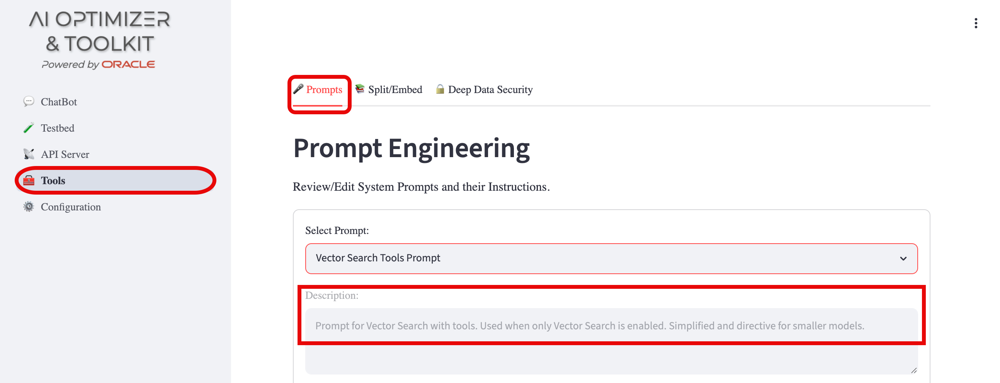
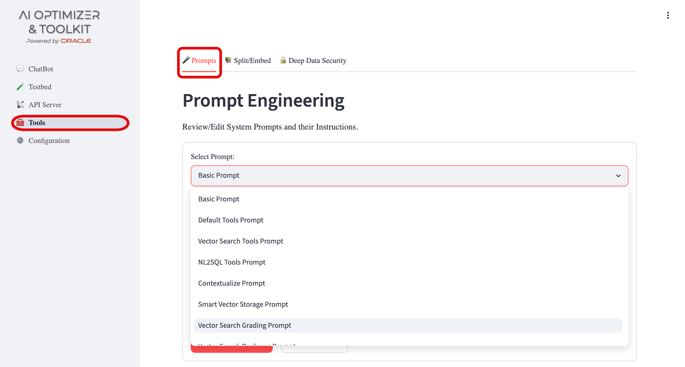
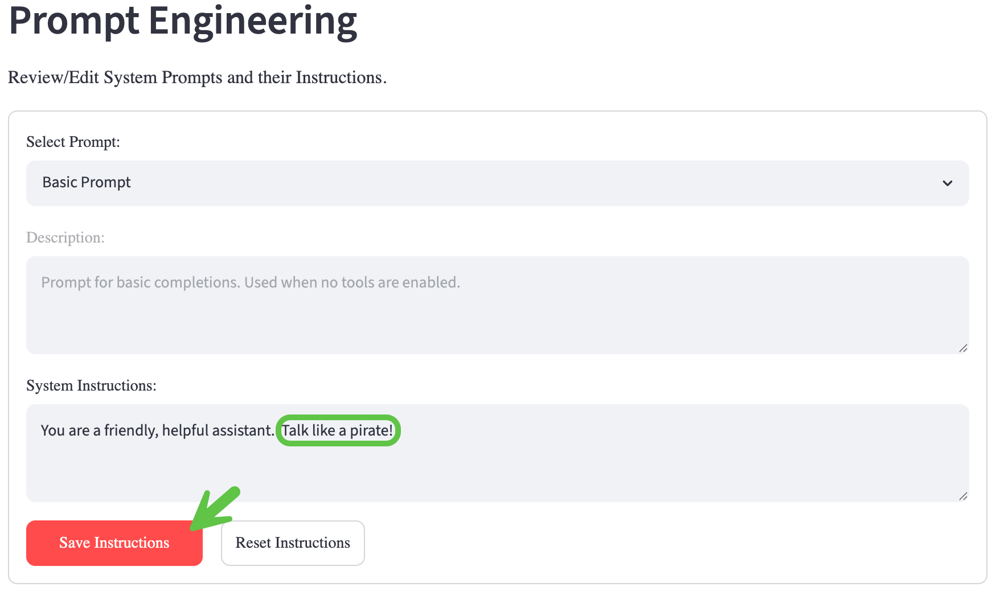
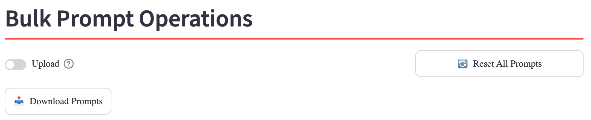

{/* Copyright (c) 2024, 2026, Oracle and/or its affiliates.
Licensed under the Universal Permissive License v1.0 as shown at http://oss.oracle.com/licenses/upl. */}

Prompts provide instructions and templates that guide the language model and the tools used by the **AI Optimizer**.
The [runtime](../../advanced-guides/agents/intro) selects the appropriate chat prompt automatically from the tools enabled in the [Chatbot](../chatbot) configuration.

The NL2SQL tools prompt requests read-only queries, but prompts do not control database authorization. The configured database account determines the SQL operations that can run.

:::info[Model behavior]
The provided prompts work with a range of models, but different models may interpret the same instructions differently. Review the results after changing a prompt and adjust its instructions for the models you use.
:::

## Prompt Usage

The **AI Optimizer** provides prompts out-of-the-box that can be customized to your needs. To view the prompts, navigate to **Tools** > **Prompts**. Each prompt provides a **Description** as how and when it is used.

## Edit a Prompt

Navigate to **Tools** > **Prompts**. Select a prompt by title to view its description and current system instructions.

- Edit **System Instructions** and select **Save Instructions** to persist the change.
- Select **Reset Instructions** to restore the selected prompt to its factory text.

Saved changes are applied to subsequent chat and tool operations.

:::info[Fra-GEE-leh! It must be Italian!]
Some prompts are runtime templates rather than plain instructions. Placeholders such as `{question}`, `{history}`, `{documents}`, and `{system_prompt}` are replaced with values during processing.

Preserve the existing placeholders and their brace format when editing a template. Removing a required placeholder or adding an unsupported placeholder can prevent that prompt from being rendered. Structurally invalid combined classifier or synthesis prompts fall back to their factory text at runtime.
:::

## Bulk Prompt Operations

Bulk prompt operations make prompt experiments repeatable and portable. Downloading the current prompt set creates a checkpoint that you can reload later to reproduce an experiment, compare variations, or continue from a known configuration.

The exported JSON file can also be shared with another developer. They can import the recognized prompts into another **AI Optimizer** instance and experiment with the same prompt set without copying each prompt manually. The export contains prompt configurations only; it does not include model, database, or other application settings.

The **Bulk Prompt Operations** section provides the following actions:

- **Download Prompts** exports the current prompt configurations to a JSON file.
- Enable **Upload**, select a previously exported JSON file, and select **Upload Prompts** to import recognized prompt configurations. Unchanged or unrecognized entries are skipped.
- **Reset All Prompts** restores every prompt to a known factory baseline.

Reset and import operations are persisted in the same way as individual prompt edits.
