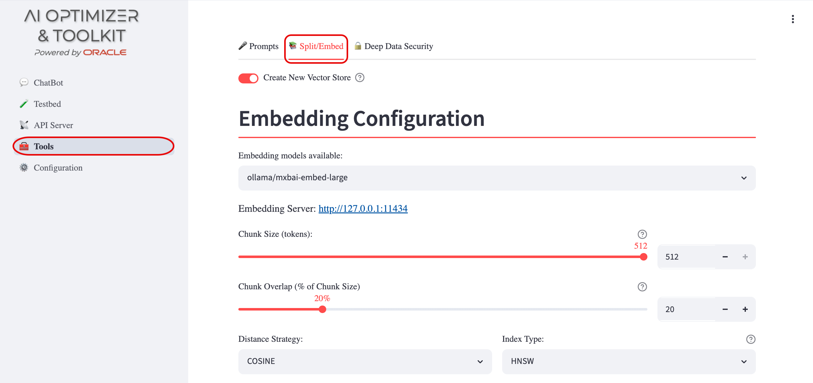
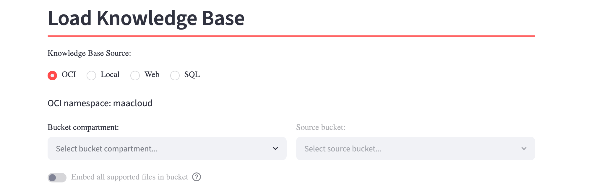
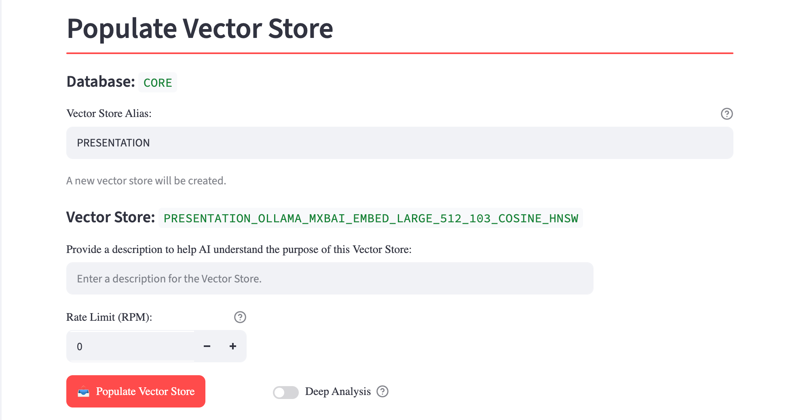
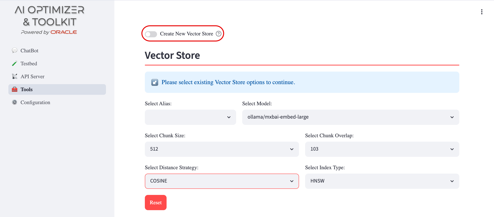
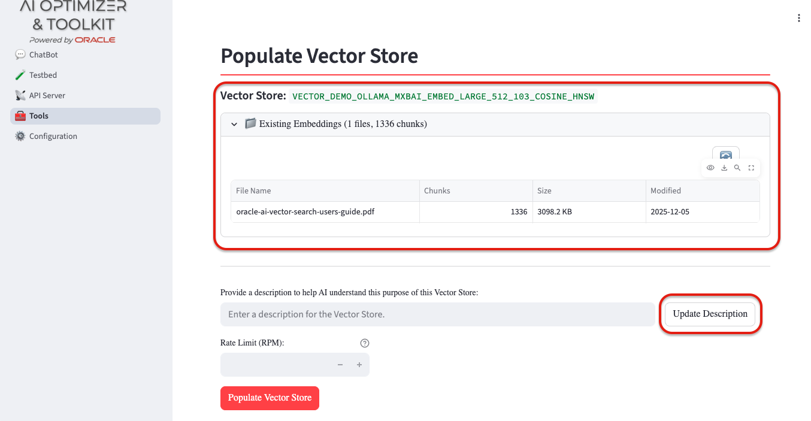

{/* Copyright (c) 2024, 2026, Oracle and/or its affiliates.
Licensed under the Universal Permissive License v1.0 as shown at http://oss.oracle.com/licenses/upl. */}

The first phase in building a Retrieval Augmented Generation (RAG) chatbot based on Vector Search is document splitting and embedding. During this phase, source documents are divided into chunks, vector embeddings are generated for each chunk, and the resulting embeddings are stored in a Vector Store. 

At query time, relevant chunks are retrieved using vector distance search and injected into the Language Model context to produce grounded answers based on the provided information.

## Embedding Models

You can choose embedding models from services such as Cohere and OpenAI or use local models on a self-managed GPU compute node. This gives you room to balance model quality, cost, and where your data is processed. 

To enable emdedding models, configure them in **Configuration** > **Models**. See [Model Configuration](../configuration/models) for details.

:::tip[Keep it Local]
Running local models, for example via Ollama or Hugging Face, avoids sharing data with external services that are outside your administrative control.
:::

## Split and Embed

To perform document splitting and embedding, navigate to **Tools** > **Split/Embed**:

### Create New Vector Store

The "Create New Vector Store" option allows you to create a new vector store table and populate it with embeddings generated from one or more data sources. If you already have existing vector stores, you can disable this option and split/embed more content into them. See [Edit Existing Vector Store](#edit-existing-vector-store) for details.

:::tip
You can create several vector stores from the same documents to compare chunk sizes, distance metrics, index types, and embedding models before deciding which setup works best for your application.
:::

### Embedding Configuration

Start by selecting an **Embedding Model**. The selection list reflects the enabled embedding models you configured in [Model Configuration](../configuration/models).

Each model will set the maximum chunk size you can use. From there, choose a **Chunk Size (tokens)** and **Chunk Overlap (% of chunk size)** that suit your documents. Smaller chunks can make retrieval more precise, while overlap helps preserve context at chunk boundaries.

Next, choose the **Distance Metric** that matches the embedding model's guidance:

* COSINE
* EUCLIDEAN_DISTANCE
* DOT_PRODUCT

Then select an **Index Type** for the vector store: HNSW, IVF, or HYB. 

The index type is part of the vector store configuration, so it is useful to record the choice when comparing stores.

⭐️ Learn more about the available index types in the [Oracle AI Vector Search User's Guide](https://docs.oracle.com/en/database/oracle/oracle-database/26/vecse/guidelines-using-vector-indexes.html).

### Load Knowledge Base

Choose where your **"corpus"** of documents is located. You can load multiple local files, multiple OCI objects, a web page, or the results of a SQL query.

- **Knowledge Base Source**: specifies the origin of the documents to be embedded. Supported sources include:
  - **OCI**: browse and select multiple documents from Oracle Cloud Infrastructure Object Storage;
  - **Local**: upload multiple documents from the client machine;
  - **Web**: load a single supported document or web page from a specified URL;
  - **SQL**: run a read-only `SELECT` query against an Oracle Database and embed its results. The query results are staged as a CSV document before they are processed. When using this option, provide:
    - **Database**: select the target database from the list of configured and connected databases (see [Database Configuration](/client/configuration/databases));
    - **SQL**: for example, `SELECT PRODUCT_NAME FROM PRODUCTS`.

### Populate Vector Store

Give the store a memorable **Vector Store Alias**. A clear alias makes it easier to distinguish stores that use similar embedding models, chunk settings, distance metrics, or index types.

As you configure the store, the **Vector Store** field shows the database table name that will be populated. The name is derived from the selected configuration.

Use the **Description** field to say what the store contains and when it should be used. This is especially useful with "Store Discover", where the description helps the Language Model select the most relevant vector store for a question.

If you select more than one local file or OCI object, you can instead choose **Create one vector store per filename**. The filename, without its extension, becomes a normalized vector store alias. 

:::note
Files with the same filename from different source paths are added to the same vector store, following the usual append behavior. For example, `a/release_notes.pdf` and `b/release_notes.pdf` both populate the `RELEASE_NOTES` vector store. Long names are compacted, and names that normalize to the same alias receive distinct suffixes.
:::

Other options include:
- **Rate Limit (RPM)**: limits embedding requests per minute so that you do not exceed an external service's usage limits. Leave the default value, `0`, when no rate limit is needed.

- **Deep Analysis**: turn this on for documents with complex layouts, where OCR and table-structure analysis may improve extraction quality. It takes significantly longer than the default processing mode.

## Edit existing Vector Store

If you already have a vector store, disable **Create New Vector Store** to add content to it instead of starting over:

After selecting an existing vector store alias from the **Select Alias** dropdown, you can use the same data sources available when creating a store.

The lower section lets you:

* Inspect the current contents of the vector store in the **Existing Embeddings** section;
* Update the vector store description;
* Append new content from additional data sources by clicking **Populate Vector Store**.

For an OCI Object Storage source, **Refresh from OCI** is often the easiest way to keep an existing store current. It processes supported files in the selected bucket that are new or have changed since the previous OCI import.

This approach lets you grow a vector store over time while preserving the embeddings it already contains.
