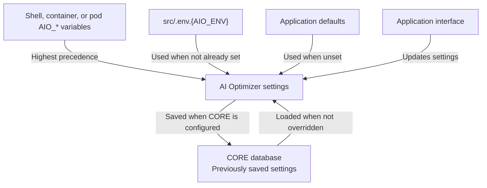

+++
title = 'Configuration'
weight = 10
+++

<!--
Copyright (c) 2024, 2026, Oracle and/or its affiliates.
Licensed under the Universal Permissive License v1.0 as shown at http://oss.oracle.com/licenses/upl.

spell-checker: ignore genai vllm pplx relref
-->

The {} requires some configuration to take full advantage of the AI capabilities in Oracle AI Database. Most settings can be configured through the [application interface]({}).

However, you can use environment variables to reduce how much needs to be configured manually and to enable features such as observability.

## Getting Started

To create an environment file, copy the example:

```bash
cp src/.env.example src/.env.dev
```

Edit `src/.env.dev` and uncomment the settings you need. For example, to configure a CORE database connection:

```dotenv
AIO_DB_USERNAME=demo
AIO_DB_PASSWORD=replace-with-your-password
AIO_DB_DSN=localhost:1521/FREEPDB1
```

Configuring a valid CORE database with `AIO_DB_USERNAME`, `AIO_DB_PASSWORD`, and `AIO_DB_DSN` enables application settings persistence and provides the database access required by RAG, NL2SQL, and the Testbed. Models and other settings configured through the interface are then restored from the configured CORE database after a restart.

{}
Environment files can contain API keys, database credentials, wallet passwords, private-key material, and telemetry headers. Do not commit a populated environment file to source control. For shared or hosted environments, store these values using your deployment platform's secret-management facilities.
{}

## How Configuration Works

Configuration is loaded, updated, and saved through the following paths:



## Environment Variables

When the {} starts, environment variables are read from the process environment or from a `.env.{AIO_ENV}` file in the `src/` directory, as outlined above. Variables already present in the process environment are not overwritten by values in the environment file.

When using an environment file, you can set `AIO_ENV` before startup to select the file; it defaults to `dev`. This allows you to easily switch between different configurations.

| `AIO_ENV` value | File loaded |
|---|---|
| `dev` (default) | `src/.env.dev` |
| `prd` | `src/.env.prd` |
| _custom_ | `src/.env.{custom}` |

Restart the affected component after changing a value.

The variables below are specific to the {} and use the `AIO_` prefix. Integrations such as [OpenTelemetry](#observability) and OpenInference also use their own environment variables; these are covered in the relevant integration documentation. `TNS_ADMIN` usage is covered under [Database Configuration]({}).

### Application

| Variable | Description | Default |
|---|---|---|
| `AIO_ENV` | Selects the `src/.env.{AIO_ENV}` file and labels the deployment environment. Set it before startup. | `dev` |
| `AIO_LOG_LEVEL` | Python logging level | `INFO` |

### Authentication

| Variable | Description | Default |
|---|---|---|
| `AIO_API_KEY` | API key for authenticating requests to the API Server. If unset, a key is generated at startup and displayed on the [API Server]({}) page. | _(generated)_ |

### Database

These variables configure the CORE database connection. See [Database Configuration]({}) for connection formats, wallet setup, and required privileges.

| Variable | Description | Default |
|---|---|---|
| `AIO_DB_USERNAME` | Database username | _(none)_ |
| `AIO_DB_PASSWORD` | Database password | _(none)_ |
| `AIO_DB_DSN` | Connection string or TNS alias | _(none)_ |
| `AIO_DB_WALLET_PASSWORD` | Wallet password for mTLS connections | _(none)_ |
| `AIO_DB_WALLET_LOCATION` | Path to the wallet directory for mTLS connections | _(none)_ |
| `AIO_DB_POOL_SIZE` | Maximum database connection pool size | `5` |

### Server

| Variable | Description | Default |
|---|---|---|
| `AIO_SERVER_URL` | URL the client uses to reach the API Server | _(auto-detected)_ |
| `AIO_SERVER_URL_PREFIX` | URL path prefix for the API Server, such as `/optimizer` | _(none)_ |
| `AIO_SERVER_ADDRESS` | API Server bind address. The standalone server uses `0.0.0.0`; client autostart uses `127.0.0.1`. Clients should connect through `AIO_SERVER_URL`. | component-specific |
| `AIO_SERVER_PORT` | API Server listen port | `8000` |
| `AIO_SERVER_SSL` | Enables TLS for the API Server | `false` |
| `AIO_SERVER_SSL_CERT_FILE` | Path to a TLS certificate in PEM format. When TLS is enabled without a certificate, a self-signed certificate is generated. | _(none)_ |
| `AIO_SERVER_SSL_KEY_FILE` | Path to the TLS private key in PEM format | _(none)_ |
| `AIO_SERVER_READY_TIMEOUT` | Seconds the client waits for the API Server to become ready at startup | `180` |
| `AIO_MAX_CLIENTS` | Maximum number of distinct client sessions cached in memory | `64` |

### Client

| Variable | Description | Default |
|---|---|---|
| `AIO_CLIENT_ADDRESS` | Client listen address | `localhost` |
| `AIO_CLIENT_URL_PREFIX` | URL path prefix for the Client | _(none)_ |
| `AIO_CLIENT_PORT` | Client listen port | `8501` |
| `AIO_CLIENT_COOKIE_SECRET` | Signing key for the client's XSRF cookies. Multi-replica deployments must provide the same value to every replica. | _(none)_ |
| `AIO_CLIENT_PASSWORD` | Shared password gating configuration and shared-state controls in the GUI client. This does not replace API Server authentication. See [Collaboration & Multi-User]({}). | _(none)_ |
| `AIO_CLIENT_SSL` | Enables TLS for the Client | `false` |
| `AIO_CLIENT_SSL_CERT_FILE` | Path to a TLS certificate in PEM format | _(none)_ |
| `AIO_CLIENT_SSL_KEY_FILE` | Path to a TLS private key in PEM format | _(none)_ |

### OCI CLI Overrides

These settings populate the DEFAULT OCI profile. See [OCI Configuration]({}) for authentication requirements and supported authentication types.

| Variable | Description | Default |
|---|---|---|
| `AIO_OCI_CLI_AUTH` | Authentication type, such as `api_key` or `instance_principal` | _(none)_ |
| `AIO_OCI_CLI_TENANCY` | Tenancy OCID | _(none)_ |
| `AIO_OCI_CLI_REGION` | OCI region | _(none)_ |
| `AIO_OCI_CLI_USER` | User OCID | _(none)_ |
| `AIO_OCI_CLI_FINGERPRINT` | API key fingerprint | _(none)_ |
| `AIO_OCI_CLI_KEY_FILE` | Path to a private key in PEM format | _(none)_ |
| `AIO_OCI_CLI_KEY_CONTENT` | Inline private-key content | _(none)_ |
| `AIO_OCI_CLI_PASSPHRASE` | Private-key passphrase | _(none)_ |
| `AIO_OCI_CLI_SECURITY_TOKEN_FILE` | Path to a security-token file | _(none)_ |

### OCI GenAI

| Variable | Description | Default |
|---|---|---|
| `AIO_GENAI_COMPARTMENT_ID` | Compartment OCID for OCI GenAI inference | _(none)_ |
| `AIO_GENAI_REGION` | Region for the OCI GenAI service endpoint | _(none)_ |

### OCI Object Storage Source Lock

Pin the Split & Embed tab's OCI source compartment and, optionally, its bucket for every user of the deployment. The compartment must resolve against the active OCI profile. The bucket is only applied when the compartment resolves and the bucket exists in that compartment.

| Variable | Description | Default |
|---|---|---|
| `AIO_OCI_SOURCE_BUCKET_COMPARTMENT_ID` | Compartment OCID pinned as the Split & Embed source compartment. When the OCID resolves, the compartment selector is locked for all users. | _(none)_ |
| `AIO_OCI_SOURCE_BUCKET_NAME` | Bucket pinned within the configured source compartment. If the compartment does not resolve or the bucket does not exist there, this value is ignored. | _(none)_ |

### Model Overrides

These settings provide API keys or service URLs and enable matching built-in models at startup.

| Variable | Description | Default |
|---|---|---|
| `AIO_COHERE_API_KEY` | Cohere API key | _(none)_ |
| `AIO_OPENAI_API_KEY` | OpenAI API key | _(none)_ |
| `AIO_PPLX_API_KEY` | Perplexity AI API key | _(none)_ |
| `AIO_ON_PREM_OLLAMA_URL` | Ollama API URL, such as `http://127.0.0.1:11434` | _(none)_ |
| `AIO_ON_PREM_HF_URL` | Hugging Face TEI URL, such as `http://127.0.0.1:8080` | _(none)_ |
| `AIO_ON_PREM_VLLM_URL` | vLLM API URL, such as `http://localhost:8000/v1` | _(none)_ |

### NL2SQL

| Variable | Description | Default |
|---|---|---|
| `AIO_SQLCL_HOME` | Overrides the SQLcl connection-store directory | _(temporary directory)_ |

### Observability

| Variable | Description | Default |
|---|---|---|
| `AIO_OTEL_LOGS_ENABLED` | Enables application log export after OTLP tracing has been configured | `false` |

OpenTelemetry endpoints, protocols, exporters, sampling, and OpenInference payload visibility use their standard integration variables. See [Observability]({}) for the supported settings and deployment examples.

## Containers and Kubernetes

### Container

Pass the environment file when starting the container:

```bash
podman run --env-file src/.env.dev -p 8501:8501 -it --rm ai-optimizer-aio
```

### Kubernetes

When using Kubernetes, configure the application through the first-class [Helm values]({}) and Kubernetes Secrets. The chart translates these values into application or integration variables and can also be embedded as a subchart without requiring the same setting in two places.
