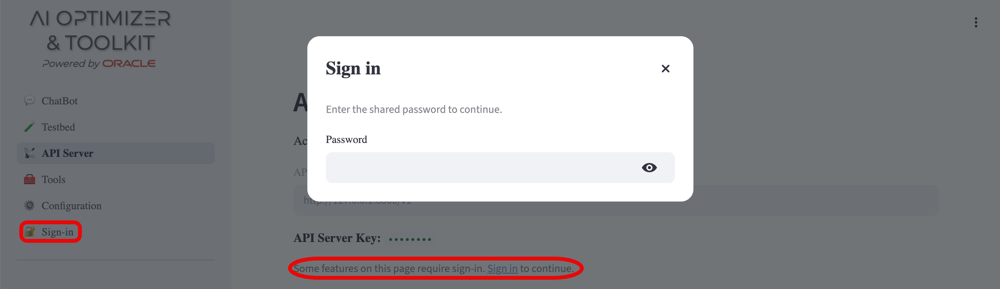
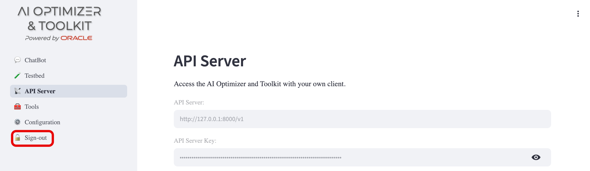

{/* Copyright (c) 2024, 2026, Oracle and/or its affiliates.
Licensed under the Universal Permissive License v1.0 as shown at http://oss.oracle.com/licenses/upl. */}

One **AI Optimizer** [API Server](../server/intro) can serve many clients at once. These can include GUI sessions, IDE or MCP connections, and external applications.

Clients that access the same API Server share resources such as database connections and model configurations. Each client selects which shared resources its session uses.

In shared deployments, you can [protect the shared configuration](#protecting-the-shared-configuration) controls with a password.

## What Is Shared vs. Isolated

The server has shared configuration that every client can use. Each client chooses how to use that configuration for its own session.

### Shared Configuration across all clients

These are configured once on the server and are available to every client:

- **Database** connections (aliases, DSNs, vector stores)
- **Model** configurations (which models exist, their endpoints and API keys)
- **OCI** profiles
- **Prompt** configurations
- The **API Server key** (`AIO_API_KEY`)

When a client adds a database or enables a model, every client can use it.

### Isolated per client

Each client keeps its own selected settings and conversation history:

- **Selected language model** and its parameters (temperature, max tokens, top-p, penalties)
- **Selected database** alias
- **Selected OCI** profile
- **Enabled tools** (Vector Search, NL2SQL)
- **Vector Search settings** (selected store, search type, top-k, thresholds)
- **Testbed** model selections
- **Conversation history**

For example, two clients can choose different configured databases and models without changing what is available to other clients.

## Client IDs and Access

A client ID selects the client-specific settings and conversation history described above. It does not authenticate a client or restrict access to a session.

Any client with the API key can use any client ID, including `server`. A client that knows or guesses another client ID can read that session's conversation history and submit requests using its settings.

:::tip
Use client IDs to separate conversation context and client settings. To isolate untrusted tenants, run separate deployments of the **AI Optimizer** with different API keys.
:::

For request details and client-ID behavior, see [AI Optimizer Server](../server/intro#client-ids).

## Protecting the Shared Configuration

Because the configuration is shared, GUI controls can change settings that affect every client including: adding or deleting databases, editing models, resetting settings, and exporting configuration that contains secrets.

For shared or multi-client deployments, set a **shared password** to protect these controls using the [`AIO_CLIENT_PASSWORD`](../guides/env-vars#client) environment variable to enable the gate.

When the password is set, the gate is enabled and protected controls are read-only until a user signs in.

When it is unset, the gate is disabled and all controls are accessible.

:::note
This check applies only to the GUI. It does not replace or affect API Server authentication. External clients still authenticate with `AIO_API_KEY`. See [Environment Variables](../guides/env-vars).
:::

### What the gate covers

When a password is configured, the following remain read-only until sign-in:

- **Configuration** tabs: Databases, Models, OCI, MCP, and Settings
- The **API Server** page (including the server key)
- Stored connection fields (passwords and keys render as a redacted `••••••••` placeholder rather than editable inputs)
- **Reset** / **Delete** actions and configuration **import/export**
- **Prompt Engineering** edits

Personal workspace pages, including **ChatBot**, **Tools**, and **Testbed**, stay usable while signed out. Only controls that change shared configuration are protected.

### Signing in and out

When the password is configured, a **🔐 Sign-in** entry appears in the sidebar. Select it, or the inline **Sign in** link next to a protected control, to open the password dialog. Enter the shared password and press **Enter**.

Authentication applies to one browser session. Signing in unlocks protected controls for that session only, and other browser sessions are unaffected. Once signed in, the entry becomes **🔓 Sign-out**, which clears that session's authenticated state.

:::warning
The password is _shared_. It protects shared controls, but does not identify the browser session that supplies it.
:::
