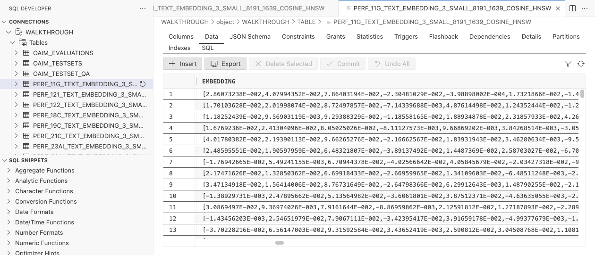

{/* Copyright (c) 2024, 2026, Oracle and/or its affiliates.
Licensed under the Universal Permissive License v1.0 as shown at http://oss.oracle.com/licenses/upl. */}

import OracleAiDatabaseFree from '../_assets/partials/oracle-ai-database-free.mdx';

The [**Oracle AI Database**](https://www.oracle.com/database/) sits at the core of the **AI Optimizer**. It is used for application persistence (settings, test sets, evaluations), storing embeddings for **Vector Search** and querying structured data via **NL2SQL**.



:::note[Reduced capabilities]
The **AI Optimizer** can be used to interact with language models without having the database configured, but additional functionality such as RAG and NL2SQL, will not be available without the database.
:::

### Database Configuration

You can configure the connection to an Oracle AI Database in the [client](../client/configuration/databases) page or by setting [environment variables](../guides/env-vars#database). The **AI Optimizer** supports multiple database connections, but only one can be active at a time.

## Run Local Oracle AI Database Free

Provisioning an on-premises database or an Oracle Cloud database is outside the scope of this guide.

For a local development environment, you can run Oracle AI Database Free in a container:

<OracleAiDatabaseFree />

After the database is ready, create a database user as described in [Database User](#database-user). When configuring the **AI Optimizer** on the same host, use `//localhost:1521/FREEPDB1` as the connect string.

## Using a Wallet/TNS_ADMIN

For mTLS database connectivity, or to use a TNS alias instead of a full connect string, use the contents of a `TNS_ADMIN` directory.

:::info[Great things come from unzipped files]

If using an ADB-S wallet, unzip its contents into the `TNS_ADMIN` directory. The `.zip` file is not recognized.

:::

### Bare-Metal

For bare-metal installations, set the `TNS_ADMIN` environment variable to the location of your unzipped wallet files before starting the **AI Optimizer**.

### Container

When starting the container, mount the `TNS_ADMIN` directory at `/app/tns_admin`.

For example:

```bash
podman run -v $TNS_ADMIN:/app/tns_admin -p 8501:8501 -it --rm localhost/ai-optimizer-aio:latest
```

## Database User

For both **RAG** and **NL2SQL**, the **AI Optimizer** needs to authenticate to an Oracle AI Database. AI agents use this user to retrieve data, so carefully consider the access granted to it. Use a non-privileged user with a non-`SYSTEM` tablespace.

For Oracle AI Database Free running in a container, connect as a privileged user and select the pluggable database:

```bash
podman exec -it ai-optimizer-db sqlplus '/ as sysdba'
```

```sql
ALTER SESSION SET CONTAINER=FREEPDB1;
```

Use the following local-development example to create a database user. It grants `DB_DEVELOPER_ROLE` and an unlimited quota on the default permanent tablespace. For other environments, grant only the privileges and quota required for the intended use. Change the value of `c_user_password`:

```sql
DECLARE
    c_user_name     CONSTANT VARCHAR2(30) := 'DEMO';
    c_user_password dba_users.password%TYPE := 'MYSUPERSECRET';
    v_default_perm  database_properties.property_value%TYPE;
    v_default_temp  database_properties.property_value%TYPE;
    v_sql           VARCHAR2(500);
BEGIN
    SELECT property_value
    INTO v_default_perm
    FROM database_properties
    WHERE property_name = 'DEFAULT_PERMANENT_TABLESPACE';

    SELECT property_value
    INTO v_default_temp
    FROM database_properties
    WHERE property_name = 'DEFAULT_TEMP_TABLESPACE';

    v_sql := 'CREATE USER ' || DBMS_ASSERT.ENQUOTE_NAME(c_user_name, FALSE) ||
            ' IDENTIFIED BY "' || c_user_password || '" ' ||
            'DEFAULT TABLESPACE ' || v_default_perm || ' ' ||
            'TEMPORARY TABLESPACE ' || v_default_temp;
    EXECUTE IMMEDIATE v_sql;

    EXECUTE IMMEDIATE 'GRANT DB_DEVELOPER_ROLE TO ' ||
        DBMS_ASSERT.ENQUOTE_NAME(c_user_name, FALSE);
    EXECUTE IMMEDIATE 'ALTER USER ' ||
        DBMS_ASSERT.ENQUOTE_NAME(c_user_name, FALSE) || ' DEFAULT ROLE ALL';
    EXECUTE IMMEDIATE 'ALTER USER ' ||
        DBMS_ASSERT.ENQUOTE_NAME(c_user_name, FALSE) || ' QUOTA UNLIMITED ON ' ||
        DBMS_ASSERT.ENQUOTE_NAME(v_default_perm, FALSE);
END;
/
EXIT;
```

:::tip[One schema fits none...]

Creating multiple users in the same database allows developers to separate their experiments by changing the Database User.

:::

## Deep Data Security Privileges

To use all Deep Data Security management actions, the database user needs the additional privileges below. They are optional. If the database does not support Deep Data Security, the GUI displays an availability warning. If the database user lacks a privilege, the corresponding management action is unavailable.

```sql
GRANT CREATE DATA ROLE TO "DEMO";
GRANT DROP DATA ROLE TO "DEMO";
GRANT CREATE END USER TO "DEMO";
GRANT DROP END USER TO "DEMO";
GRANT CREATE DATA GRANT TO "DEMO";
GRANT CREATE END USER CONTEXT TO "DEMO";
GRANT CREATE END USER SECURITY CONTEXT TO "DEMO";
GRANT ADMINISTER ANY DATA GRANT TO "DEMO";
GRANT GRANT ANY DATA ROLE TO "DEMO";
-- Read access so the tool can list data roles and end users
GRANT SELECT ON DBA_DATA_ROLES TO "DEMO";
GRANT SELECT ON DBA_DATA_ROLE_GRANTS TO "DEMO";
GRANT SELECT ON DBA_END_USERS TO "DEMO";
```

To let **Vector Search** and **NL2SQL** connect _as_ a Deep Data Security end user (the **Connect tools as** control), the end user must be able to log in. An end user cannot be granted `CREATE SESSION` directly; the privilege is carried by a standard database role that flows to the end user through a data role. As a privileged user (for example, `ADMIN` or `SYSTEM`), create that role once and let `"DEMO"` grant it:

```sql
-- Privileged user: one standard role that carries CREATE SESSION
CREATE ROLE AIO_DDS_ROLE;
GRANT CREATE SESSION TO AIO_DDS_ROLE;
-- Let the database user grant AIO_DDS_ROLE to data roles it creates and assign data roles
GRANT AIO_DDS_ROLE TO "DEMO" WITH ADMIN OPTION;
```

The tool grants `AIO_DDS_ROLE` to each locally managed data role it creates, so any end user assigned that data role can be connected as.
