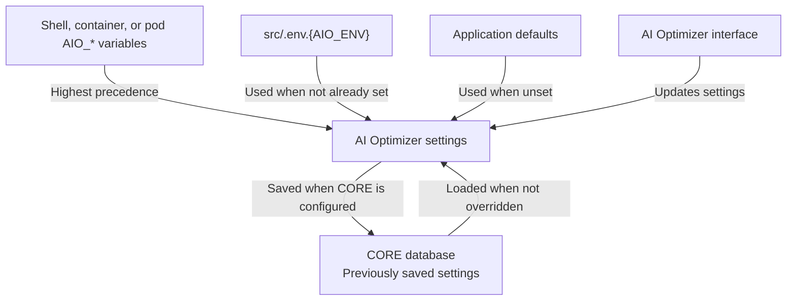

{/* Copyright (c) 2024, 2026, Oracle and/or its affiliates.
Licensed under the Universal Permissive License v1.0 as shown at http://oss.oracle.com/licenses/upl. */}

## Getting Started

Most settings can be configured in the [AI Optimizer interface](../client/configuration), however, you can use environment variables to pre-configure a deployment and enable operational integrations. You can provide them in two ways:

- Create an environment file. This is the **preferred approach** for reusable local configuration because it keeps related settings together.
- Export values in the shell before starting the application. This is useful for temporary configuration and deployment platforms that inject environment variables.

To create the recommended environment file for local use, copy the example:

```bash
cp src/.env.example src/.env.dev
```

Then edit `src/.env.dev` and uncomment or add the settings your deployment needs:

```dotenv
AIO_DB_USERNAME=demo
AIO_DB_PASSWORD=replace-with-your-password
AIO_DB_DSN=localhost:1521/FREEPDB1
```

To export values from the shell for a temporary configuration:

```bash
export AIO_DB_USERNAME=demo
export AIO_DB_PASSWORD=replace-with-your-password
export AIO_DB_DSN=localhost:1521/FREEPDB1
```

:::note[Database at the Core]
A valid CORE database configuration (`AIO_DB_USERNAME`, `AIO_DB_PASSWORD`, and `AIO_DB_DSN`) enables settings persistence and provides the database access required by Vector Search, NL2SQL, and Testbed. Settings configured in the interface are restored from the CORE database after a restart.
:::

### Common Starting Configurations

To use a hosted model, configure its provider key. For example:

```dotenv
AIO_OPENAI_API_KEY=replace-with-your-api-key
```

To use database-backed features, add the CORE database settings shown above. To use a local Ollama model instead of a hosted model provider, set its URL:

```dotenv
AIO_ON_PREM_OLLAMA_URL=http://127.0.0.1:11434
```

See [AI Models](./ai-models) for model-provider setup and [Oracle AI Database](./database) for database connection details.

:::warning[Secrets inside]
Environment files can contain API keys, database credentials, wallet passwords, private-key material, and telemetry headers. Do not commit a populated environment file. For shared or hosted deployments, use the platform's secret-management facilities.
:::

## How Configuration Works

At startup, the application uses the following precedence:



## Environment Files

The entrypoint reads `AIO_*` variables from the process environment and then loads `src/.env.{AIO_ENV}` without replacing values already present in the process environment. In a POSIX shell, use `export` so the application inherits the variables.

Set `AIO_ENV` before startup to select an environment file. If it is unset, the application uses `dev`.

| `AIO_ENV` value | File loaded         |
| --------------- | ------------------- |
| `dev` (default) | `src/.env.dev`      |
| `prd`           | `src/.env.prd`      |
| _custom_        | `src/.env.{custom}` |

Restart the affected component after changing an environment variable.

`AIO_*` variables are specific to the **AI Optimizer**. Integrations such as OpenTelemetry and OpenInference use their own variables. See [Database Configuration](./database#using-a-wallettns_admin) for `TNS_ADMIN`.

Values supplied through `AIO_*` variables are reapplied at startup. You can change a matching setting in the interface while the application is running, but the environment value takes effect again after a restart. For the CORE database, `DB_*` environment variables take precedence over `AIO_DB_*`; for OCI profiles, `OCI_CLI_*` variables take precedence over `AIO_OCI_CLI_*`.

## Environment Variables

### Application

| Variable        | Description                                                                                         | Default |
| --------------- | --------------------------------------------------------------------------------------------------- | ------- |
| `AIO_ENV`       | Selects the `src/.env.{AIO_ENV}` file and labels the deployment environment. Set it before startup. | `dev`   |
| `AIO_LOG_LEVEL` | Python logging level                                                                                | `INFO`  |

### Authentication

| Variable                        | Description                                                                                                                                                                  | Default                                |
| ------------------------------- | ---------------------------------------------------------------------------------------------------------------------------------------------------------------------------- | -------------------------------------- |
| `AIO_API_KEY`                   | Shared API key used only when `AIO_AUTH_MODE` is unset. When unset, the Server generates one at startup. Principal-authenticated deployments do not accept it. | _(generated)_                          |
| `AIO_AUTH_MODE`                 | Principal authentication adapter: `dev` for the built-in OIDC provider, `oidc` for an external provider, or `proxy` for configured trusted-proxy identity headers. A configured CORE database defaults to `dev`. | _(none)_ |
| `AIO_AUTH_OIDC_ISSUER`          | Expected external OIDC issuer; its discovery document supplies the signing-key endpoint when `AIO_AUTH_MODE=oidc`.                                                           | _(none)_                               |
| `AIO_AUTH_OIDC_AUDIENCE`        | Expected external API access-token audience when `AIO_AUTH_MODE=oidc`.                                                                                                       | _(none)_                               |
| `AIO_AUTH_OIDC_CLIENT_ID`       | OIDC client identifier used by an application client.                                                                                                                        | _(none)_                               |
| `AIO_AUTH_OIDC_CLIENT_SECRET`   | OIDC client secret when the configured client is confidential.                                                                                                               | _(none)_                               |
| `AIO_AUTH_OIDC_SCOPES`          | Requested OIDC scopes.                                                                                                                                                       | `openid,profile,email,aio.api`         |
| `AIO_AUTH_OIDC_REQUIRED_SCOPES` | Scopes every API/MCP access token must contain.                                                                                                                              | `aio.api`                              |
| `AIO_AUTH_OIDC_ROLES_CLAIM`     | JWT claim containing roles or scopes used for administrator mapping.                                                                                                         | `roles`                                |
| `AIO_AUTH_ADMIN_CLAIM_VALUES`   | JSON array of role/scope values that grant administrator authority.                                                                                                          | `["aio.admin"]`                        |
| `AIO_AUTH_DEV_ISSUER`           | Built-in provider issuer. It must be an absolute root-path origin; plain HTTP is accepted only for loopback.                                                                 | `http://127.0.0.1:8765`                |
| `AIO_AUTH_DEV_WEB_REDIRECT_URI` | Registered Streamlit callback URI for the built-in provider.                                                                                                                 | `http://localhost:8501/oauth2callback` |
| `AIO_AUTH_DEV_LISTEN_HOST`      | Built-in provider bind address.                                                                                                                                              | `127.0.0.1`                            |
| `AIO_AUTH_DEV_LISTEN_PORT`      | Built-in provider listener port.                                                                                                                                             | `8765`                                 |
| `AIO_AUTH_DEV_ADMIN_PASSWORD`   | Password for the bootstrapped `admin@example.test` development administrator. It is applied whenever the development provider starts. When unset, a random password is generated and retained locally for All-In-One startup. | _(generated)_ |
| `AIO_AUTH_DEV_WEB_CLIENT_SECRET` | Confidential credential for the built-in Streamlit OIDC client. All-In-One and Helm generate and share it automatically. | _(generated)_ |
| `AIO_AUTH_PROXY_TRUSTED_CIDRS`  | JSON array of trusted direct-peer CIDRs allowed to supply configured proxy identity headers.                                                                                 | _(none)_                               |
| `AIO_AUTH_PROXY_SUBJECT_HEADER` | Trusted-proxy header containing the authenticated subject.                                                                                                                   | `X-Authenticated-Subject`              |
| `AIO_AUTH_PROXY_ROLES_HEADER`   | Trusted-proxy header containing roles/scopes.                                                                                                                                | `X-Authenticated-Roles`                |
| `AIO_AUTH_PROXY_ISSUER`         | Stable issuer label recorded for proxy-authenticated principals.                                                                                                             | `trusted-proxy`                        |

Choose the authentication model from the available deployment resources:

- Without an Oracle CORE database, leave `AIO_AUTH_MODE` unset and use
  `AIO_API_KEY`. This is the current no-database deployment model.
- With an Oracle CORE database, the built-in development OIDC provider is
  selected by default. Set `AIO_AUTH_MODE` only to select `oidc` or `proxy`.
- With an Oracle CORE database and an external OIDC provider, set
  `AIO_AUTH_MODE=oidc`.

### Built-in development OIDC

The built-in provider is enabled only when `AIO_AUTH_MODE=dev` and a
CORE Oracle Database is configured. It runs as a dedicated listener in the
same platform process; it does not require Docker, Podman, a JVM, or a
separately installed identity product.

For a local installation, the default issuer and discovery URL are:

```text
http://127.0.0.1:8765
http://127.0.0.1:8765/.well-known/openid-configuration
```

The provider seeds one `admin@example.test` account with `aio.admin` and the
`openid profile email aio.api` scopes. Its password is
`AIO_AUTH_DEV_ADMIN_PASSWORD`. When unset, the server generates a random value
at startup. The configured or generated value is applied whenever the
development provider starts, including when the bootstrap account already
exists. HTTP is supported only on loopback; use a configured HTTPS issuer
behind TLS for other deployments.

When the Client is started through the platform entrypoint, development mode
automatically creates its local Streamlit OIDC configuration using the issuer
and callback settings above. In an All-In-One bare-metal installation, when
the development administrator password is not configured, the launcher also
creates and reuses a private local bootstrap credential. Retrieve it only from
the machine that started All-In-One:

```bash
uv run python -m server.app.dev_oidc_admin show-bootstrap-password
```

The command prints `admin@example.test` and the generated password. On each
local All-In-One start, that generated password is synchronized to the
bootstrap account, including an account created by an earlier server startup.
The local credential and generated `secrets.toml` are owner-only and ignored by Git.
Helm mounts the equivalent Streamlit configuration from its chart-managed
Secret.

To add an additional development user after the server database is configured:

```bash
uv run python -m server.app.dev_oidc_admin add-user \
  --username carol@example.test \
  --email carol@example.test \
  --display-name Carol
```

The command prompts for the password twice. Add `--administrator` only when
the user needs the `aio.admin` scope.

### Client

| Variable                   | Description                                                                                                                                                                                                    | Default     |
| -------------------------- | -------------------------------------------------------------------------------------------------------------------------------------------------------------------------------------------------------------- | ----------- |
| `AIO_CLIENT_ADDRESS`       | Client listen address                                                                                                                                                                                          | `localhost` |
| `AIO_CLIENT_PORT`          | Client listen port                                                                                                                                                                                             | `8501`      |
| `AIO_CLIENT_COOKIE_SECRET` | Signing key for the client's XSRF cookies. Multi-replica deployments must provide the same value to every replica.                                                                                             | _(none)_    |
| `AIO_CLIENT_SSL`           | Enables TLS for the Client                                                                                                                                                                                     | `false`     |
| `AIO_CLIENT_SSL_CERT_FILE` | Path to a TLS certificate in PEM format                                                                                                                                                                        | _(none)_    |
| `AIO_CLIENT_SSL_KEY_FILE`  | Path to a TLS private key in PEM format                                                                                                                                                                        | _(none)_    |

### Server

| Variable                   | Description                                                                                                                                                                            | Default            |
| -------------------------- | -------------------------------------------------------------------------------------------------------------------------------------------------------------------------------------- | ------------------ |
| `AIO_SERVER_URL`           | URL the client uses to reach the [**AI Optimizer Server**](../server/intro.mdx). Set it when the client connects to a separately deployed, remote, or reverse-proxied instance.        | _(auto-detected)_  |
| `AIO_SERVER_URL_PREFIX`    | URL path prefix for the [**AI Optimizer Server**](../server/intro.mdx), such as `/optimizer`                                                                                           | _(none)_           |
| `AIO_SERVER_ADDRESS`       | [**AI Optimizer Server**](../server/intro.mdx) bind address. A standalone instance uses `0.0.0.0`; client autostart uses `127.0.0.1`. Clients should connect through `AIO_SERVER_URL`. | component-specific |
| `AIO_SERVER_PORT`          | [**AI Optimizer Server**](../server/intro.mdx) listen port                                                                                                                             | `8000`             |
| `AIO_SERVER_SSL`           | Enables TLS for the [**AI Optimizer Server**](../server/intro.mdx)                                                                                                                     | `false`            |
| `AIO_SERVER_SSL_CERT_FILE` | Path to a TLS certificate in PEM format. When TLS is enabled without a certificate, a self-signed certificate is generated.                                                            | _(none)_           |
| `AIO_SERVER_SSL_KEY_FILE`  | Path to the TLS private key in PEM format                                                                                                                                              | _(none)_           |
| `AIO_SERVER_READY_TIMEOUT` | Seconds the client waits for the [**AI Optimizer Server**](../server/intro.mdx) to become ready at startup                                                                             | `180`              |
| `AIO_MAX_CLIENTS`          | Maximum number of distinct client sessions cached in memory                                                                                                                            | `64`               |

### Database

These variables configure the CORE database connection. See [Database Configuration](./database) for connection formats, wallet setup, and required privileges.

| Variable                 | Description                                       | Default  |
| ------------------------ | ------------------------------------------------- | -------- |
| `AIO_DB_USERNAME`        | Database username                                 | _(none)_ |
| `AIO_DB_PASSWORD`        | Database password                                 | _(none)_ |
| `AIO_DB_DSN`             | Connection string or TNS alias                    | _(none)_ |
| `AIO_DB_WALLET_PASSWORD` | Wallet password for mTLS connections              | _(none)_ |
| `AIO_DB_WALLET_LOCATION` | Path to the wallet directory for mTLS connections | _(none)_ |
| `AIO_DB_POOL_SIZE`       | Maximum database connection pool size             | `5`      |

### OCI CLI

These settings populate the DEFAULT OCI profile. See [OCI Configuration](./oracle-cloud-infra.mdx) for authentication requirements and supported authentication types.

| Variable                          | Description                                                    | Default  |
| --------------------------------- | -------------------------------------------------------------- | -------- |
| `AIO_OCI_CLI_AUTH`                | Authentication type, such as `api_key` or `instance_principal` | _(none)_ |
| `AIO_OCI_CLI_TENANCY`             | Tenancy OCID                                                   | _(none)_ |
| `AIO_OCI_CLI_REGION`              | OCI region                                                     | _(none)_ |
| `AIO_OCI_CLI_USER`                | User OCID                                                      | _(none)_ |
| `AIO_OCI_CLI_FINGERPRINT`         | API key fingerprint                                            | _(none)_ |
| `AIO_OCI_CLI_KEY_FILE`            | Path to a private key in PEM format                            | _(none)_ |
| `AIO_OCI_CLI_KEY_CONTENT`         | Inline private-key content                                     | _(none)_ |
| `AIO_OCI_CLI_PASSPHRASE`          | Private-key passphrase                                         | _(none)_ |
| `AIO_OCI_CLI_SECURITY_TOKEN_FILE` | Path to a security-token file                                  | _(none)_ |

#### OCI GenAI

| Variable                   | Description                               | Default  |
| -------------------------- | ----------------------------------------- | -------- |
| `AIO_GENAI_COMPARTMENT_ID` | Compartment OCID for OCI GenAI inference  | _(none)_ |
| `AIO_GENAI_REGION`         | Region for the OCI GenAI service endpoint | _(none)_ |

#### OCI Object Storage Source Lock

Pin the Split & Embed tab's OCI source compartment and, optionally, its bucket for every user of the deployment. The compartment must resolve against the active OCI profile. The bucket is only applied when the compartment resolves and the bucket exists in that compartment.

| Variable                               | Description                                                                                                                                            | Default  |
| -------------------------------------- | ------------------------------------------------------------------------------------------------------------------------------------------------------ | -------- |
| `AIO_OCI_SOURCE_BUCKET_COMPARTMENT_ID` | Compartment OCID pinned as the Split & Embed source compartment. When the OCID resolves, the compartment selector is locked for all users.             | _(none)_ |
| `AIO_OCI_SOURCE_BUCKET_NAME`           | Bucket pinned within the configured source compartment. If the compartment does not resolve or the bucket does not exist there, this value is ignored. | _(none)_ |

### Models

These settings provide API keys or service URLs and enable matching built-in models at startup.

| Variable                 | Description                                           | Default  |
| ------------------------ | ----------------------------------------------------- | -------- |
| `AIO_COHERE_API_KEY`     | Cohere API key                                        | _(none)_ |
| `AIO_OPENAI_API_KEY`     | OpenAI API key                                        | _(none)_ |
| `AIO_PPLX_API_KEY`       | Perplexity AI API key                                 | _(none)_ |
| `AIO_ON_PREM_OLLAMA_URL` | Ollama API URL, such as `http://127.0.0.1:11434`      | _(none)_ |
| `AIO_ON_PREM_HF_URL`     | Hugging Face TEI URL, such as `http://127.0.0.1:8080` | _(none)_ |
| `AIO_ON_PREM_VLLM_URL`   | vLLM API URL, such as `http://localhost:8000/v1`      | _(none)_ |

### NL2SQL

| Variable              | Description                                       | Default                 |
| --------------------- | ------------------------------------------------- | ----------------------- |
| `AIO_SQLCL_HOME`      | Overrides the SQLcl connection-store directory    | _(temporary directory)_ |
| `AIO_SQLCL_MCP_LEVEL` | SQLcl MCP restrict level; integer from `0` to `4` | `4`                     |

### Observability

| Variable                | Description                                                            | Default |
| ----------------------- | ---------------------------------------------------------------------- | ------- |
| `AIO_OTEL_LOGS_ENABLED` | Enables application log export after OTLP tracing has been configured. | `false` |

The **AI Optimizer** honors the standard [OpenTelemetry SDK environment variables](https://opentelemetry.io/docs/languages/sdk-configuration/). The most relevant ones for operators are listed below.

#### Endpoint and protocol

| Variable                             | Description                                                              | Default                   |
| ------------------------------------ | ------------------------------------------------------------------------ | ------------------------- |
| `OTEL_EXPORTER_OTLP_ENDPOINT`        | OTLP receiver URL (all signals)                                          | _(unset = OTLP disabled)_ |
| `OTEL_EXPORTER_OTLP_TRACES_ENDPOINT` | Trace-specific endpoint (overrides the generic one)                      | _(unset)_                 |
| `OTEL_EXPORTER_OTLP_LOGS_ENDPOINT`   | Log-specific endpoint (overrides the generic one)                        | _(unset)_                 |
| `OTEL_EXPORTER_OTLP_PROTOCOL`        | `grpc` or `http/protobuf` (all signals)                                  | `grpc`                    |
| `OTEL_EXPORTER_OTLP_TRACES_PROTOCOL` | Trace-specific protocol (overrides the generic one)                      | _(unset)_                 |
| `OTEL_EXPORTER_OTLP_LOGS_PROTOCOL`   | Log-specific protocol (overrides the generic one)                        | _(unset)_                 |
| `OTEL_EXPORTER_OTLP_INSECURE`        | If `true`, skips TLS for gRPC OTLP. Required for plaintext local SigNoz. | `false`                   |
| `OTEL_EXPORTER_OTLP_HEADERS`         | Comma-separated `k=v` headers (for example, vendor authentication)       | _(unset)_                 |

#### Exporter selection

| Variable               | Description                                                                                                                                 | Default |
| ---------------------- | ------------------------------------------------------------------------------------------------------------------------------------------- | ------- |
| `OTEL_TRACES_EXPORTER` | Comma-separated list. Supported values: `otlp`, `console`, `none`. Unsupported values are ignored.                                          | `otlp`  |
| `OTEL_LOGS_EXPORTER`   | Comma-separated list. Supported values: `otlp`, `none`. Set to `none` to disable log export when `AIO_OTEL_LOGS_ENABLED=true` is in effect. | `otlp`  |

#### Resource attributes

| Variable                   | Description                                                                                                              | Default               |
| -------------------------- | ------------------------------------------------------------------------------------------------------------------------ | --------------------- |
| `OTEL_SERVICE_NAME`        | Service name shown in the backend                                                                                        | `ai-optimizer-server` |
| `OTEL_RESOURCE_ATTRIBUTES` | Comma-separated `k=v` attributes attached to every span (for example, `deployment.environment=prd,service.namespace=ai`) | _(unset)_             |

#### Sampling

| Variable                  | Description                                                                                    | Default                 |
| ------------------------- | ---------------------------------------------------------------------------------------------- | ----------------------- |
| `OTEL_TRACES_SAMPLER`     | Sampler. Common: `parentbased_always_on` (default), `parentbased_traceidratio` (probabilistic) | `parentbased_always_on` |
| `OTEL_TRACES_SAMPLER_ARG` | Sampler argument (for ratio sampler: `0.0`–`1.0`, for example `0.1` for 10%)                   | _(none)_                |

#### Batch span processor tuning

The `OTEL_BSP_*` family (`OTEL_BSP_MAX_QUEUE_SIZE`, `OTEL_BSP_SCHEDULE_DELAY`, and others) is honored by the SDK without code changes. Tune it in production if you observe span drops or back-pressure. See the [SDK configuration specification](https://opentelemetry.io/docs/languages/sdk-configuration/general/) for the full list.

#### OpenInference payload visibility

OpenInference payload fields are hidden by default. Set the relevant `OPENINFERENCE_HIDE_*` variables to `false` only for a backend approved to retain prompts, responses, or retrieved content. See [Full Payload Export](../advanced-guides/observability/intro#full-payload-export) for the supported variables and their effects.

For more information on observability in the **AI Optimizer**, see the [advanced guide](../advanced-guides/observability/intro).

## Containers and Kubernetes

### Container

Pass an environment file when starting a container:

```bash
podman run --env-file src/.env.dev -p 8501:8501 -it --rm localhost/ai-optimizer-aio:latest
```

### Kubernetes

For Kubernetes, configure the application with Helm values and Kubernetes Secrets. See [Kubernetes / Helm](../advanced-guides/k8s-helm) and the [Helm chart](https://github.com/oracle/ai-optimizer/tree/main/helm) for the available settings.
