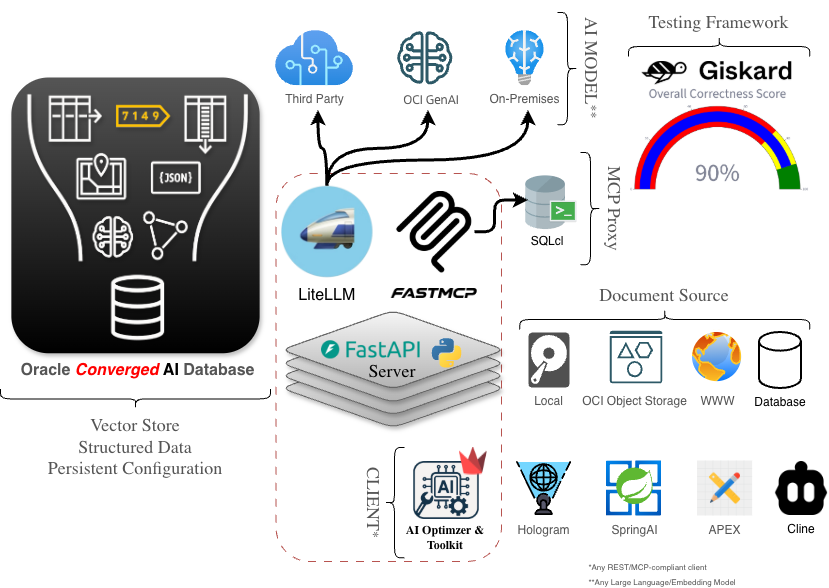

{/* Copyright (c) 2024, 2026, Oracle and/or its affiliates.
Licensed under the Universal Permissive License v1.0 as shown at http://oss.oracle.com/licenses/upl. */}

The **Oracle AI Optimizer and Toolkit** (the **AI Optimizer**) provides a streamlined environment where developers and data scientists can explore the potential of Generative Artificial Intelligence (**GenAI**).

By integrating [_Oracle AI Database_](https://www.oracle.com/database/) [Vector Search](https://www.oracle.com/database/ai-vector-search/) and [SQLcl MCP](https://www.oracle.com/database/sqldeveloper/technologies/sqlcl/) with familiar Open Source Software (**OSS**), the **AI Optimizer** enables users to enhance existing Language Models through Retrieval Augmented Generation (**RAG**) and Natural Language to SQL (**NL2SQL**).

This method significantly improves the accuracy of AI models, helping to avoid common issues such as knowledge cut-off and hallucinations.

  

  

    <strong className="home-integrations__heading">
      Familiar OSS components*
    </strong>
    <ul>
      <li>
        <a href="https://github.com/fastapi/fastapi">FastAPI</a> (REST API)
      </li>
      <li>
        <a href="https://github.com/jlowin/fastmcp">FastMCP</a> (tools)
      </li>
      <li>
        <a href="https://github.com/langchain-ai/langgraph">LangGraph</a> +{' '}
        <a href="https://github.com/oracle/agent-spec">AgentSpec</a> (orchestration)
      </li>
      <li>
        <a href="https://github.com/docling-project/docling">Docling</a> (parsing)
      </li>
      <li>
        <a href="https://github.com/open-telemetry/opentelemetry-python">OpenTelemetry</a> (observability)
      </li>
      <li>
        <a href="https://github.com/BerriAI/litellm">LiteLLM</a> (models)
      </li>
      <li>
        <a href="https://github.com/Giskard-AI/giskard">Giskard</a> (evaluation)
      </li>
    </ul>
  

  *Project names and logos are shown for identification purposes only. Unless expressly stated, their use does
  not imply affiliation with, sponsorship by, or endorsement by Oracle or the respective project owners.

## Architecture

The **Oracle AI Optimizer and Toolkit** (the **AI Optimizer**) consists of an API Server ([**AI Optimizer Server**](./server/intro)) and an _optional_ web-based GUI ([**AI Optimizer Client**](./client/intro)) component. Both the API Server and GUI can run directly on a developer workstation, in on-premises infrastructure, or in cloud environments.

Depending on the capabilities you plan to use, you may also need the following components, which are not delivered with the **AI Optimizer**. These can be local, on premises, or cloud-hosted:

- [Oracle AI Database](guides/database), including [Oracle AI Database **Free**](https://www.oracle.com/database/free)
- Access to at least one [Large Language Model](guides/ai-models#language-models) (for completions)
- Access to at least one [Embedding Model](guides/ai-models#embedding-models) (for Retrieval Augmented Generation)
- (Optional) Access to an [SQLcl **MCP Server**-enabled](https://docs.oracle.com/en/database/oracle/sql-developer-command-line/25.2/sqcug/using-oracle-sqlcl-mcp-server.html) instance

:::tip[Cloud Native]
The **AI Optimizer** supports Kubernetes deployments using a Helm chart. For deployment guidance, see the [Kubernetes guide](advanced-guides/kubernetes).
:::

## Features

The **AI Optimizer** brings together the capabilities you need to build, test, and refine GenAI solutions on the **Oracle AI Database**:

- [Configuring **Embedding** and **Language** Models](./client/configuration/models)
- [Experimenting with **Language Model** Parameters](./client/chatbot)
- [Splitting and **Embedding** Documentation](./client/tools/split_embed)
- [Modifying System **Prompts** (Prompt Engineering)](./client/tools/prompts)
- [Enforcing **Deep Data Security**](./client/tools/dds)
- [**Testbed** for auto-generated or existing Q&A datasets](./client/testbed)
