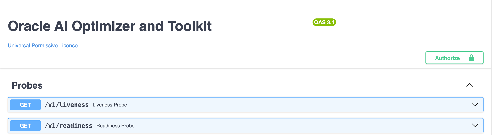

{/* Copyright (c) 2024, 2026, Oracle and/or its affiliates.
Licensed under the Universal Permissive License v1.0 as shown at http://oss.oracle.com/licenses/upl. */}

The workhorse of the **AI Optimizer** is the API Server, referred to as the **AI Optimizer Server**. By default, the **AI Optimizer Server** starts on port 8000.

:::note[All the docs]
The **AI Optimizer Server** API documentation is available at `http://<IP Address>:<Port>/v1/docs` for a running instance. Enter the API key to view and use the documented endpoints.
:::

Powered by [FastAPI](https://fastapi.tiangolo.com/) and [Uvicorn](https://www.uvicorn.org/), the **AI Optimizer Server** acts as an intermediary between REST-capable clients, AI models, and the Oracle AI Database.

## Calling the API

Authenticated API requests send the API key in the `X-API-Key` header. In a standalone deployment, set `AIO_API_KEY` before starting the server and distribute the key through your normal secret-management process.

## Multiple Clients

Several GUI, IDE, MCP, and external clients can use the same server. The server keeps their working sessions separate while they use the same configured resources.

Use [separate client sessions](./multi-user-sessions) for a shared deployment. For the security boundary, see [Access Control](../guides/access-control).
