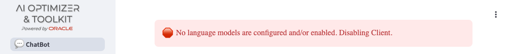
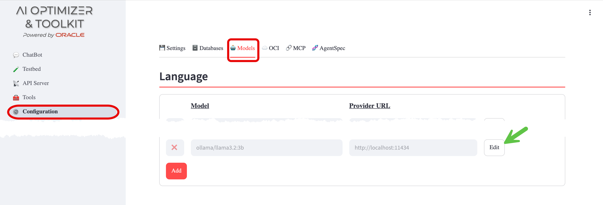
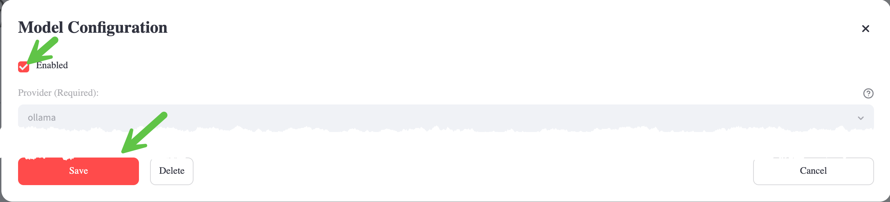
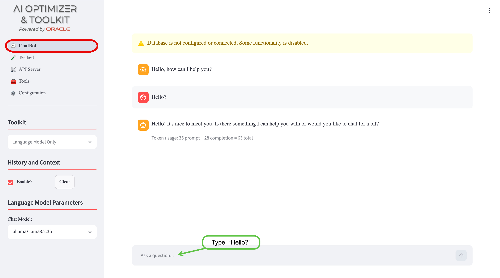
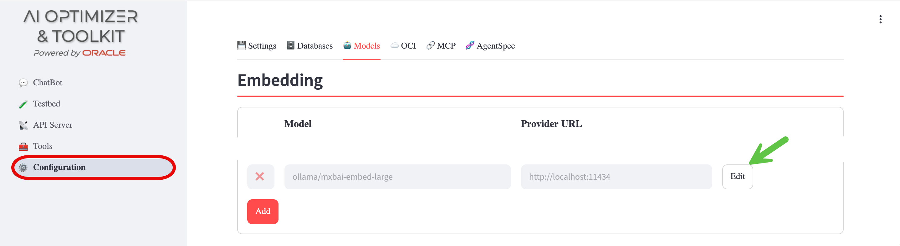
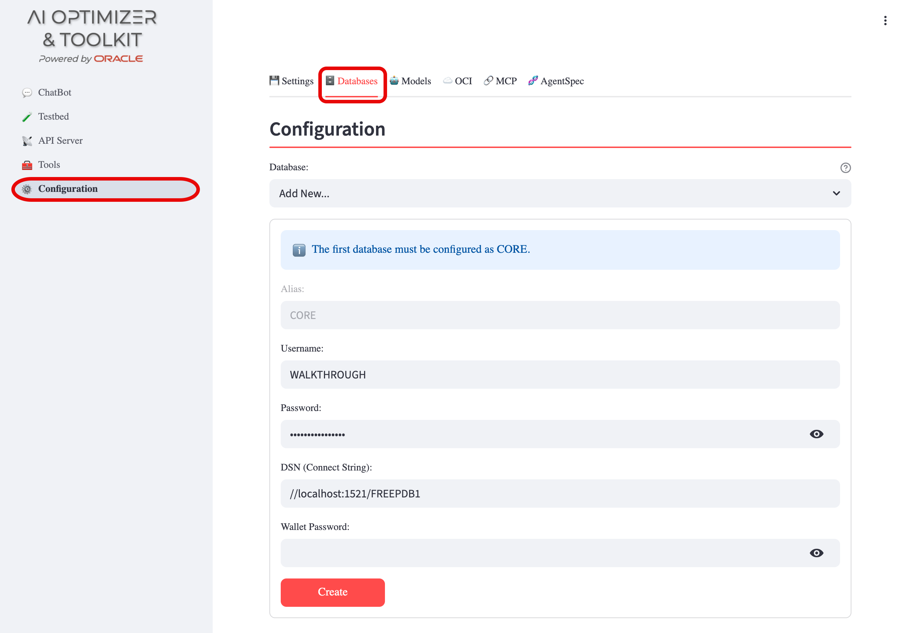
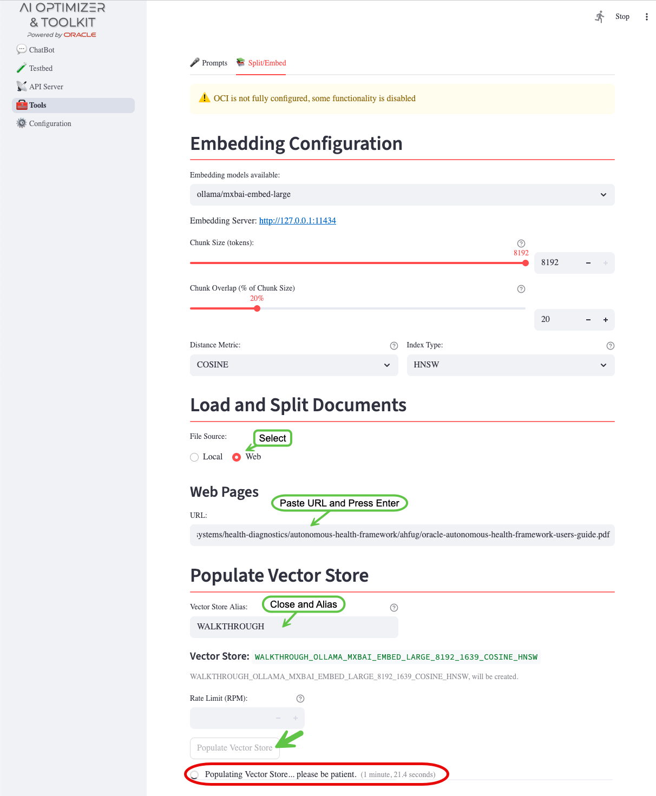
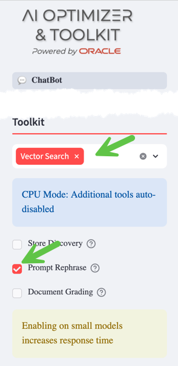

+++
title = 'Walkthrough'
menus = 'main'
weight = 5
+++

<!--
Copyright (c) 2024, 2026, Oracle and/or its affiliates.
Licensed under the Universal Permissive License v1.0 as shown at http://oss.oracle.com/licenses/upl.

spell-checker: ignore mxbai, ollama, sqlplus, sysdba, spfile, freepdb, tablespace, firewalld, hnsw
-->

This walkthrough will guide you through a basic installation of the {}. It will allow you to experiment with GenAI, using Retrieval-Augmented Generation (**RAG**) and Natural Language to SQL (**NL2SQL**) with the Oracle AI Database at the core.

By the end of the walkthrough you will be familiar with:

- Configuring a Language Model
- Configuring an Embedding Model
- Configuring the Vector Storage
- Splitting, Embedding, and Storing vectors
- Experimenting with the {}

What you'll need for the walkthrough:

- Internet Access (docker.io and container-registry.oracle.com)
- Access to an environment where you can run container images (Podman or Docker).
- 100G of free disk space.
- 12G of usable memory.
- Sufficient GPU/CPU resources to run the language model, embedding model, and database (see below).

{}
The performance will vary depending on the infrastructure.

Language and Embedding Models are designed to use GPUs, but this walkthrough _can work_ on machines with just CPUs; albeit _much_ slower!
When testing the Language Model, if you don't get a response in a couple of minutes; your hardware is not sufficient to continue with the walkthrough.
{}

## Installation



You will run four container images to establish the "Infrastructure":

- On-Premises Language Model - llama3.2:3b
- On-Premises Embedding Model - mxbai-embed-large
- Vector Storage - Oracle AI Database Free
- The {}

### Language Model - llama3.2:3b

To enable the _ChatBot_ functionality, access to a Language Model is required. The walkthrough will use [Ollama](https://ollama.com/) to run the _llama3.2:3b_ model.

1. Start the *Ollama* container:

   
   {}
   The Container Runtime is native. The command below makes all configured GPUs available; omit `--gpus=all` when running with CPUs only.

   ```bash
   podman run -d --gpus=all -v ollama:$HOME/.ollama -p 11434:11434 --name ollama docker.io/ollama/ollama
   ```
   {}
   {}
   The Container Runtime is backed by a virtual machine. Configure the VM with at least **12G of memory** and **100G of disk space**. The Ollama container will use the CPUs assigned to the VM.

   ```bash
   podman run -d -e OLLAMA_NUM_PARALLEL=1 -v ollama:$HOME/.ollama -p 11434:11434 --name ollama docker.io/ollama/ollama
   ```
   {}
   {}
   The Container Runtime is backed by a virtual machine. Configure the VM with at least **12G of memory** and **100G of disk space**. The LibKrun provider can expose the Apple Metal GPU to compatible container workloads, but does not by itself enable GPU acceleration for Ollama. The command below uses the CPUs assigned to the VM.

   ```bash
   podman run -d -e OLLAMA_NUM_PARALLEL=1 -v ollama:$HOME/.ollama -p 11434:11434 --name ollama docker.io/ollama/ollama
   ```
   {}
   {}
   The Container Runtime is backed by a virtual machine using WSL2 or Hyper-V. Configure the VM with at least **12G of memory** and **100G of disk space**. GPU acceleration with an NVIDIA GPU requires WSL2, a compatible driver, and the NVIDIA Container Toolkit configured in the Podman machine. The command below is a CPU-safe default.

   ```bash
   podman run -d -e OLLAMA_NUM_PARALLEL=1 -v ollama:$HOME/.ollama -p 11434:11434 --name ollama docker.io/ollama/ollama
   ```
   {}
   

1. Pull the Language Model into the container:

   ```bash
   podman exec -it ollama ollama pull llama3.2:3b
   ```

1. Test the Language Model:

   {}
   Unfortunately, if the below `curl` does not respond within 5-10 minutes, the rest of the walkthrough will be unbearable.
   If this is the case, please consider using different hardware.
   {}

   ```bash
   curl http://127.0.0.1:11434/api/generate -d '{
   "model": "llama3.2:3b",
   "prompt": "Why is the sky blue?",
   "stream": false
   }'
   ```

### Embedding - mxbai-embed-large

To enable the **RAG** functionality, access to an embedding model is required. The walkthrough will use [Ollama](https://ollama.com/) to run the _mxbai-embed-large_ embedding model.

1. Pull the embedding model into the container:

   ```bash
   podman exec -it ollama ollama pull mxbai-embed-large
   ```

### The AI Optimizer

The {} provides an easy to use front-end for experimenting with Language Model parameters and **RAG**.

1. Download and Unzip the [latest release](https://github.com/oracle/ai-optimizer/releases/latest) of the {}:

   ```bash
   curl -LO https://github.com/oracle/ai-optimizer/releases/latest/download/ai-optimizer-src.tar.gz
   ```

   ```bash
   mkdir ai-optimizer
   ```

   ```bash
   tar zxf ai-optimizer-src.tar.gz -C ai-optimizer
   ```

1. Build the Container Image

   _Note:_ MacOS Silicon users may need to specify `--arch amd64`

   ```bash
   cd ai-optimizer
   podman build -f src/Dockerfile -t localhost/ai-optimizer-aio:latest .
   ```

1. Start the {}:

   ```bash
   podman run -d --name ai-optimizer-aio --network=host localhost/ai-optimizer-aio:latest
   ```

### Vector Storage - Oracle AI Database Free

AI Vector Search in Oracle AI Database provides the ability to store and query private business data using a natural language interface. The {} uses these capabilities to provide more accurate and relevant Language Model responses via Retrieval-Augmented Generation (**RAG**). [Oracle AI Database Free](https://www.oracle.com/database/free/get-started/) provides an ideal, no-cost vector store for this walkthrough.

To start the Oracle AI Database Free:

1. Start the container:

   ```bash
   podman run -d --name ai-optimizer-db -p 1521:1521 container-registry.oracle.com/database/free:latest-lite
   ```

1. Alter the `vector_memory_size` parameter and create a [new database user]({}):

   ```bash
   podman exec -it ai-optimizer-db sqlplus '/ as sysdba'
   ```

   ```sql
   alter system set vector_memory_size=512M scope=spfile;

   alter session set container=FREEPDB1;

   CREATE TABLESPACE USERS DATAFILE 'users.dbf' SIZE 1G;
   CREATE USER "WALKTHROUGH" IDENTIFIED BY OrA_41_OpTIMIZER
       DEFAULT TABLESPACE "USERS"
       TEMPORARY TABLESPACE "TEMP";
   GRANT "DB_DEVELOPER_ROLE" TO "WALKTHROUGH";
   ALTER USER "WALKTHROUGH" DEFAULT ROLE ALL;
   ALTER USER "WALKTHROUGH" QUOTA UNLIMITED ON USERS;
   EXIT;
   ```

1. Bounce the database for the `vector_memory_size` to take effect:

   ```bash
   podman container restart ai-optimizer-db
   ```

## Configuration

Operating System specific instructions:

{}
If you are running on a remote host, you may need to allow access to the `8501` port.

For example, in Oracle Linux 8/9 with `firewalld`:

```bash
firewall-cmd --zone=public --add-port=8501/tcp
```
{}
{}
As the container is running in a VM, a port-forward is required from the localhost to the Podman VM:
```bash
podman machine ssh -- -N -L 8501:localhost:8501
```

This command does not return as it holds the tunnel open. Leave it running in its own terminal for the duration of the walkthrough, and open a new terminal for the remaining commands.
{}


With the "Infrastructure" in-place, you're ready to configure the {}. 

In a web browser, navigate to `http://localhost:8501`:


Notice that there are no language models configured to use. Let's start the configuration.

### Configure the Language Model

To configure the On-Premises Language Model, navigate to the _Configuration_ screen and _Models_ tab:

1. Enable the `llama3.2:3b` model that you pulled earlier by clicking the _Edit_ button

1. Tick the _Enabled_ checkbox, leave all other settings as-is, and _Save_

{} More information about configuring Language Models can be found in the [Model Configuration]({}) documentation.

#### Say "Hello?"

Navigate to the _ChatBot_ screen:



The error about language models will have disappeared, but there is a new warnings about the database. You'll take care of that in the next steps.

The `Chat model:` will have been pre-set to the only enabled Language Model and a dialog box to interact with the Language Model will be ready for input.

Feel free to play around with the different Language Model Parameters, hovering over the {} icons to get more information on what they do.

You'll come back to the _ChatBot_ later to experiment further.

### Configure the Embedding Model

To configure the On-Premises Embedding Model, navigate back to the _Configuration_ screen and _Models_ tab:

1. Enable the `mxbai-embed-large` Embedding Model following the same process as you did for the Language Model.


{}  More information about configuring embedding models can be found in the [Model Configuration]({}) documentation.

### Configure the Database

To configure Oracle AI Database Free, navigate to the _Configuration_ screen and _Databases_ tab:

1. Enter the Database Username: `WALKTHROUGH`
1. Enter the Database Password for the database user: `OrA_41_OpTIMIZER`
1. Enter the Database Connection String: `//localhost:1521/FREEPDB1`
1. Save Database



{} More information about configuring the database can be found in the [Database Configuration]({}) documentation.

## Split and Embed

With the embedding model and database configured, you can now split and embed documents for use in **Vector Search**.

Navigate to the _Tools_ screen and _Split/Embed_ tab:

1. Change the **Knowledge Base Source** to `Web`
1. Enter the URL: 
   ```text
   https://docs.oracle.com/en/database/oracle/oracle-database/26/xeinl/oracle-ai-database-free-installation-guide-linux.pdf
   ```
1. Press Enter
1. Give the Vector Store an Alias: `WALKTHROUGH`
1. Click _Populate Vector Store_
1. Please be patient...

{}
Depending on the infrastructure, the embedding process can take a few minutes. As long as the "Populating Vector Store..." timer is running... it's working.
{}



{}
You can watch the progress of the embedding by streaming the server logs: `podman exec -it ai-optimizer-aio tail -f /app/src/apiserver_8000.log`

Chunks are processed in batches. Wait until the logs output: `POST ... HTTP/1.1" 200 OK` before continuing.
{}

### Query the Vector Store

After the splitting and embedding process completes, you can query the Vector Store to see the chunked and embedded document:

From the command line:

1. Connect to the Oracle AI Database:

   ```bash
   podman exec -it ai-optimizer-db sqlplus 'WALKTHROUGH/OrA_41_OpTIMIZER@FREEPDB1'
   ```

1. Query the Vector Store:

   ```sql
   select * from WALKTHROUGH_OLLAMA_MXBAI_EMBED_LARGE_512_103_COSINE_HNSW;
   ```

## Experiment with Vector Search

With the {} configured, you're ready for some experimentation.

Navigate back to the _ChatBot_.

For this guided experiment, perform the following:

1. Ask the _ChatBot_:
   ```text
   What are the required packages for a successful installation of an Oracle AI Database?
   ```

Responses may vary, but generally the _ChatBot_'s response will be inaccurate, including:

- Not understanding that there is a Oracle AI Database release. This is known as **knowledge-cutoff**.
- Suggestions of requiring unrelated software. These are **hallucinations**.

Now select "Vector Search" in the Toolkit options, enable "Prompt Rephrase", and simply ask: `Are you sure?`



{}
With **RAG** enabled, all the services (Language/Embedding Models and Database) are being utilized simultaneously:

- The Language Model is rephrasing "Are you sure?" into a query that takes into account the conversation history and context
- The embedding model is being used to convert the rephrased query into vectors for a similarity search
- The database is being queried for documentation chunks similar to the rephrased query (AI Vector Search)
- The Language Model is completing its response using the documents from the database (if the documents are relevant)

Depending on your hardware, this may cause the response to be **_significantly_** delayed.
{}

By asking `Are you sure?`, you are taking advantage of the {}'s history and context functionality.  
The response should be different and include a list of Operating System packages and maybe even an apology!.

Under "Vector Search Details" you should see the PDF source, the vector store tables searched, and the rephrased query. 

## What's Next?

You should now have a solid foundation using the {}.

{}
The [Racing Championship use-case]({}) walks the same {} through an end-to-end demo that shows the progressive value of **NL2SQL**, **Vector Search**, and combined-mode grounding against a synthetic racing championship dataset. See all [Use Cases]({}) for more.
{}

To take your experiments further, consider exploring:

- Turn On/Off/Clear history
- Experiment with different Language Models and Embedding Models
- Tweak Language Model parameters, including Temperature and Penalties, to fine-tune model performance
- Investigate various strategies for splitting and embedding text data, such as adjusting chunk-sizes, overlaps, and distance metrics

## Clean Up

To cleanup the walkthrough "Infrastructure", stop and remove the containers.

```bash
podman container rm ai-optimizer-db --force
podman container rm ai-optimizer-aio --force
podman container rm ollama --force
```
