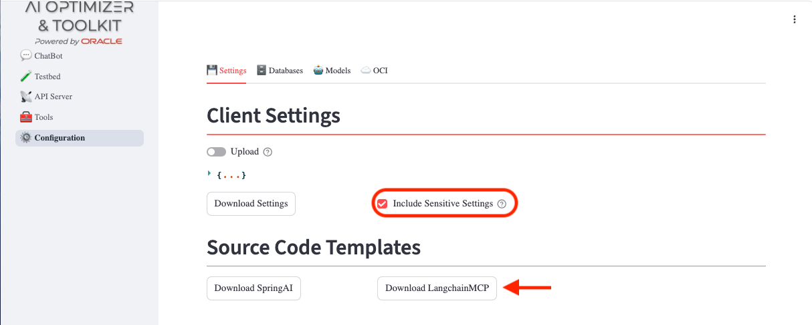
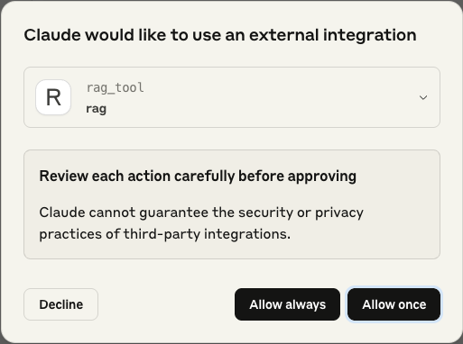

# MCP Server for a tested AI Optimizer & Toolkit configuration

**Version:** *Developer preview*

## Introduction
This document describe how to re-use the configuration tested in the **AI Optimizer & Toolkit** an expose it as an MCP tool to a local **Claude Desktop** and how to setup as a remote MCP server. This early draft implementation utilizes the `stdio` and `sse` to interact between the agent dashboard, represented by the **Claude Desktop**, and the tool. 

**NOTICE**: Only `Ollama` or `OpenAI` configurations are currently supported. Full support will come.

## Pre-requisites.
You need:
- Node.js: v20.17.0+
- npx/npm: v11.2.0+
- uv: v0.7.10+
- Claude Desktop free

## Setup
With **[`uv`](https://docs.astral.sh/uv/getting-started/installation/)** installed, run the following commands in your current project directory `<PROJECT_DIR>/src/client/mcp/rag/`:

```bash
uv init --python=3.11 --no-workspace
uv venv --python=3.11
source .venv/bin/activate
uv add mcp langchain-core==0.3.52 oracledb~=3.1 langchain-community==0.3.21 langchain-huggingface==0.1.2 langchain-openai==0.3.13 langchain-ollama==0.3.2
```

## Export config
In the **AI Optimizer & Toolkit** web interface, after tested a configuration, in `Settings/Client Settings`:



* select the checkbox `Include Sensitive Settings` 
* press button `Download Settings` to download configuration in the project directory: `src/client/mcp/rag` as `optimizer_settings.json`.
* in `<PROJECT_DIR>/src/client/mcp/rag/rag_base_optimizer_config_mcp.py` change filepath with the absolute path of your `optimizer_settings.json` file.


## Standalone client
There is a client that you can run without MCP via commandline to test it:

```bash
uv run rag_base_optimizer_config.py   
```

## Quick test via MCP "inspector"

* Run the inspector:

```bash
npx @modelcontextprotocol/inspector uv run rag_base_optimizer_config_mcp.py
```

* connect to the port `http://localhost:6274/` with your browser
* setup the `Inspector Proxy Address` with `http://127.0.0.1:6277` 
* test the tool developed.


## Claude Desktop setup

* In **Claude Desktop** application, in `Settings/Developer/Edit Config`, get the `claude_desktop_config.json` to add the references to the local MCP server for RAG in the `<PROJECT_DIR>/src/client/mcp/rag/`:
```json
{
 "mcpServers": {
	...
	,
	"rag":{
		"command":"bash",
		"args":[
			"-c",
			"source <PROJECT_DIR>/src/client/mcp/rag/.venv/bin/activate && uv run <PROJECT_DIR>/src/client/mcp/rag/rag_base_optimizer_config_mcp.py"
		]
	}
   }
}
```
* In **Claude Desktop** application, in `Settings/General/Claude Settings/Configure`, under `Profile` tab, update fields like:
- `Full Name`
- `What should we call you`
	
	and so on, putting in `What personal preferences should Claude consider in responses?`
	the following text:

```
#INSTRUCTION:
Always call the rag_tool tool when the user asks a factual or information-seeking question, even if you think you know the answer.
Show the rag_tool message as-is, without modification.
```
This will impose the usage of `rag_tool` in any case. 

**NOTICE**: If you prefer, in this agent dashboard or any other, you could setup a message in the conversation with the same content of `Instruction` to enforce the LLM to use the rag tool as well.

* Restart **Claude Desktop**.

* You will see two warnings on rag_tool configuration: they will disappear and will not cause any issue in activating the tool.

* Start a conversation. You should see a pop up that ask to allow the `rag` tool usage to answer the questions:



 If the question is related to the knowledge base content stored in the vector store, you will have an answer based on that information. Otherwise, it will try to answer considering information on which has been trained the LLM o other tools configured in the same Claude Desktop.


## Make a remote MCP server the RAG Tool

In `rag_base_optimizer_config_mcp.py`:

* Update the absolute path of your `optimizer_settings.json`. Example:

```python
rag.set_optimizer_settings_path("/Users/cdebari/Documents/GitHub/ai-optimizer-mcp-export/src/client/mcp/rag/optimizer_settings.json")
```

* Substitute `Local` with `Remote client` line:

```python
#mcp = FastMCP("rag", port=8001) #Remote client
mcp = FastMCP("rag") #Local
```

* Substitute `stdio` with `sse` line of code:
```python
mcp.run(transport='stdio')
#mcp.run(transport='sse')
```

* Start MCP server in another shell with:
```bash
uv run rag_base_optimizer_config_mcp.py
```


## Quick test

* Run the inspector:

```bash
npx @modelcontextprotocol/inspector 
```

* connect the browser to `http://127.0.0.1:6274` 

* set the Transport Type to `SSE`

* set the `URL` to `http://localhost:8001/sse`

* test the tool developed.


## Claude Desktop setup for remote/local server
Claude Desktop, in free version, not allows to connect remote server. You can overcome, for testing purpose only, with a proxy library called `mcp-remote`. These are the options.
If you have already installed Node.js v20.17.0+, it should work:

* replace `rag` mcpServer, setting in `claude_desktop_config.json`:
```json
{
  "mcpServers": {
    "remote": {
			"command": "npx",
			"args": [
				"mcp-remote",
				"http://127.0.0.1:8001/sse"
			]
		}
  }
}
```
* restart Claude Desktop. 

**NOTICE**: If you have any problem running, check the logs if it's related to an old npx/nodejs version used with mcp-remote library. Check with:
```bash
nvm -list
```
if you have any other versions available than the default. It could happen that Claude Desktop uses the older one. Try to remove any other nvm versions available to force the use the only one avalable, at minimum v20.17.0+.

* restart and test as remote server


# Dependency Issues Troubleshooting Guide

## Common Installation and Runtime Issues

### Issue 1: Dependency Version Conflicts During Installation

**Problem**: Getting version conflict errors when running `uv add` with specific package versions.

**Example Error**:
```
× No solution found when resolving dependencies:
╰─▶ Because langchain-community==0.3.26 depends on langchain-core>=0.3.66,<1.0.0 
    and your project depends on langchain-core==0.3.52, we can conclude that 
    your project's requirements are unsatisfiable.
```

**Root Cause**: Package version incompatibilities between dependencies.

**Solution Steps**:
1. **Update conflicting packages to compatible versions**:
   ```bash
   uv add mcp langchain-core==0.3.66 oracledb~=3.1 langchain-community==0.3.26 langchain-huggingface==0.3.0 langchain-openai==0.3.27 langchain-ollama==0.3.3
   ```

2. **If still failing, let uv resolve versions automatically**:
   ```bash
   uv add mcp langchain-core langchain-community langchain-huggingface langchain-openai langchain-ollama oracledb~=3.1
   ```

### Issue 2: Python Version Compatibility Conflicts

**Problem**: Getting numpy version conflicts related to Python 3.13 support.

**Example Error**:
```
× No solution found when resolving dependencies for split (python_full_version >= '3.13'):
╰─▶ Because ai-optimizer[all] depends on giskard==2.17.0 and giskard==2.17.0 depends on numpy>=1.26.0,<2
    and langchain-community==0.3.26 depends on numpy>=2.1.0 for Python 3.13
```

**Root Cause**: Project supports Python 3.13 but dependencies have conflicting numpy requirements for that version.

**Solution Steps**:
1. **Limit Python version in pyproject.toml** (Recommended):
   ```toml
   [project]
   requires-python = ">=3.11,<3.13"
   ```

2. **Then retry installation**:
   ```bash
   uv add mcp langchain-core==0.3.66 oracledb~=3.1 langchain-community==0.3.26 langchain-huggingface==0.3.0 langchain-openai==0.3.27 langchain-ollama==0.3.3
   ```

**Alternative Solutions**:
- Use older package versions that are compatible
- Use `--frozen` flag to skip dependency resolution (not recommended for production)

### Issue 3: Module Not Found During Runtime

**Problem**: Getting `ModuleNotFoundError` when running the application, even though packages were installed successfully.

**Example Error**:
```
ModuleNotFoundError: No module named 'langchain_core'
```

**Root Cause**: Running the application from system Python instead of the project's virtual environment.

**Solution Steps**:

**Option 1: Use uv run (Recommended)**:
```bash
uv run streamlit run launch_client.py --server.port 8501
```

**Option 2: Manually activate virtual environment**:
```bash
source .venv/bin/activate
streamlit run launch_client.py --server.port 8501
```

**Option 3: Install missing runtime dependencies**:
```bash
uv add streamlit
```

## Best Practices

1. **Always use `uv run` for executing scripts** - it automatically uses the correct virtual environment
2. **Pin Python versions** in `pyproject.toml` to avoid compatibility issues
3. **Let uv resolve versions** when possible instead of pinning specific versions
4. **Check virtual environment activation** if you get import errors

## Quick Diagnosis

If you encounter dependency issues:

1. **Installation fails**: Check for version conflicts in error message
2. **Runtime import errors**: Verify you're using the correct Python environment
3. **Mixed errors**: Try `uv run` instead of manual activation

## Commands Reference

```bash
# Initialize project
uv init --python=3.11 --no-workspace

# Create virtual environment
uv venv --python=3.11

# Install dependencies (let uv resolve versions)
uv add package1 package2 package3

# Run application (recommended)
uv run streamlit run launch_client.py --server.port 8501

# Manual activation (alternative)
source .venv/bin/activate
streamlit run launch_client.py --server.port 8501
```
