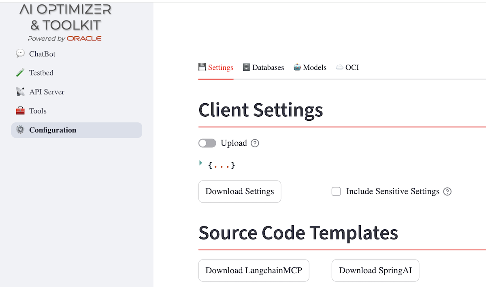

# Exploring Spring AI for RAG as an Oracle AI Optimizer & Toolkit outcome

## Introduction  

Generative AI development has primarily been associated with Python-based frameworks. However, frameworks like **Spring AI** introduce a way to bring the Java ecosystem—known for its portability, modularity, and enterprise adoption—into the AI engineering domain.  
We will see step by step how to implement a Spring Boot application based on Retrieval-Augmented Generation (RAG) using a knowledge base stored in the Oracle DB23ai Vector DB and how to expose it to MCP Agents, leveraging public, hybrid, or on-premises LLMs. Tips & tricks such as data ingestion, the choice of LLM, prompt engineering setup, and a comprehensive evaluation with an existing Q&A test dataset—or a synthetic one—can be assisted and simplified by the [Oracle AI Optimizer and Toolkit](https://www.oracle.com/database/ai-optimizer-toolkit/). It exports the tested stack as a Spring AI microservice and exposes it both as an OpenAI API–compliant chatbot and as an MCP agent. The production transition phase on a cloud-native platform, like the [Oracle Backend for Microservices and AI](https://oracle.github.io/microservices-datadriven/spring/), will not be overlooked.  
This paper explores how **Spring AI**, in combination with **Oracle Database Vector Store** and the **Oracle AI Optimizer and Toolkit**, provides developers with powerful abstractions to build, test, and deploy Retrieval-Augmented Generation (RAG) applications in Java.  

---

## Spring AI 

Spring AI applies Spring ecosystem design principles to the AI domain:  

- Support for all major **AI Model providers** such as **Anthropic**, **OpenAI**, **Microsoft**, **Amazon**, **Google**, and **Ollama**  
- Support for all major **Vector Database** providers such as …, **Oracle**, …  
- **Structured Outputs** – Mapping AI Model output to POJOs.  
- **Tools/Function Calling** – allows the model to request the execution of client-side tools and functions, thereby accessing necessary real-time information as required.  
- Support for **Chat Conversation Memory** and **Retrieval-Augmented Generation** (RAG).  

…and many more.  

_Source: [Spring AI Project](https://spring.io/projects/spring-ai)_  

Spring AI integrates seamlessly into **Spring Boot** projects, as easily as we are used to starting a Spring Boot project—quickly and with a scalable microservice output.  
To have a simple runner that builds a `ChatClient`, issues a prompt, and defines Oracle DB connection and Spring AI vector/embedding/chat models, follow these steps to have a microservice up and running that calls an LLM, including the starter needed for a further RAG extension:

- Go to the Spring initializer [here](https://start.spring.io/)  
- Choose Spring Boot: 3.4.9  
- Add Dependencies:  
  - **Ollama**  
  - **Oracle Vector Database**   
  - **Oracle Driver**  
- Generate!  
- Add in `SpringAiDemoApplication.java`:  

```java
@Bean 
public CommandLineRunner runner(ChatClient.Builder builder) { 
  return args -> { 
    ChatClient chatClient = builder.build(); 
    String response = chatClient.prompt("Tell me a joke")
            .call()
            .content(); 
    System.out.println(response); 
  }; 
}
```

This will send a message to the chat completion endpoint of the LLM provider, in this case Ollama.  

- Add in `src/main/resources/application.properties`:  

```java
spring.datasource.url=jdbc:oracle:thin:@localhost:1521/FREEPDB1
spring.datasource.username=vector
spring.datasource.password=vector

spring.ai.vectorstore.oracle.table-name=SPRING_AI
spring.ai.vectorstore.oracle.distance-type=COSINE
spring.ai.vectorstore.oracle.dimensions=256
spring.ai.vectorstore.oracle.initialize-schema=true

spring.ai.ollama.base-url=http://localhost:11434
spring.ai.ollama.embedding.model=all-minilm
spring.ai.ollama.chat.model=llama3.1
```

- Run:  
```shell
./mvnw spring-boot:run
```

*Sources:*  
- *[Vector Oracle DB](https://docs.spring.io/spring-ai/reference/api/vectordbs/oracle.html)*  
- *[Ollama Chat API](https://docs.spring.io/spring-ai/reference/api/chat/ollama-chat.html)*  
- *[Ollama Embeddings API](https://docs.spring.io/spring-ai/reference/api/embeddings/ollama-embeddings.html)*  

---

### Developer's Dilemmas  
At this point, several questions naturally arise for a developer when deciding which guidelines to follow for setting parameters in `application.properties`. Typical considerations include:

- **Choosing the right distance metric**  
  (e.g., `COSINE`, `L2`, `DOT_PRODUCT`) → *Which metric best fits my retrieval or ranking use case?*

- **Evaluating semantic accuracy of embeddings**  
  → *How well does the chosen embedding model capture the meaning of my data?*

- **Balancing performance vs. cost**  
  → *What is the tradeoff between model accuracy, response latency, and operational expense?*

Some concrete examples:

- `oracle.distance-type=COSINE` → *Is this the most appropriate distance metric for my queries?*  
- `dimensions=256` → *What does this number mean, and how do I know if it’s sufficient?*  
- `embedding.model=all-minilm` → *Will this embedding model represent the semantics of my text well enough?*  
- `chat.model=llama3.1` → *Does this LLM offer a good balance of price and performance for my application?*  

Ultimately, the most critical success factor is **experimentation and iteration**.  
There’s rarely a single “correct” configuration—you discover what works best by testing, measuring, and refining.  

---

## Oracle AI Optimizer and Toolkit: your trusted assistant

It's a **zero-code Open Source platform** to:  
- Build, test, and deploy **RAG chatbots**.  
- Compare models, embeddings, chunking strategies, and hyperparameters.  
- Export applications as **Spring AI microservices** or **LangChain/Python MCP servers**.  

_Sources: [Oracle AI Optimizer Toolkit](https://www.oracle.com/database/ai-optimizer-toolkit/), [Oracle GitHub](https://github.com/oracle/ai-optimizer)_  

It offers several ways to export the results of your experiments, such as:  

1. Use the tested chatbot configuration & the Vector Store to build a custom service  
2. Use the API server  
3. Export as a **SpringAI** microservice *OpenAI API* compliant, including as an MCP Tool  
4. Run as LangChain/Python MCP server  

Let’s focus on the 3rd option, which you can use to start and customize your final production-ready Spring Boot microservice.  
After you finish testing your OpenAI or Ollama configuration, based on the same provider for Chat/Embeddings LLM, to have a private/public LLM-based RAG chat service, go under `Configuration` → `Source Code Templates`, click `Download SpringAI`, and unzip the project.  
Let’s explore in the next paragraph what you’ll find in this project.  



## Spring AI project example content

The microservice based on SpringAI microservice exposes:

- REST endpoints:
  - **/v1/chat/completions**: to use RAG via OpenAI REST API 
  - **/v1/models**: returns models behind the RAG via OpenAI REST API 
  - **/v1/service/llm**: to chat straight with the LLM used 
  - **/v1/service/search/**: to search for similar chunk documents to the message provided 
  - **/v1/service/store-chunks/**: from a list of chunks provided, it generates vector embeddings and store them in the vector store.

- MCP server: the **getRAG** Tool, based on the same logic under */v1/chat/completions* endpoint, but via `sse`/`stdio` protocol

It uses the Vector Store and LLMs tested, including references and credentials for Vector DB access.
Let's examine the main components of this example. 

### application-dev.yml — RAG Parameters Injection

All main RAG parameters, like model details, vector store, prompt, etc, are exported as environment variables injected into the application.yaml to be provided to the related beans at startup. One yaml for the two public/private deployments.

```yaml
spring:
  ai:
    ollama:
      base-url: ${SPRING_AI_OLLAMA_BASE_URL:http://localhost:11434}
      chat:
        model: ${SPRING_AI_CHAT_MODEL:llama3.1}
      embedding:
        model: ${SPRING_AI_EMBEDDING_MODEL:all-minilm}

  datasource:
    url: ${SPRING_DATASOURCE_URL:jdbc:oracle:thin:@localhost:1521/FREEPDB1}
    username: ${SPRING_DATASOURCE_USERNAME:vector}
    password: ${SPRING_DATASOURCE_PASSWORD:vector}

ai:
  rag:
    top-k: ${RAG_TOP_K:4}
    distance-type: ${RAG_DISTANCE_TYPE:COSINE}
    dimensions: ${RAG_DIMENSIONS:256}
    table-name: ${RAG_TABLE_NAME:SPRING_AI}
    prompt-template: ${RAG_PROMPT_TEMPLATE:You are a helpful assistant...}
```

**Notes:**  
All main RAG parameters are exported as environment variables and injected here for both public/private deployments.  
- RAG parameters injected into Spring beans at startup.  
- Embedding model configured via Ollama.  
- VectorStore initializes schema if needed.  

---

### Config.java — Beans Wiring

RAG parameters usage example in the code, like `{ai.rag.table-name}` and so on:

```java
@Configuration
@EnableConfigurationProperties
public class Config {

    @Value("${ai.rag.table-name}")
    private String tableName;

    @Value("${ai.rag.distance-type}")
    private String distanceType;

    @Value("${ai.rag.dimensions}")
    private Integer dimensions;

    @Bean
    public DataSource dataSource(@Value("${spring.datasource.url}") String url,
                                 @Value("${spring.datasource.username}") String user,
                                 @Value("${spring.datasource.password}") String pass) throws SQLException {
        OracleDataSource ods = new OracleDataSource();
        ods.setURL(url);
        ods.setUser(user);
        ods.setPassword(pass);
        return ods;
    }

    @Bean
    public EmbeddingModel embeddingModel(EmbeddingModelClientFactory factory) {
        return factory.create(); // [See notes below]
    }

    @Bean
    public VectorStore vectorStore(DataSource ds, EmbeddingModel embeddingModel) {
        OracleVectorStore store = new OracleVectorStore(ds, tableName, dimensions, distanceType);
        store.initializeSchemaIfNeeded(); // [See notes below]
        store.setEmbeddingModel(embeddingModel);
        return store;
    }

    @Bean
    public ChatClient chatClient(ChatModelClientFactory factory) {
        return ChatClient.builder().model(factory.create()).build();
    }
}
```

---

### Application.java — Vector Store Initialization
Oracle Vector Store initialization: a new table created `legacyTable + "_SPRINGAI"` to preserve the original table created by LangChain in the Optimizer. The EmbeddingModel chosen is injected too at `OracleVectorStore vectorStore(EmbeddingModel ec, JdbcTemplate t)` level.

```java
@SpringBootApplication
public class Application {

    @Value("${aims.vectortable.name}")
    private String legacyTable;

    public static void main(String[] args) {
        SpringApplication.run(Application.class, args);
    }

    @Bean
    OracleVectorStore vectorStore(EmbeddingModel ec, JdbcTemplate t) {
        OracleVectorStore ovs = OracleVectorStore.builder(t, ec)
                .tableName(legacyTable + "_SPRINGAI")
                .initializeSchema(true)
                .build();
        return ovs;
    }

    @Bean
    public ToolCallbackProvider ragTools(RagService ragService) {
        return MethodToolCallbackProvider.builder()
                .toolObjects(ragService)
                .build();
    }
}
```

_Source: [Spring AI Oracle Vector Store](https://docs.spring.io/spring-ai/reference/api/vectordbs/oracle.html)_  

---

### Maven Dependencies
This is the part of `pom.xml` that includes the dependencies to manage the Oracle Vector Store, as well as the integration Spring AI layer for Ollama:

```xml
<dependencies>
  <dependency>
    <groupId>org.springframework.ai</groupId>
    <artifactId>spring-ai-oracle-vectordb</artifactId>
    <version>${spring-ai.version}</version>
  </dependency>
  <dependency>
    <groupId>com.oracle.database.jdbc</groupId>
    <artifactId>ojdbc11</artifactId>
    <version>${ojdbc.version}</version>
  </dependency>
  <dependency>
    <groupId>org.springframework.ai</groupId>
    <artifactId>spring-ai-ollama</artifactId>
    <version>${spring-ai.version}</version>
  </dependency>
</dependencies>
```
These dependencies will require the following properties in `application-dev.yml` file:

```yaml
..
spring:
  datasource:
    url: ${DB_DSN}
    username: ${DB_USERNAME}
    password: ${DB_PASSWORD}
..
  vectorstore:
    oracle:
      distance-type: ${DISTANCE_TYPE}
      remove-existing-vector-store-table: True
      initialize-schema: True
      index-type: ${INDEX_TYPE}
```

---

### AIController.java — Vector Store Load
Executed after the Spring bean has been created and dependency injection is completed, but before the bean is put into service.
It's a one times only operation, performed on the original LangChain table.

```java
@PostConstruct
public void insertData() {
    String sqlUser = "SELECT USER FROM DUAL";
    String user = "";
    String sql = "";
    String newTable = legacyTable + "_SPRINGAI";

    user = jdbcTemplate.queryForObject(sqlUser, String.class);
    if (helper.doesTableExist(legacyTable, user, this.jdbcTemplate) != -1) {
        // RUNNING LOCAL
        logger.info("Running local with user: " + user);
        sql = "INSERT INTO " + user + "." + newTable + " (ID, CONTENT, METADATA, EMBEDDING) " +
              "SELECT ID, TEXT, METADATA, EMBEDDING FROM " + user + "." + legacyTable;
    } else {
        // RUNNING in OBaaS
        logger.info("Running on OBaaS with user: " + user);
        sql = "INSERT INTO " + user + "." + newTable + " (ID, CONTENT, METADATA, EMBEDDING) " +
              "SELECT ID, TEXT, METADATA, EMBEDDING FROM ADMIN." + legacyTable;
    }

    // Execute the insert
    logger.info("doesExist " + user + ": " + helper.doesTableExist(newTable, user, this.jdbcTemplate));
    if (helper.countRecordsInTable(newTable, user, this.jdbcTemplate) == 0) {
        // First microservice execution
        logger.info("Table " + user + "." + newTable + " doesn't exist: create from ADMIN/USER." + legacyTable);
        jdbcTemplate.update(sql);
    } else {
        // Table conversion already done
        logger.info("Table " + newTable + " exists: drop before if you want use with new contents " + legacyTable);
    }
}
```

---

### AIController.java — Similarity Search
Finds the top‑K nearest documents from Oracle Vector Store.  
- `.query(query)`: the text for which you are looking for nearest in terms of semantic
- `.topK(topK)` : how many chunks, starting from the nearest one.

```java
/**
 * Similarity search
 *
 * @param message the message to be routed to the LLM along the prompt/context
 * @param topK the number of chunks to be included in the context
 * @return the list of the nearest topK chunks
 */
@GetMapping("/v1/service/search")
List<Map<String, Object>> search(
        @RequestParam(value = "message", defaultValue = "Tell me a joke") String query,
        @RequestParam(value = "topk", defaultValue = "5") Integer topK) {

    List<Document> similarDocs = vectorStore.similaritySearch(
            SearchRequest.builder()
                    .query(query)
                    .topK(topK)
                    .build());

    List<Map<String, Object>> resultList = new ArrayList<>();
    for (Document d : similarDocs) {
       ..
    }

    return resultList;
}
```

---

### AIController.java — RAG Prompt Handling
REST endpoint exposing OpenAI-compatible chat completions. It combines user input with nearest context chunks to build the RAG prompt, then queries the actual LLM.

**Notes:**
- `@PostMapping(value = "/v1/chat/completions", produces = MediaType.TEXT_EVENT_STREAM_VALUE)`: Chat completion endpoint, OpenAI API compliant
- `Prompt prompt = promptBuilderService.buildPrompt(userMessageContent, contextInstr, TOPK) `: it is the RAG Prompt building -
getting the user message, the context and the TopK nearest chunks, will be created the LLM message request
- `String contentResponse = chatClient.prompt(prompt).call().content()`: Chat actual completion call
- `if (request.isStream())` : Stream management, if requested, to provide the partial answers text when generated by the LLM, token by token
- `ChatMessage messageAnswer = new ChatMessage("assistant", contentResponse)`
  `List<ChatChoice> choices = List.of(new ChatChoice(messageAnswer))`: LLM answer return
  
```java
@PostMapping(value = "/v1/chat/completions", produces = MediaType.TEXT_EVENT_STREAM_VALUE)
public ResponseBodyEmitter streamCompletions(@RequestBody ChatRequest request) {
    ResponseBodyEmitter bodyEmitter = new ResponseBodyEmitter();
    String userMessageContent;

    for (Map<String, String> message : request.getMessages()) {
        if ("user".equals(message.get("role"))) {
            String content = message.get("content");
            if (content != null && !content.trim().isEmpty()) {
                userMessageContent = content;
                logger.info("user message: " + userMessageContent);

                Prompt prompt = promptBuilderService.buildPrompt(userMessageContent, contextInstr, TOPK);
                logger.info("prompt message: " + prompt.getContents());

                String contentResponse = chatClient.prompt(prompt).call().content();
               
                ...

                new Thread(() -> {
                    try {
                        ObjectMapper mapper = new ObjectMapper();

                        if (request.isStream()) {
                            // handle streaming case
                            ...

                        } else {
                            // handle one-shot case
                            ...
                            
                            String model = helper.getModel(this.modelOpenAI, this.modelLlamaAI);

                            ChatMessage messageAnswer =
                                    new ChatMessage("assistant", contentResponse);

                            List<ChatChoice> choices =
                                    List.of(new ChatChoice(messageAnswer));

                            bodyEmitter.send(new ChatResponse(id, object, created, model, choices));
                        }

                        bodyEmitter.complete();
                    } catch (Exception e) {
                        bodyEmitter.completeWithError(e);
                    }
                }).start();

                return bodyEmitter;
            }
            break;
        }
    }

    return bodyEmitter;
}

```

---

### PromptBuilderService.java  
A helper class to build the final prompts that merges the instruction with the user message plus the nearest chunks found to ground the request. A more enhanced implementation could include also conversation memory and other functionalities re-mapped in Spring AI APIs.

**Notes:**
- `String template`: standard format to include grounded question plus instruction to the LLM to answer
- `template += "\n" + contextInstr`: Prompt merge
- `List<Document> similarDocuments = vectorStore.similaritySearch(...`: Documents retrieval service
- `PromptTemplate promptTemplate = new PromptTemplate(...` Final merge Chunks + Instructions into the template
- `private StringBuilder createContext(List<Document> documents)`: Helper method to format the documents list to ground the question

```java
public class PromptBuilderService {

    private final OracleVectorStore vectorStore;

    public PromptBuilderService(OracleVectorStore vectorStore) {
        this.vectorStore = vectorStore;
    }

    public Prompt buildPrompt(String message, String contextInstr, int topK) {
        String template = """
                DOCUMENTS:
                {documents}

                QUESTION:
                {question}

                INSTRUCTIONS:""";

        ...

        template += "\n" + contextInstr;

        List<Document> similarDocuments = vectorStore.similaritySearch(
                SearchRequest.builder().query(message).topK(topK).build());

        StringBuilder context = createContext(similarDocuments);

        PromptTemplate promptTemplate = new PromptTemplate(template);
        Prompt prompt = promptTemplate.create(Map.of("documents", context,
                                                     "question", message));

        ...

        return prompt;
    }

    private StringBuilder createContext(List<Document> documents) {
        String START = "\n<article>\n";
        String STOP = "\n</article>\n";

        StringBuilder context = new StringBuilder();
        for (Document doc : documents) {
            context.append(doc.getId()).append(".");
            context.append(START).append(doc.getFormattedContent()).append(STOP);
        }
        return context;
    }
}
```

---

## RAGService.java: The RAG microservice as a MCP Tool
This class implements the same service exposed as OpenAI API compliant chatbot, with the under the hood RAG implementation, as an MCP server that exposes a Tool called (`getRag`), managed as a Spring bean.  
The main points to highlight is this one:
```
@Tool(description = "Use this tool to answer any question that may benefit from up-to-date or domain-specific information.")
    public String getRag(String question) {...
```
where with the **@Tool** tag you provides the description will help the **getRag** tool to be engaged by the LLM. The parameter it should be described too, but the meaning is to clear that it has been omitted.

```java
@Autowired
private PromptBuilderService promptBuilderService;

public class RagService {

    String modelOpenAI;
    String modelLlamaAI;
    @Lazy ChatClient chatClient;
    EmbeddingModel embeddingModel;
    OracleVectorStore vectorStore;
    JdbcTemplate jdbcTemplate;
    String legacyTable;
    String contextInstr;
    String searchType;
    int TOPK;

    public RagService(String modelOpenAI,
                      String modelLlamaAI,
                      @Lazy ChatClient chatClient,
                      EmbeddingModel embeddingModel,
                      OracleVectorStore vectorStore,
                      JdbcTemplate jdbcTemplate,
                      String legacyTable,
                      String contextInstr,
                      String searchType,
                      int TOPK) {
       ....
    }

    @Tool(description = "Use this tool to answer any question that may benefit from up-to-date or domain-specific information.")
    public String getRag(String question) {

        // Implementation
        Prompt prompt = promptBuilderService.buildPrompt(question, contextInstr, TOPK);
        logger.info("prompt message: " + prompt.getContents());
        String contentResponse = chatClient.prompt(prompt).call().content();

        return contentResponse;
    }
}

```

The MCP server needs parameters in the `application-dev.yml`, as shown here:

```yaml
spring:
  datasource:
...
ai:
  mcp:
    server:
      name: webmvc-mcp-server
      version: 1.0.0
      type: SYNC
      request-timeout: 120
      instructions: "Use this tool to answer any question that may benefit from up-to-date or domain-specific information."
      capabilities:
        tool: true
        resource: true
        prompt: true
        completion: true
```
Last thing to point out is that you need to create the callback bean in the `Application.java` that bootstraps the Spring Boot application:

```java
@SpringBootApplication
public class Application {

    @Value("${aims.vectortable.name}")
    private String legacyTable;

    public static void main(String[] args) {
        SpringApplication.run(Application.class, args);
    }

...

    @Bean
    public ToolCallbackProvider ragTools(RagService ragService) {
        return MethodToolCallbackProvider.builder()
                .toolObjects(ragService)
                .build();
    }
}

```
### Test the MCP tool
We can proceed to any MCP compliant client. Anyway, since the engagement and the behavior could change according the kind of LLM used by the MCP client, I suggest to make first a raw test, straight to the Tool, to be sure about the output before to add noise caused by an LLM or other prompting stuff included in the MCP client.
To do this kind of raw test, it could be used the standard [MCP Inspector](https://modelcontextprotocol.io/legacy/tools/inspector).
The pre-requisites are:

- node --version   # >= v20.17.0
- npm --version    # >= v11.2.0

To run:
```bash
npx @modelcontextprotocol/inspector
```


In the GUI, by a browser, proceed in this way:

- Access MCP Inspector at http://127.0.0.1:6274  
- Configure: SSE transport, endpoint http://127.0.0.1:9090/sse, timeout 200000  
- Use the `getRag` tool interactively.  


## Store new chunks
It's provided an endpoint to add a list of new text chunks, that will be embedded and stored into the vector store. This allow to update the knowledge base with new info. This offer the opportunity to show how it's added a document into the Vector store:

```java
return Document.builder()
                    .text(chunk)
                    .metadata("source", "user-added")
                    .build();
```
The embeddings will be down by the Vector Store implementation that creates an instance getting the reference to the embedding model.
Other primitives offer a way to ingest pdf automatically, performing the chunking process according several techniques and parameters.
This is done in Oracle AI Optimizer & Toolkit, where you can experiment several combinations to test the best accuracy in Q&A.

```java
/**
 * Store new chunks, sent as a list of strings in the request body
 *
 * @param chunks the list of chunks
 * @return the list of vector embeddings created and stored along the chunks
 */
@PostMapping("/v1/service/store-chunks")
List<List<Double>> store(@RequestBody List<String> chunks) {
    List<List<Double>> allVectors = new ArrayList<>();
    List<Document> documents = chunks.stream()
        .map(chunk -> {
            double[] vector = helper.floatToDouble(embeddingModel.embed(chunk));
            Double[] sVector = java.util.Arrays.stream(vector)
                    .mapToObj(Double::valueOf)
                    .toArray(Double[]::new);
            allVectors.add(java.util.Arrays.asList(sVector));
            return Document.builder()
                    .text(chunk)
                    .metadata("source", "user-added")
                    .build();
        })
        .collect(Collectors.toList());

    vectorStore.doAdd(documents);

    return allVectors;
}

```

---

## Oracle Backend for Microservices and AI deployment
If you have further customized the example code provided and you want to deploy in a scalable, secure, multi-Cloud  Kubernetes environment, in which is also available the AI Optimizer, you can use the:
[Oracle Backend for Microservices and AI](https://oracle.github.io/microservices-datadriven/spring/)
It includes pre-configured Service registry & discovery, orchestration/workflow, Saga/LRA coordinator, as well as an API Gateway and observability and monitoring capabilities.

These are the details and operations needed.

### application-obaas.yml — Production Config
It's available a dedicated yaml file to address the deployment in this platform:

```yaml
aims:
  context_instr: "..."
  rag_params:
    search_type: Similarity
    top_k: 4
  vectortable:
    name: JAVA_OLLAMA_ALL_MINILM_256_52_COSINE_HNSW

spring:
  ai:
    ollama:
      base-url: http://ollama.ollama.svc.cluster.local:11434
    chat: {}
```

### Deployment via CLI
With the provided command line tool, the `oractl`, you can proceed to deploy the jar file built as shown in this example:

```bash
kubectl -n obaas-admin port-forward svc/obaas-admin 8080:8080

oractl
oractl:> connect
? username obaas-admin
? password **************

oractl:> create --app-name rag
oractl:> deploy --app-name rag --service-name springai  --artifact-path ./target/myspringai-1.0.0-SNAPSHOT.jar --image-version 0.0.1 --service-profile prod
```
 
---

## References  

- [Spring AI Project](https://spring.io/projects/spring-ai)  
- [Spring AI Docs: Oracle Vector Store](https://docs.spring.io/spring-ai/reference/api/vectordbs/oracle.html)  
- [Spring AI Docs: Ollama Chat](https://docs.spring.io/spring-ai/reference/api/chat/ollama-chat.html)  
- [Spring AI Docs: Ollama Embeddings](https://docs.spring.io/spring-ai/reference/api/embeddings/ollama-embeddings.html)  
- [Spring AI Docs: ETL Pipeline](https://docs.spring.io/spring-ai/reference/api/etl-pipeline.html)  
- [Oracle AI Optimizer Toolkit](https://www.oracle.com/database/ai-optimizer-toolkit/)  
- [Oracle AI Optimizer GitHub](https://github.com/oracle/ai-optimizer)  
